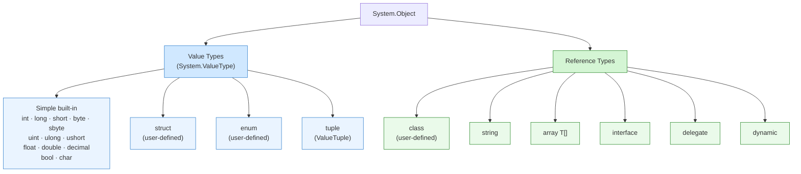

# Variables and Naming

Variables give names to values so code can read, update, and communicate state clearly. In C#, variable declarations are tightly connected to the type system, which means declaration style affects both readability and correctness.

If you misunderstand variables early, later topics such as conditions, loops, methods, and objects feel harder than they really are. A variable is not just a storage box. It is also a promise to the compiler and to future readers about what kind of data the code expects.

## The C# type system at a glance

Every value in C# has a type. All types ultimately derive from `System.Object`, but they split into two fundamentally different families: **value types** and **reference types**.

Understanding where a type lives in this hierarchy tells you how variables copy, share, and default.



The blue branch holds its data **directly in the variable**. The green branch holds a **reference** (a pointer) to an object that lives elsewhere in memory. That single difference explains most of the behavior you will see in the next several lessons.

## Declaring variables

Microsoft's C# type-system guidance emphasizes that every variable has a type, whether you write it explicitly or let the compiler infer it.

```csharp
int orderCount = 42;
string productName = "Notebook";
bool isActive = true;

var price = 19.95m;
```

These declarations all create local variables, but they are not the same kind of decision:

- explicit typing makes the intended type obvious in the declaration
- `var` keeps the code shorter when the type is already clear from the right-hand side

`var` does not make the variable loosely typed. The compiler still infers one concrete type and enforces it.

For example, in this declaration:

```csharp
var count = 10;
```

the compiler decides `count` is an `int`. After that, `count` is treated exactly like a normally declared `int` variable.

```csharp
var count = 10;
count = 20;

// Not allowed:
// count = "twenty";
```

That is why `var` is best understood as compiler-assisted type inference, not as “any type.”

## How to think about a variable

When you read a variable declaration, ask three questions:

- what value does it hold right now
- what type of values may it hold later
- what meaning does its name communicate

This example looks simple, but it already answers all three questions:

```csharp
int retryCount = 0;
```

- current value: `0`
- allowed future values: integers
- meaning: number of retries attempted so far

## Naming matters because code is read more than once

The compiler checks types, but it does not check whether a name communicates meaning. That part is your responsibility.

Good names usually:

- describe what the value represents
- match the level of abstraction of the code
- avoid unnecessary abbreviations
- avoid misleading units or meanings

For example, `orderCount` is better than `x`, and `priceInUsd` is better than `price` if currency matters.

Consider the difference between these two examples:

```csharp
int x = 3;
int y = 12;
```

```csharp
int failedLoginAttempts = 3;
int remainingSeats = 12;
```

The second version is easier to trust because the names explain the role of each value.

## Initialization and first assignment

You can declare a variable and assign a value in one step:

```csharp
string userName = "Ava";
```

Or you can declare first and assign later when that improves clarity:

```csharp
int total;
total = 100;
```

Beginners often learn the combined form first because it is shorter, but both patterns are valid.

## Assignment and reassignment

Once a variable is declared, the compiler expects later assignments to be compatible with the same type.

```csharp
int quantity = 10;
quantity = 12;

// Not allowed:
// quantity = "twelve";
```

That rule is one of the reasons C# catches many mistakes early.

Reassignment does not create a new variable. It changes the value stored in the existing variable.

```csharp
int lives = 3;
lives = lives - 1;

Console.WriteLine(lives); // 2
```

The variable name stays the same, but the current value changes over time.

## A larger example

The following sample shows how naming, typing, and reassignment work together in a realistic beginner program:

```csharp
string studentName = "Nora";
int completedLessons = 4;
int totalLessons = 10;
bool isCourseFinished = completedLessons >= totalLessons;

completedLessons += 2;
isCourseFinished = completedLessons >= totalLessons;

Console.WriteLine($"Student: {studentName}");
Console.WriteLine($"Completed: {completedLessons} of {totalLessons}");
Console.WriteLine($"Finished: {isCourseFinished}");
```

This example is helpful because it shows:

- strings for names
- integers for counts
- Boolean values for yes-or-no state
- reassignment as the program state changes

## A practical guideline for `var`

Use `var` when the right-hand side makes the type obvious:

```csharp
var message = "Hello";
var scores = new int[] { 10, 20, 30 };
```

Prefer explicit types when the inferred type would be unclear to a reader.

For example, this may be less clear for a beginner:

```csharp
var result = GetCustomerReport();
```

If the return type is not obvious, an explicit type can make the code easier to learn from.

## Common mistakes

- using names that describe implementation instead of meaning, such as `temp1` or `value2`
- assuming `var` means dynamic typing
- choosing very short names outside tiny loops or mathematical code
- hiding important units, such as seconds, bytes, or dollars, inside vague names

## Summary

Variables are one of the first places where C#'s type system becomes visible. A good variable declaration combines:

- the right type
- a useful initial value
- a name that explains intent

When those three parts work together, code becomes easier to read, debug, and extend.

## Practice

Take a short code sample and rename any variables called `data`, `item`, or `value` to something more specific. Then decide whether each declaration is clearer with `var` or with an explicit type.

As a second exercise, rewrite the following declarations with better names and explain your choices:

```csharp
int a = 5;
string s = "Pending";
bool b = false;
```
