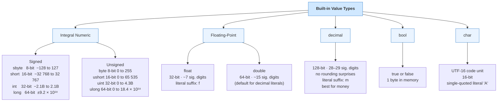

# Built-in Value Types

Built-in value types are C#'s basic units for numbers, Boolean values, and characters. They are called value types because a variable of one of these types holds the value itself, not a reference to a separate object instance.

This is one of the most important distinctions in the entire language. Later, when you work with structs, enums, tuples, and custom types, you will keep returning to the same question: does this variable hold its own value, or does it refer to another object somewhere else?

## Built-in value type hierarchy

The diagram below maps every built-in value type, its size in memory, and its precision where relevant.



Reading the diagram top-down shows the grouping. Reading the leaf nodes shows the concrete types you declare in code.

## The main built-in value types

The core categories are:

- integral numeric types such as `int`, `long`, `byte`, and `short`
- floating-point types such as `float` and `double`
- `decimal` for high-precision decimal arithmetic
- `bool` for true-or-false logic
- `char` for a single UTF-16 code unit

```csharp
int quantity = 12;
double price = 19.95;
decimal total = 239.40m;
bool inStock = true;
char grade = 'A';

Console.WriteLine($"{quantity}, {price}, {total}, {inStock}, {grade}");
```

Each of these types exists because programs deal with different kinds of data:

- `int` for whole numbers such as counts, indexes, and identifiers
- `double` for many general mathematical calculations
- `decimal` when decimal precision matters, especially in money-related code
- `bool` for true-or-false decisions
- `char` for one character-like unit of text

If you choose the wrong type, the program might still compile, but the design becomes weaker and mistakes become more likely.

## Why choosing the right type matters

Different numeric types communicate different intent.

- `int` is the default choice for many whole-number counts
- `double` is common for scientific or general floating-point calculations
- `decimal` is often the safer choice for financial values

This is not only about what compiles. It is about whether the type matches the meaning of the data.

For example, consider these two declarations:

```csharp
double accountBalance = 152.35;
decimal accountBalance2 = 152.35m;
```

Both may look reasonable at first, but `decimal` is usually the better choice for financial values because it avoids many binary floating-point surprises.

## Literal syntax matters too

C# uses different literal forms to help the compiler understand the intended type.

```csharp
int wholeNumber = 42;
long largeNumber = 42L;
float smallMeasurement = 12.5f;
double average = 12.5;
decimal money = 12.5m;
char firstLetter = 'A';
bool isReady = true;
```

The suffixes such as `L`, `f`, and `m` are not decoration. They help the compiler pick the correct type.

## Value-type copy behavior

When you assign one value-type variable to another, the value is copied.

```csharp
int left = 5;
int right = left;
right = 10;

Console.WriteLine(left);
Console.WriteLine(right);
```

Changing `right` does not change `left` because the assignment copied the value.

This behavior is different from many reference types and is a major reason you must understand value semantics early.

## Passing value types to methods

By default, passing a value type to a method also copies the value.

```csharp
int score = 10;
Increase(score);

Console.WriteLine(score); // still 10

static void Increase(int value)
{
    value++;
}
```

The method changes its local copy, not the original variable from the caller.

## Default values

Built-in value types always have a default value. For example:

- `0` for numeric types
- `false` for `bool`
- `\0` for `char`

That matters when values are stored in arrays, fields, or structs before you assign something more meaningful.

## A mental model that helps

When working with built-in value types, imagine that the variable directly contains the data.

```csharp
int age = 21;
```

The variable `age` contains the numeric value `21` itself. That simple mental model explains why copying and method calls behave the way they do.

## Common mistakes

Do not choose numeric types casually. Precision, overflow risk, size, and intended meaning all matter. A type that compiles may still be the wrong type for the problem.

Also remember that `char` is not the same as `string`. A `char` holds one character-like unit; a `string` holds a sequence of characters.

Other common beginner mistakes include:

- assuming `double` and `decimal` are interchangeable
- forgetting the `m` suffix on decimal literals
- using `int` for values that clearly need fractional parts
- treating `char` like a one-letter string

## A worked example

```csharp
int itemsInCart = 3;
decimal pricePerItem = 14.99m;
decimal totalCost = itemsInCart * pricePerItem;
bool qualifiesForDiscount = totalCost >= 40m;

Console.WriteLine($"Items: {itemsInCart}");
Console.WriteLine($"Total: {totalCost:C}");
Console.WriteLine($"Discount: {qualifiesForDiscount}");
```

This short program mixes several value types correctly:

- `int` for counting items
- `decimal` for currency values
- `bool` for a yes-or-no business rule

That is exactly the kind of type choice you want to practice making naturally.

## Summary

Built-in value types are small but foundational. They teach several core ideas at once:

- data has meaning, not just storage
- type choice affects correctness
- copying a value type copies the value itself
- the compiler helps you keep those decisions consistent

## Practice

Pick three values from a realistic domain, such as age, account balance, and yes-or-no status. Choose types for each and explain why those choices fit better than nearby alternatives.

As a second exercise, write one short program that uses at least four different built-in value types and explain why each type was chosen.
