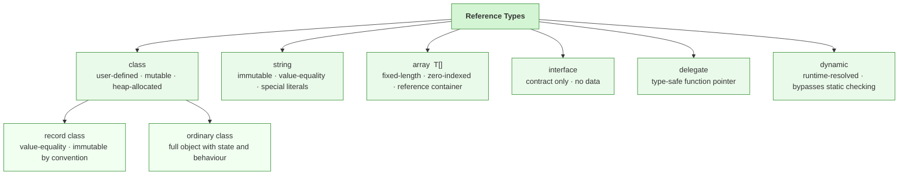
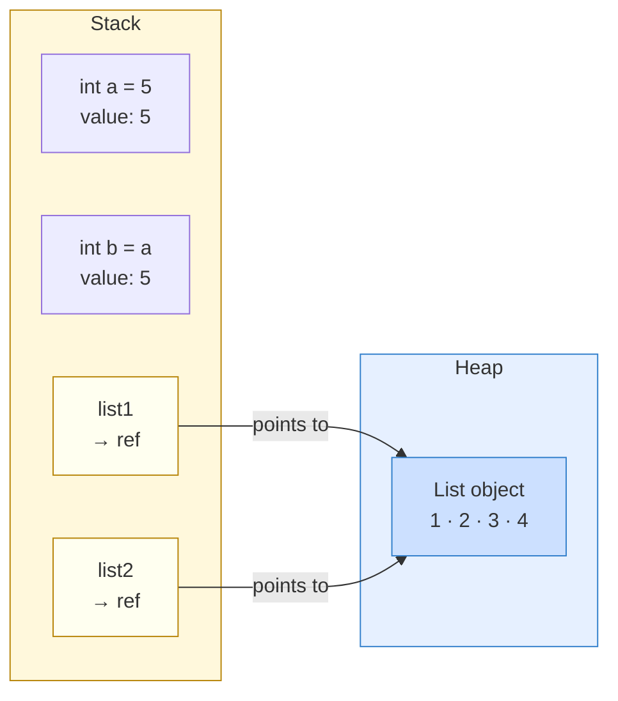

# Reference Types and Nullability

Reference types store references to objects rather than embedding the full data directly in the variable. Classes, arrays, delegates, and strings are all reference types in C#.

That distinction matters because assignment, mutation, and nullability behave differently from value types.

This topic is the natural partner to built-in value types. If value types teach you “the variable contains the data,” reference types teach you “the variable points to an object.” Understanding both models is essential.

## Reference type family

The diagram below shows the main kinds of reference types in C#.



## How value types and reference types store data differently

This diagram shows the most important runtime difference. Value-type variables hold their data **directly on the stack**. Reference-type variables hold only a **reference** on the stack; the actual object lives on the **heap**.



Key observations from this diagram:

- `a` and `b` are independent. Changing one does not affect the other.
- `list1` and `list2` both point to the same heap object. Mutating the list through either variable changes what the other variable sees.
- Assigning a reference variable copies the reference, not the full object.

## Reference behavior

When you assign one reference-type variable to another, both variables can refer to the same object.

```csharp
var list1 = new List<int> { 1, 2, 3 };
var list2 = list1;

list2.Add(4);

Console.WriteLine(list1.Count);
Console.WriteLine(list2.Count);
```

Both counts are `4` because the two variables refer to the same list instance.

This is the simplest way to see reference semantics in action. The variables are separate, but the object they refer to is shared.

## A useful mental model

With reference types, think in two layers:

- the variable stores a reference
- the reference points to an object instance

That model explains why reassignment and mutation are different operations.

```csharp
var names = new List<string> { "Ava", "Noah" };
var otherNames = names;

otherNames.Add("Liam");   // mutate the shared object
otherNames = new List<string>(); // reassign the variable itself
```

The first operation changes the shared list. The second makes `otherNames` point somewhere else.

## Nullability explains absence explicitly

Modern C# uses nullable reference type annotations to make the possibility of `null` visible in code.

```csharp
string? middleName = null;
string displayName = middleName ?? "Unknown";

Console.WriteLine(displayName);
```

Here, `string?` means the variable may legitimately contain `null`. A plain `string` means the code intends that the variable should contain a non-null string.

This is one of the most useful improvements in modern C#. Instead of leaving null-related assumptions hidden, you can express them directly in the type.

## Why nullable annotations help

Nullable annotations do not make `null` impossible. They make the compiler participate in your reasoning.

That means the compiler can warn you when code appears to use a possibly null reference unsafely.

For example:

```csharp
string? nickname = GetNickname();

// Warning from nullable analysis:
// Console.WriteLine(nickname.Length);

if (nickname is not null)
{
    Console.WriteLine(nickname.Length);
}
```

The compiler is effectively asking, “have you proved this value is not null before using it as non-null?”

## Reference type does not mean always nullable

This is a subtle but important point. A reference type and a nullable reference type are not the same thing.

- `string` means a non-null string is intended
- `string?` means null is allowed

That distinction makes API expectations clearer and catches bugs earlier.

It also improves method design. Compare these method signatures:

```csharp
string FormatName(string firstName, string lastName)
string? FindMiddleName(int personId)
```

The first promises a non-null result. The second says “there might not be a value.”

That difference becomes part of the contract.

## `null` is a state, not a mystery

Treat `null` as a meaningful state rather than a vague absence.

Good questions to ask are:

- does `null` mean “not found”
- does it mean “not loaded yet”
- does it mean “optional”
- would a different model be clearer than allowing `null`

The goal is not to ban `null` entirely. The goal is to use it deliberately.

## A larger example

```csharp
string firstName = "Mina";
string? middleName = null;
string lastName = "Rahimi";

string fullName = middleName is null
    ? $"{firstName} {lastName}"
    : $"{firstName} {middleName} {lastName}";

Console.WriteLine(fullName);
```

This example works well for beginners because it shows:

- non-null references for required data
- a nullable reference for optional data
- an explicit branch that handles both cases safely

## Strings are a special-looking reference type

Strings are reference types, but they often feel different because:

- they compare by value with `==`
- they are immutable
- they are used constantly in beginner programs

That can make them feel like value types at first. They are not. They still follow reference-type rules in the broader type system.

## Common mistakes

Nullable annotations help, but they do not remove the need to think about real program states. If `null` represents "missing", "not loaded", or "not yet assigned", that meaning should still be clear in your design.

Other common mistakes include:

- assuming assignment duplicates the full object
- forgetting that mutating a shared object affects every reference to it
- using `!` to silence warnings without actually proving correctness
- marking everything nullable to avoid warnings instead of modeling data well

## Summary

Reference types teach two core lessons:

- variables can point to shared objects
- nullability should be modeled explicitly

Once these ideas are clear, later topics such as classes, collections, methods, and async code become much easier to reason about.

## Practice

Take three reference-type variables in a sample program and decide whether each should be nullable. For each one, explain what `null` would actually mean.

As a second exercise, create a list, assign it to a second variable, mutate it through the second variable, and explain why both variables appear to change.
