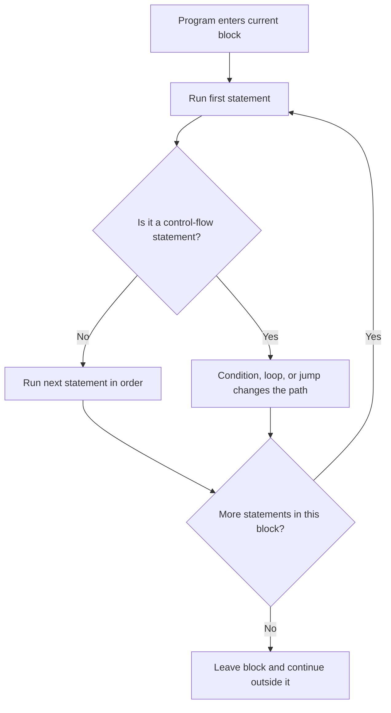

# Statements and Blocks

Statements are the executable units of a C# program. A statement tells the runtime to do something: declare a variable, call a method, make a decision, repeat work, or leave the current flow.

Blocks group statements together with braces, `{ }`. That grouping matters because blocks define scope, lifetime, and which statements belong to a condition, loop, method, or other construct.

This lesson is the foundation for the entire chapter. If you understand what a statement is, what a block is, and how execution moves through them, `if`, `switch`, loops, exceptions, and pattern matching become much easier to reason about.

## What counts as a statement

In C#, a statement is usually a complete instruction that ends with a semicolon or is wrapped in a control-flow form.

Common examples include:

- declaration statements
- expression statements
- selection statements such as `if`
- iteration statements such as `for` and `while`
- jump statements such as `return`, `break`, and `continue`
- exception-handling statements such as `try` and `throw`

```csharp
int count = 3;                 // declaration statement
count++;                       // expression statement
Console.WriteLine(count);      // expression statement

if (count > 0)                 // selection statement
{
    Console.WriteLine("Positive");
}
```

The important idea is that statements are about **actions**. Types describe data. Statements describe what the program does with that data.

## What a block does

A block is a group of zero or more statements enclosed in braces.

```csharp
{
    int x = 10;
    Console.WriteLine(x);
}
```

The braces do more than make code look organized. They create a local region where names exist.

Inside that block:

- `x` can be used
- other statements in the same block can read or change `x`

Outside that block:

- `x` no longer exists
- trying to use `x` causes a compile-time error

That is called **scope**.

## Statement flow at a glance

Most beginner confusion comes from not knowing what runs next. This diagram shows the basic idea.



By default, statements execute top to bottom. Control-flow constructs change that default path.

## Blocks and scope

Consider this example:

```csharp
int score = 85;

if (score >= 60)
{
    string message = "Passed";
    Console.WriteLine(message);
}

// Console.WriteLine(message); // Does not compile
```

The variable `message` exists only inside the `if` block. That rule is useful because it prevents temporary values from leaking into unrelated parts of the program.

This is one of the main reasons blocks matter. They do not just group code visually. They also define where variables are valid.

## Nested blocks

Blocks can appear inside other blocks.

```csharp
int temperature = 28;

if (temperature > 0)
{
    Console.WriteLine("Above freezing");

    if (temperature > 25)
    {
        Console.WriteLine("Warm day");
    }
}
```

Here there are two nested scopes:

- the outer `if` block
- the inner `if` block

Code in the inner block can use variables from the outer block, but not the other way around for variables declared only inside the inner block.

## A useful mental model

Read blocks like containers of valid context.

- a method block defines variables local to that method
- an `if` block defines work that happens only when a condition is true
- a loop block defines repeated work
- a `try` block defines the statements being watched for exceptions

Whenever you see braces, ask two questions:

1. Which statements belong together here?
2. Which variable names exist only inside this region?

## A worked example

The following sample shows declarations, a condition, nested blocks, and statement order working together.

```csharp
string customerName = "Mina";
decimal orderTotal = 125.50m;
bool isPremiumCustomer = true;

Console.WriteLine($"Checking order for {customerName}...");

if (orderTotal >= 100m)
{
    decimal discountRate = 0.10m;

    if (isPremiumCustomer)
    {
        discountRate = 0.15m;
    }

    decimal discountAmount = orderTotal * discountRate;
    decimal finalTotal = orderTotal - discountAmount;

    Console.WriteLine($"Discount applied: {discountAmount:C}");
    Console.WriteLine($"Final total: {finalTotal:C}");
}
else
{
    Console.WriteLine("No discount applied.");
}
```

Read it in this order:

1. The variables are declared.
2. The first `WriteLine` runs.
3. The `if (orderTotal >= 100m)` condition is tested.
4. Because the condition is true, execution enters that block.
5. `discountRate` is created and starts as `0.10m`.
6. The nested `if (isPremiumCustomer)` condition is tested.
7. Because that condition is also true, `discountRate` becomes `0.15m`.
8. The program calculates the discount and final total.
9. The two `WriteLine` calls inside the block run.
10. The block ends, and `discountRate`, `discountAmount`, and `finalTotal` go out of scope.

This kind of step-by-step tracing is worth practicing. Many control-flow mistakes become obvious when you narrate execution in order.

## Single statements versus blocks

Some C# constructs allow a single statement without braces:

```csharp
if (orderTotal > 0)
    Console.WriteLine("Valid order");
```

That is legal, but beginners should usually prefer braces:

```csharp
if (orderTotal > 0)
{
    Console.WriteLine("Valid order");
}
```

Why? Because braces make structure explicit and reduce bugs when another statement gets added later.

## Common mistakes

- Forgetting that a variable declared inside a block cannot be used outside it.
- Assuming indentation changes scope. In C#, braces define scope, not spacing.
- Omitting braces and later adding another line that does not actually belong to the `if` or loop.
- Reading code visually instead of tracing the actual statement order.

## Summary

Statements are the actions of a C# program. Blocks group statements and create scope.

If you remember only a few ideas from this lesson, remember these:

- statements describe what the program does
- blocks describe which statements belong together
- braces define scope
- execution normally moves top to bottom unless a control-flow statement changes it

These ideas will appear again in every remaining lesson in this chapter.

## Practice

Write a small program that declares a `bool hasPermission` variable and prints one message when it is `true` and another when it is `false`. Use braces even if each branch has only one line.

As a second exercise, declare a variable inside an `if` block and then try to use it outside the block. Predict the compiler error before you test it.
