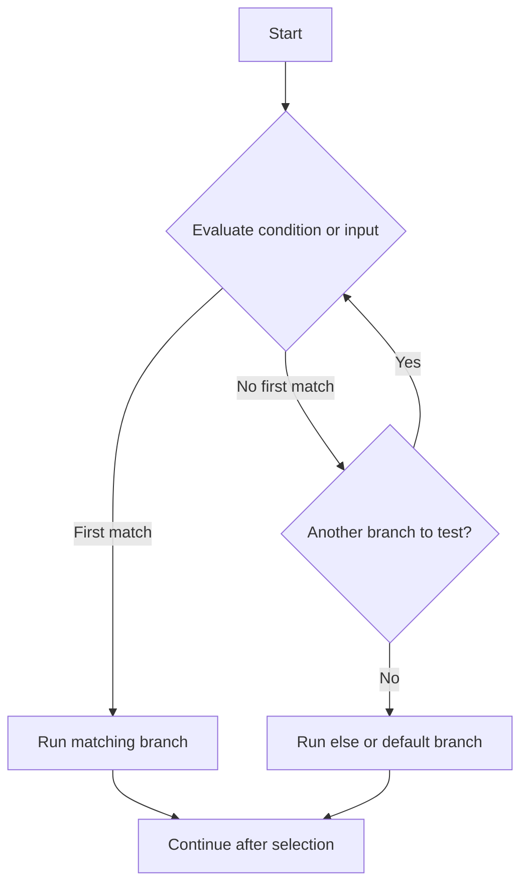

# Selection Statements

Selection statements let a program choose one path from several possibilities. Without them, code would only run top to bottom in a straight line.

This is the first major step from “code that executes” to “code that decides.” Real programs constantly ask questions such as:

- Is the input valid?
- Which menu option did the user choose?
- What status is this order in?
- Which branch should run for this type or value?

In C#, the most common selection tools are:

- `if`
- `if` / `else if` / `else`
- `switch` statements
- `switch` expressions

## The basic idea

Selection always starts with a question. The answer determines which block runs.



This is why selection code should be read in order. Each branch is an alternative path, not additional work that all runs together.

## `if` statements

Use `if` when you want to run code only when a boolean condition is true.

```csharp
int age = 20;

if (age >= 18)
{
    Console.WriteLine("Adult");
}
```

If the condition is true, the block runs. If it is false, the block is skipped.

This is the most direct form of decision-making in C#.

## `if` / `else`

Use `else` when exactly one of two paths should run.

```csharp
bool isLoggedIn = false;

if (isLoggedIn)
{
    Console.WriteLine("Show dashboard");
}
else
{
    Console.WriteLine("Show login screen");
}
```

Only one branch runs. That is important. An `else` block is not a second independent check. It is the fallback path when the `if` condition is false.

## `else if` chains

Use `else if` when you need several mutually exclusive choices.

```csharp
int score = 82;

if (score >= 90)
{
    Console.WriteLine("A");
}
else if (score >= 80)
{
    Console.WriteLine("B");
}
else if (score >= 70)
{
    Console.WriteLine("C");
}
else
{
    Console.WriteLine("Needs improvement");
}
```

The runtime checks conditions from top to bottom and stops at the first true branch.

That means ordering matters. If you put a broader condition first, later branches may never run.

## `switch` statements

Use a `switch` statement when you want to select behavior based on one value and several known cases.

```csharp
string command = "save";

switch (command)
{
    case "open":
        Console.WriteLine("Opening file...");
        break;
    case "save":
        Console.WriteLine("Saving file...");
        break;
    case "exit":
        Console.WriteLine("Closing application...");
        break;
    default:
        Console.WriteLine("Unknown command.");
        break;
}
```

This is often clearer than a long `if`/`else if` chain when each branch depends on the same input.

## `switch` expressions

`switch` expressions are a more compact form that return a value.

```csharp
int month = 3;

string quarter = month switch
{
    1 or 2 or 3 => "Q1",
    4 or 5 or 6 => "Q2",
    7 or 8 or 9 => "Q3",
    10 or 11 or 12 => "Q4",
    _ => "Invalid month"
};
```

This is especially useful when you are transforming one value into another.

## When to use which form

- Use `if` when the condition is a general boolean test.
- Use `if` / `else` when there are two clear alternatives.
- Use `else if` when order matters and you are checking several conditions.
- Use `switch` when one input is being compared against a known set of cases.
- Use a `switch` expression when you want to compute and return a value cleanly.

## A worked example

Imagine a checkout system that chooses shipping cost based on order amount and delivery speed.

```csharp
decimal orderTotal = 85m;
string shippingSpeed = "Express";

decimal shippingCost;

if (orderTotal >= 100m)
{
    shippingCost = 0m;
}
else if (shippingSpeed == "Express")
{
    shippingCost = 14.99m;
}
else if (shippingSpeed == "Standard")
{
    shippingCost = 5.99m;
}
else
{
    shippingCost = 9.99m;
}

Console.WriteLine($"Shipping cost: {shippingCost:C}");
```

Trace it carefully:

1. `orderTotal >= 100m` is checked first. It is false.
2. `shippingSpeed == "Express"` is checked next. It is true.
3. `shippingCost` becomes `14.99m`.
4. The rest of the chain is skipped.
5. The final line prints the result.

That “skip the rest after the first match” rule is one of the most important ideas in selection statements.

## Common mistakes

- Writing several `if` statements when only one branch should run. That usually means you wanted `else if`.
- Ordering conditions incorrectly, which can make later branches unreachable in practice.
- Forgetting a `default` branch in a `switch` when unmatched input is possible.
- Using a long `if` chain where a `switch` would express intent more clearly.

## Summary

Selection statements give your program alternatives.

The main things to remember are:

- `if` is for conditions
- `else` is the fallback path
- `else if` checks multiple alternatives in order
- `switch` is often clearer when one value chooses among many cases
- `switch` expressions are excellent when you need to produce a value

Good selection code is not just correct. It is easy to read in the same order the runtime evaluates it.

## Practice

Write an `if` / `else if` / `else` chain that prints a description for a temperature: cold, mild, warm, or hot.

As a second exercise, write a `switch` expression that converts a day number from `1` to `7` into a weekday name.
