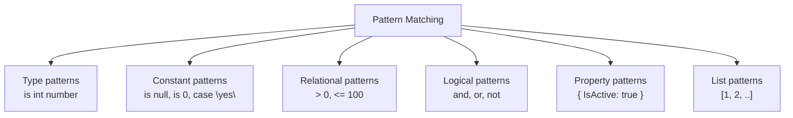

# Pattern Matching

Pattern matching lets you ask richer questions than simple equality or boolean conditions. Instead of asking only “is this true or false?”, you can ask things like:

- Is this value an `int`?
- Is it greater than `0`?
- Does this object have certain property values?
- Does this sequence start with a particular shape?

This makes code more expressive because the condition can describe **type**, **value**, **range**, and sometimes **structure** in one place.

## Why pattern matching matters

Without pattern matching, you often need several separate steps:

1. check a type
2. cast the value
3. inspect the casted value

Pattern matching combines these ideas into one readable construct.

```csharp
object value = 10;

if (value is int number && number > 5)
{
    Console.WriteLine($"Large integer: {number}");
}
```

That single `is` pattern both checks the runtime type and introduces a typed variable named `number`.

## Pattern types at a glance



You do not need every pattern form at once. Start with type, constant, relational, and logical patterns. Those are the most immediately useful.

## Type patterns

Type patterns check whether a value is a specific runtime type.

```csharp
object input = "hello";

if (input is string text)
{
    Console.WriteLine(text.ToUpper());
}
```

If the runtime object really is a `string`, the pattern succeeds and `text` becomes available inside the block.

This is usually clearer and safer than doing a direct cast first.

## Constant patterns

Constant patterns compare against a fixed value.

```csharp
string? command = null;

if (command is null)
{
    Console.WriteLine("No command provided.");
}
```

You will often see constant patterns with `null`, numbers, strings, and enum values.

## Relational and logical patterns

Relational patterns let you check ranges. Logical patterns let you combine checks.

```csharp
int temperature = 22;

if (temperature is >= 20 and <= 25)
{
    Console.WriteLine("Comfortable temperature");
}
```

This reads almost like a sentence, which is one reason modern pattern matching can improve readability.

## Property patterns

Property patterns inspect object members directly inside the pattern.

```csharp
var order = new { Total = 120m, IsPaid = true };

if (order is { Total: >= 100m, IsPaid: true })
{
    Console.WriteLine("Large paid order");
}
```

This is useful when you care about the shape of an object more than the object type alone.

## Pattern matching in `switch`

Patterns become especially powerful inside `switch` expressions or statements.

```csharp
object input = 15;

string description = input switch
{
    null => "No value",
    int number when number < 0 => "Negative integer",
    int number => $"Integer: {number}",
    string text => $"Text with length {text.Length}",
    _ => "Unknown value"
};
```

This is far richer than a basic `switch` on exact constant values.

## A useful mental model

Think of pattern matching as asking whether a value fits a description.

The description might be:

- a type
- an exact value
- a numeric range
- a logical combination of rules
- an object with certain properties

That is why pattern matching belongs in the flow-control chapter. It is decision logic, but more expressive than plain boolean comparisons.

## A worked example

Suppose a program receives mixed input from a command pipeline and wants to describe it safely.

```csharp
static string DescribeInput(object? input) => input switch
{
    null => "No value supplied",
    int number and < 0 => "Negative whole number",
    int number => $"Whole number: {number}",
    decimal amount and >= 100m => $"Large amount: {amount:C}",
    decimal amount => $"Amount: {amount:C}",
    string { Length: 0 } => "Empty text",
    string text => $"Text: {text}",
    _ => "Unsupported input type"
};
```

This example shows several important things at once:

- `null` is handled explicitly
- integer and decimal values can take different branches
- ranges can refine a type pattern
- strings can be matched by a property such as `Length`
- the discard pattern `_` acts as a fallback

This is often easier to read than a long sequence of casts and nested `if` statements.

## Common mistakes

- Using a direct cast when a type pattern would be safer.
- Writing patterns in an order where broader matches come before more specific ones.
- Forgetting that pattern variables exist only where the pattern is known to have matched.
- Introducing complex patterns without making the intent clearer.

Pattern matching is powerful, but it should still improve readability rather than turn conditions into puzzles.

## Summary

Pattern matching lets C# express decision logic in a more descriptive way.

The core beginner-friendly forms are:

- type patterns
- constant patterns
- relational patterns
- logical patterns
- property patterns

When used well, patterns reduce manual casts, make intent clearer, and keep condition logic closer to the shape of the data being tested.

## Practice

Write an `if` statement that uses a type pattern to check whether an `object` contains a `string`, and if it does, print the string length.

As a second exercise, write a `switch` expression that classifies an `int` as negative, zero, small positive, or large positive using relational patterns.
