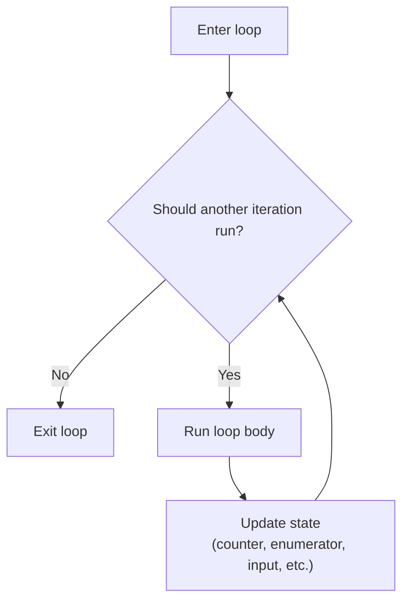

# Iteration Statements

Iteration statements repeat work. Instead of writing the same code many times, you describe a repeating pattern and let the runtime execute it as many times as needed.

This matters because many programming tasks are repetitive by nature:

- processing every item in a list
- reading input until the user is done
- retrying an operation until a condition changes
- counting through a numeric range

C# has several loop forms because repeated work is not always the same problem.

## The main loop forms

- `while`
- `do`
- `for`
- `foreach`

## Loop flow at a glance



Every loop has the same big idea:

1. decide whether to keep going
2. run the body
3. update something
4. test again

The loop form you choose changes how those parts are expressed.

## `while`

Use `while` when you want to keep looping as long as a condition remains true.

```csharp
int count = 0;

while (count < 3)
{
    Console.WriteLine(count);
    count++;
}
```

The condition is tested **before** each iteration. If it is false at the start, the body does not run at all.

## `do` loops

Use `do` when the body must run at least once.

```csharp
int option;

do
{
    Console.WriteLine("Enter 0 to quit:");
    option = int.Parse(Console.ReadLine() ?? "0");
}
while (option != 0);
```

The condition is tested **after** the body. That guarantees at least one iteration.

## `for`

Use `for` when iteration is controlled by a counter.

```csharp
for (int i = 0; i < 5; i++)
{
    Console.WriteLine(i);
}
```

The `for` loop places initialization, condition, and update in one compact header:

- initialization: `int i = 0`
- condition: `i < 5`
- update: `i++`

This is often the clearest loop when counting, indexing, or stepping through a numeric range.

## `foreach`

Use `foreach` when you want to iterate through every element in a collection.

```csharp
string[] names = { "Ava", "Noah", "Lina" };

foreach (string name in names)
{
    Console.WriteLine(name);
}
```

`foreach` is often the safest and cleanest loop for collections because it focuses on the elements rather than indexes.

## Choosing the right loop

- Use `while` for condition-driven repetition.
- Use `do` when at least one run must happen.
- Use `for` for counter-based repetition.
- Use `foreach` for collection traversal.

Choosing the right loop is not just a style issue. It reduces bugs by matching the code structure to the problem structure.

## A worked example

Suppose you want to total monthly sales stored in an array.

```csharp
decimal[] monthlySales = { 1200m, 1350m, 1100m, 1500m };
decimal total = 0m;

foreach (decimal sale in monthlySales)
{
    total += sale;
}

Console.WriteLine($"Total sales: {total:C}");
```

This is a good `foreach` use case because:

- you want every element
- you do not need the index
- the code reads naturally as “for each sale in monthlySales”

Now compare it with a `for` loop:

```csharp
decimal total = 0m;

for (int i = 0; i < monthlySales.Length; i++)
{
    total += monthlySales[i];
}
```

This also works, but it is better suited when you actually need the index.

## Loop variables and scope

Variables declared inside a loop body belong to that block.

```csharp
for (int i = 0; i < 2; i++)
{
    string label = $"Item {i}";
    Console.WriteLine(label);
}

// Console.WriteLine(label); // Does not compile
```

That is the same scope rule you saw in the previous lesson: blocks define where names exist.

## Infinite loops and termination

Every loop needs a believable way to stop.

These questions help:

- What changes between iterations?
- Which condition will eventually become false?
- Is input guaranteed to change?

If nothing changes, the loop may never end.

```csharp
while (true)
{
    Console.WriteLine("This runs forever unless something breaks out.");
}
```

Infinite loops are sometimes intentional, but beginners create them accidentally by forgetting to update loop state.

## Common mistakes

- Forgetting to update the counter or condition state.
- Using `for` when `foreach` would be clearer.
- Modifying collection structure during a `foreach` in unsupported ways.
- Writing loop conditions that are off by one, such as using `<=` when `<` was intended.

## Summary

Iteration statements repeat work, but each loop form has a specific strength:

- `while` for condition-based repetition
- `do` for at-least-once repetition
- `for` for counter-controlled repetition
- `foreach` for processing every item in a sequence

Good loop code makes it obvious what repeats, what changes, and what eventually stops the repetition.

## Practice

Write a `for` loop that prints the numbers `1` through `10`.

As a second exercise, create an array of three course names and use `foreach` to print each one on its own line.
