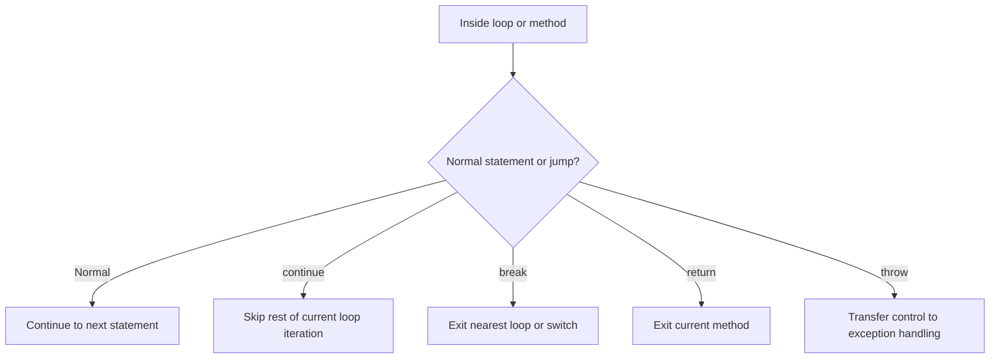

# Jump Statements

Jump statements transfer control immediately from one place to another. They interrupt the normal top-to-bottom flow of statements.

That sounds dramatic, but jump statements are common and useful when they express intent clearly. They let you:

- stop a loop early
- skip the rest of the current iteration
- leave a method
- signal an error

The most common jump statements in everyday C# are:

- `break`
- `continue`
- `return`
- `throw`

There is also `goto`, but it is rare in modern C# and should usually be avoided in beginner code.

## How jump flow changes execution



The key idea is that jump statements do not just do work. They change **where execution goes next**.

## `break`

`break` exits the nearest enclosing loop or `switch`.

```csharp
for (int i = 0; i < 10; i++)
{
    if (i == 4)
    {
        break;
    }

    Console.WriteLine(i);
}
```

This prints `0`, `1`, `2`, and `3`, then stops the loop completely.

Use `break` when the loop's job is finished before reaching its normal end.

## `continue`

`continue` skips the rest of the current loop iteration and starts the next one.

```csharp
for (int i = 0; i < 5; i++)
{
    if (i == 2)
    {
        continue;
    }

    Console.WriteLine(i);
}
```

This prints `0`, `1`, `3`, and `4`. When `i` is `2`, the remaining statements in the loop body are skipped.

## `return`

`return` exits the current method. If the method has a return type, it also provides the result.

```csharp
static int Square(int number)
{
    return number * number;
}
```

You can also use `return;` in a `void` method to leave early.

```csharp
static void PrintName(string? name)
{
    if (string.IsNullOrWhiteSpace(name))
    {
        return;
    }

    Console.WriteLine(name);
}
```

This pattern is often called an **early return**. It can reduce nesting and make code easier to follow.

## `throw`

`throw` stops normal execution and signals an exception.

```csharp
static int Divide(int left, int right)
{
    if (right == 0)
    {
        throw new DivideByZeroException("Right operand cannot be zero.");
    }

    return left / right;
}
```

Unlike `break` or `return`, `throw` does not merely move to another nearby statement. It transfers control into exception-handling flow.

## `goto`

`goto` jumps to a labeled statement. It exists in C#, but it is rarely the best choice.

```csharp
// Example only; usually avoid this style.
start:
Console.WriteLine("Hello");
```

Beginners should usually avoid `goto` because it can make flow harder to trace.

## A worked example

Suppose you want to search a list of product codes and stop as soon as a match is found.

```csharp
string[] productCodes = { "A100", "B205", "C310", "D450" };
string searchCode = "C310";
bool found = false;

foreach (string code in productCodes)
{
    if (code != searchCode)
    {
        continue;
    }

    Console.WriteLine($"Found product: {code}");
    found = true;
    break;
}

if (!found)
{
    Console.WriteLine("Product not found.");
}
```

Trace the flow carefully:

1. The loop starts with `A100`.
2. Because it does not match, `continue` skips to the next iteration.
3. The same happens for `B205`.
4. When `C310` is reached, the `continue` path is not taken.
5. The program prints the match, sets `found` to `true`, and uses `break` to exit the loop.
6. The final `if` sees that `found` is true, so it does not print the “not found” message.

This example shows how `continue` and `break` solve different problems:

- `continue` skips irrelevant work
- `break` stops the loop once the goal is reached

## Common mistakes

- Using too many jump statements in one block, which can make flow hard to read.
- Forgetting that `break` exits only the nearest loop or `switch`.
- Using `continue` when a simple `if` block would be clearer.
- Throwing exceptions for normal expected cases that should be handled with regular conditions instead.

## Summary

Jump statements change where execution goes next.

The most important ones are:

- `break` to leave a loop or `switch`
- `continue` to skip to the next loop iteration
- `return` to leave a method
- `throw` to signal an exception

Used well, they simplify code. Used carelessly, they can make code feel scattered. The goal is always clearer control flow, not more surprising control flow.

## Practice

Write a loop that prints numbers from `1` to `10` but skips `5` using `continue`.

As a second exercise, write a method that returns early when a string argument is `null` or empty, and otherwise prints the string in uppercase.
