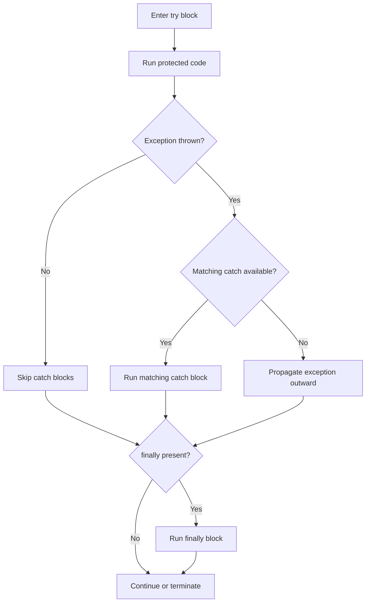

# Exception-Handling Statements

Exception-handling statements separate normal program flow from failure flow. They let you describe what should happen when an operation cannot complete as expected.

This matters because real programs work with uncertain input and unreliable environments:

- text may fail to parse
- files may not exist
- network calls may fail
- objects may be in an invalid state

If all error logic is mixed directly into the main path, code quickly becomes harder to read. Exception handling provides a structured alternative.

## The main exception-handling statements

- `try`
- `catch`
- `finally`
- `throw`

## Exception flow at a glance



This diagram captures the most important idea: exceptions do not follow normal statement-by-statement flow. They interrupt it.

## `try` and `catch`

Use `try` for the code that might fail and `catch` for the code that handles a matching exception.

```csharp
try
{
    int number = int.Parse("not-a-number");
}
catch (FormatException ex)
{
    Console.WriteLine($"Input was invalid: {ex.Message}");
}
```

Here is the flow:

1. The program enters the `try` block.
2. `int.Parse` throws a `FormatException`.
3. Normal execution of the `try` block stops immediately.
4. The matching `catch` block runs.

Any statements after the point of failure inside the `try` block are skipped.

## Multiple `catch` blocks

Different failures often need different responses.

```csharp
try
{
    string text = File.ReadAllText("settings.txt");
    Console.WriteLine(text);
}
catch (FileNotFoundException)
{
    Console.WriteLine("The settings file was not found.");
}
catch (UnauthorizedAccessException)
{
    Console.WriteLine("The file exists, but access is denied.");
}
```

The runtime chooses the first compatible `catch` block. That means order matters, especially when exceptions are related by inheritance.

## `finally`

Use `finally` for cleanup work that should happen whether the protected code succeeds or fails.

```csharp
StreamReader? reader = null;

try
{
    reader = new StreamReader("data.txt");
    Console.WriteLine(reader.ReadLine());
}
catch (IOException ex)
{
    Console.WriteLine(ex.Message);
}
finally
{
    reader?.Dispose();
}
```

`finally` is about guaranteed cleanup. It is not mainly for error messages. It is for things the program must still do on the way out.

## `throw`

`throw` creates or rethrows an exception.

```csharp
static decimal CalculateUnitPrice(decimal total, int quantity)
{
    if (quantity <= 0)
    {
        throw new ArgumentOutOfRangeException(nameof(quantity), "Quantity must be greater than zero.");
    }

    return total / quantity;
}
```

This is how code signals that execution cannot continue normally.

## Rethrowing exceptions correctly

If you catch an exception only to log it and pass it along, prefer `throw;` instead of `throw ex;`.

```csharp
catch (Exception)
{
    throw;
}
```

`throw;` preserves the original stack trace more accurately.

## Exceptions versus normal validation

One of the most important design habits is knowing when **not** to use exceptions.

Use regular conditions for expected situations:

- checking whether input is empty
- using `TryParse` for user-entered text
- testing whether a collection has items

Use exceptions for abnormal or failed operations:

- a required file is missing
- an invalid state makes the operation impossible
- an argument violates a method contract

For example, this is often better than relying on exceptions for user input:

```csharp
if (int.TryParse("42", out int result))
{
    Console.WriteLine(result);
}
else
{
    Console.WriteLine("Input was not a valid integer.");
}
```

## A worked example

Imagine a method that reads a quantity from text, rejects invalid input, and always logs that processing finished.

```csharp
string input = "12";

try
{
    int quantity = int.Parse(input);

    if (quantity <= 0)
    {
        throw new ArgumentOutOfRangeException(nameof(quantity), "Quantity must be positive.");
    }

    Console.WriteLine($"Quantity accepted: {quantity}");
}
catch (FormatException)
{
    Console.WriteLine("The quantity must be a whole number.");
}
catch (ArgumentOutOfRangeException ex)
{
    Console.WriteLine(ex.Message);
}
finally
{
    Console.WriteLine("Processing finished.");
}
```

This example shows three different roles:

- `try` contains the risky work
- `catch` handles specific failures
- `finally` runs cleanup or finalization logic

## Common mistakes

- Catching `Exception` too broadly when only a specific exception should be handled.
- Using exceptions for ordinary control flow that should be handled with conditions.
- Swallowing exceptions silently without logging, fixing, or rethrowing them.
- Putting too much code in one `try` block, which makes it harder to see what really might fail.

## Summary

Exception-handling statements let you describe failure paths without mixing them into every normal statement.

The main ideas are:

- `try` protects code that may fail
- `catch` handles specific exceptions
- `finally` runs cleanup logic
- `throw` signals a failure explicitly

Good exception handling is specific, deliberate, and focused on real failure scenarios rather than ordinary branching.

## Practice

Write a small example that uses `int.Parse` inside a `try` block and handles `FormatException`.

As a second exercise, write a method that throws `ArgumentException` when a required string parameter is empty or whitespace.
