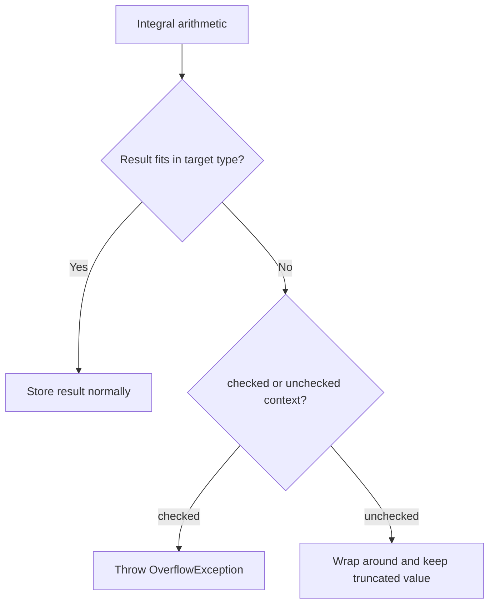

# Checked and Unchecked

Overflow happens when a numeric calculation produces a value outside the range a type can store. For fixed-size integral types such as `int`, `long`, `short`, and `byte`, that can change the result dramatically.

C# lets you make overflow behavior explicit with `checked` and `unchecked`.

This topic matters because overflow bugs can produce incorrect results that look valid at first glance. They are often harder to notice than a visible exception.

## The problem overflow solves

An `int` has a maximum value of `2,147,483,647`.

What should happen if you add `1` to that value?

That depends on the overflow context.

## Overflow behavior at a glance



This is the core difference:

- `checked` makes overflow visible by throwing
- `unchecked` allows wraparound behavior

## `checked`

Use `checked` when overflow should be treated as a bug or invalid calculation.

```csharp
checked
{
    int max = int.MaxValue;
    int next = max + 1;
}
```

In a checked context, this throws an `OverflowException`.

That is often the safer choice for calculations where wrong results are unacceptable.

## `unchecked`

Use `unchecked` when wraparound behavior is acceptable or intentionally required.

```csharp
unchecked
{
    int max = int.MaxValue;
    int next = max + 1;
    Console.WriteLine(next);
}
```

In an unchecked context, the value wraps around to `int.MinValue`.

That behavior is usually surprising to beginners, which is why the topic deserves explicit attention.

## Statement form and expression form

You can use `checked` and `unchecked` as statements:

```csharp
checked
{
    int result = int.MaxValue + 1;
}
```

Or as expressions:

```csharp
int result = checked(int.MaxValue + 1);
```

The expression form is useful when you want to make the overflow rule explicit for one calculation.

## What types are affected

This topic mainly applies to integral arithmetic and conversions where the target type has a fixed range.

Examples include:

- `int`
- `long`
- `short`
- `byte`
- `uint`
- `ulong`

The important idea is that the type has a hard numeric boundary.

## A worked example

Suppose a program tracks a serial number using `int` and increments it repeatedly.

```csharp
int serialNumber = int.MaxValue;

try
{
    serialNumber = checked(serialNumber + 1);
    Console.WriteLine(serialNumber);
}
catch (OverflowException)
{
    Console.WriteLine("Serial number overflowed.");
}
```

Here the overflow is treated as a real problem, not silently ignored.

Now compare an unchecked version:

```csharp
int serialNumber = int.MaxValue;
serialNumber = unchecked(serialNumber + 1);

Console.WriteLine(serialNumber);
```

This prints a negative value because the result wrapped around.

## Why this matters in real code

Overflow matters most when the number has domain meaning, such as:

- counts
- IDs
- balances
- scores
- sizes
- array indexes

If a value silently wraps, the program may continue running while using incorrect data.

## Common mistakes

- Assuming numeric overflow always throws automatically.
- Forgetting that unchecked overflow can produce believable but wrong results.
- Using small numeric types without thinking about growth over time.
- Ignoring overflow in calculations that represent money, inventory, or identifiers.

## Summary

`checked` and `unchecked` control what happens when an integral calculation exceeds the target type's range.

- `checked` throws an exception
- `unchecked` wraps around

The main lesson is not just syntax. It is intent. You should decide whether overflow means “stop, this is invalid” or “wraparound is acceptable here.”

## Practice

Write a short sample that demonstrates `checked(int.MaxValue + 1)` and explain why it fails.

As a second exercise, write an `unchecked` example and predict the resulting value before you run it.
