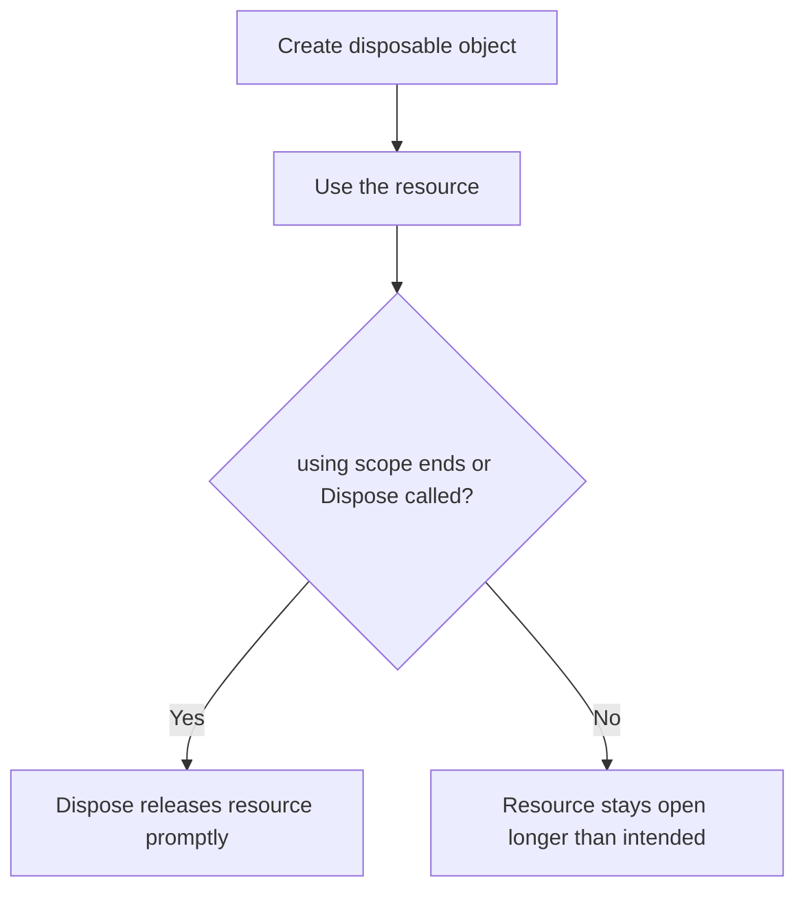

# Using and Dispose Patterns

Some objects need cleanup as soon as you are done with them because they manage external resources, not just memory. Examples include files, network streams, database connections, and some writers or readers.

C# uses `using` and the dispose pattern to make this cleanup explicit and reliable.

This topic matters because garbage collection does **not** mean “all cleanup happens immediately.” The garbage collector manages managed memory, but many important resources need earlier, deterministic cleanup.

## Why disposal exists

An object such as a file stream may hold:

- an operating system file handle
- a network connection
- a buffered writer
- unmanaged resources outside the normal managed heap model

If you wait too long to release those resources, your program may:

- lock files longer than necessary
- waste system resources
- fail to open additional resources later

## The dispose flow at a glance



The central idea is deterministic cleanup: when the scope ends, disposal happens right away.

## `IDisposable`

Many disposable types implement `IDisposable`. That interface provides a `Dispose()` method.

```csharp
using var writer = new StringWriter();
writer.WriteLine("Disposable resource in use");
Console.WriteLine(writer.ToString());
```

When the enclosing scope ends, `writer.Dispose()` is called automatically.

## `using` statement

The traditional `using` statement wraps a block.

```csharp
using (var writer = new StringWriter())
{
    writer.WriteLine("Hello");
    Console.WriteLine(writer.ToString());
}
```

This says clearly: the object is needed only inside this block.

## `using` declaration

The newer `using` declaration is often shorter and more convenient.

```csharp
using var writer = new StringWriter();
writer.WriteLine("Hello");
Console.WriteLine(writer.ToString());
```

This object is disposed at the end of the current scope.

## Mental model: `using` is a cleanup promise

You can think of `using` as syntax sugar for a `try` / `finally` shape.

```csharp
StringWriter writer = new StringWriter();

try
{
    writer.WriteLine("Hello");
}
finally
{
    writer.Dispose();
}
```

That is why `using` belongs in a control-flow chapter. It is not only about objects. It is about what must happen when execution leaves a scope.

## A worked example

Suppose you want to write some text into a memory-backed writer and then print the final result.

```csharp
using var writer = new StringWriter();

writer.WriteLine("Report");
writer.WriteLine("------");
writer.WriteLine("Completed successfully");

string report = writer.ToString();
Console.WriteLine(report);
```

Trace the lifetime:

1. `writer` is created.
2. The program uses it for several operations.
3. `ToString()` reads the buffered text.
4. The scope ends.
5. `Dispose()` is called automatically.

Even though `StringWriter` is a simple example, the same pattern matters much more for files and streams.

## When to dispose

Dispose when a type says it owns a resource that should be released promptly.

Typical examples include:

- `FileStream`
- `StreamReader`
- `StreamWriter`
- many database-related objects
- many networking objects

Not every object should be disposed. Only dispose types designed for it.

## Common mistakes

- Forgetting to dispose an object that owns a real resource.
- Disposing too early and then trying to keep using the object.
- Assuming garbage collection is a replacement for prompt resource cleanup.
- Wrapping non-disposable types in `using` just because they are objects.

## Summary

`using` and the dispose pattern help C# programs release important resources at the right time.

The main ideas are:

- some resources need cleanup before garbage collection would naturally run
- `IDisposable` provides a cleanup contract
- `using` ensures cleanup when scope ends
- `using` is closely related to `try` / `finally` behavior

Good disposal code makes resource lifetime obvious.

## Practice

Write a short sample that uses `using var` with `StringWriter` and prints the generated text.

As a second exercise, rewrite the same sample with the block form of `using`.
