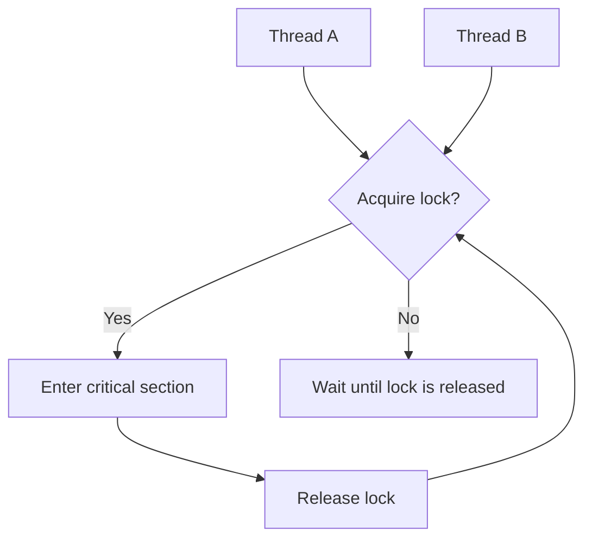

# Lock Statement

When multiple threads can access the same mutable data, the program may behave incorrectly unless access is coordinated. The `lock` statement is one of the simplest built-in ways to protect a critical section.

This topic matters because concurrent code introduces a new class of bugs. The code may compile and look correct, but different thread interleavings can still produce wrong results.

## The problem: race conditions

A race condition happens when multiple threads read and write shared state without proper synchronization.

For example, imagine two threads doing this at the same time:

1. read `counter`
2. add `1`
3. write the updated value back

If both threads read the same old value before either writes the new one, one update can be lost.

## What `lock` does

`lock` allows only one thread at a time to execute the protected block for a given lock object.



This is the basic idea: one thread enters, others wait.

## Basic syntax

```csharp
object gate = new();
int counter = 0;

lock (gate)
{
    counter++;
}
```

The object inside `lock (...)` is the synchronization token. All threads that need to coordinate must lock on the same object.

## Why the block matters

Everything inside the `lock` block is treated as one protected region.

That means you should keep the block:

- small
- focused
- limited to the shared state that needs protection

Large lock blocks increase waiting and make concurrency slower.

## A worked example

Suppose a banking application updates a shared balance from multiple threads.

```csharp
object balanceLock = new();
decimal balance = 1000m;

void Withdraw(decimal amount)
{
    lock (balanceLock)
    {
        if (amount <= balance)
        {
            balance -= amount;
            Console.WriteLine($"Withdrew {amount:C}. New balance: {balance:C}");
        }
        else
        {
            Console.WriteLine("Insufficient funds.");
        }
    }
}
```

The whole read-check-update sequence is inside the lock. That is important.

If only part of that logic were protected, another thread could change `balance` between the check and the update.

## A useful mental model

Think of `lock` as “reserve exclusive access to this shared thing while I do a small, important operation.”

It is not a general tool for making complex code safe by default. It protects a specific critical section.

## Lock-object guidelines

Prefer locking on a private dedicated object:

```csharp
private readonly object _gate = new();
```

Avoid locking on:

- `this`
- strings
- publicly accessible objects
- type objects unless you intentionally want application-wide coordination

Those choices can create unexpected interactions because other code may also lock on the same object.

## Common mistakes

- Locking on the wrong object so threads are not actually coordinated.
- Using different lock objects for the same shared state.
- Holding the lock while doing slow work that does not need protection.
- Assuming `lock` makes all concurrency problems disappear automatically.

## Summary

The `lock` statement protects a critical section so only one thread at a time can execute it for a given synchronization object.

The key ideas are:

- use it for shared mutable state
- protect the whole read-modify-write sequence
- keep the locked region small
- use a dedicated private lock object

Concurrency is a deeper topic than one keyword, but `lock` gives you a practical first tool for making shared-state access safer.

## Practice

Write a sample with a shared `int counter` and a dedicated lock object, then increment the counter inside a `lock` block.

As a second exercise, explain why locking on `this` is usually a weaker design than locking on a private field.
