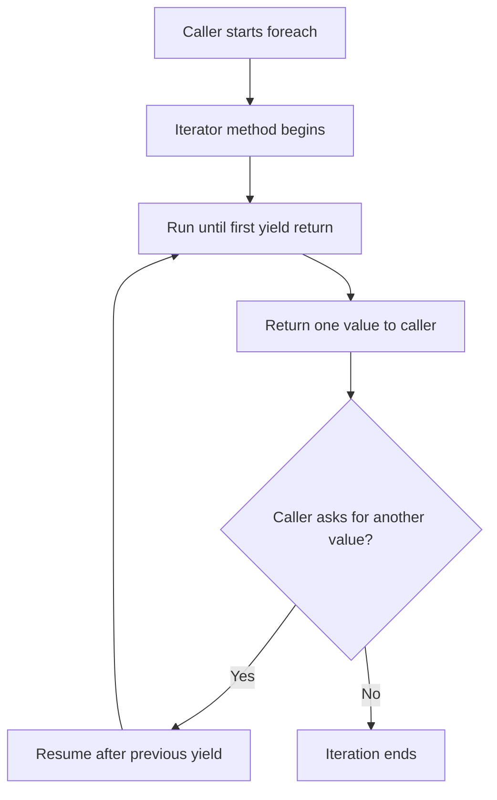

# Yield Statement

The `yield` statement lets a method produce sequence values one at a time instead of building the entire result up front. This is one of the clearest examples of lazy execution in C#.

That matters because sometimes you do not want to create a whole collection immediately. You want to describe **how values are produced** and let callers consume them as needed.

## The main idea

An ordinary method usually finishes all its work before returning. A method that uses `yield return` can pause after producing one value, then resume later when the caller asks for the next value.

```csharp
static IEnumerable<int> CountToThree()
{
    yield return 1;
    yield return 2;
    yield return 3;
}
```

This does not mean the whole sequence is built immediately in memory. It means the method defines an iterator.

## Lazy iteration flow



This is the most important mental model for `yield`: the method pauses and resumes.

## `yield return`

`yield return` produces one value in a sequence.

```csharp
static IEnumerable<string> GetNames()
{
    yield return "Ava";
    yield return "Liam";
    yield return "Mina";
}
```

Each time the caller asks for the next item, the iterator resumes until it reaches the next `yield return`.

## `yield break`

`yield break` ends the iteration early.

```csharp
static IEnumerable<int> GetPositiveNumbers(int[] values)
{
    foreach (int value in values)
    {
        if (value < 0)
        {
            yield break;
        }

        yield return value;
    }
}
```

Once `yield break` runs, the sequence ends.

## A worked example

Suppose you want a method that returns even numbers from `1` through a chosen limit.

```csharp
static IEnumerable<int> GetEvenNumbers(int limit)
{
    for (int i = 1; i <= limit; i++)
    {
        if (i % 2 == 0)
        {
            yield return i;
        }
    }
}

foreach (int number in GetEvenNumbers(10))
{
    Console.WriteLine(number);
}
```

Notice what the iterator method is doing:

- it does not create a `List<int>`
- it does not need to store all even numbers first
- it yields each value at the moment it is discovered

This is often a more natural way to express sequence generation.

## Why `yield` is useful

`yield` is especially useful when:

- the sequence may be large
- values can be generated one by one
- callers may stop early
- you want iteration logic without manually implementing `IEnumerator`

It keeps sequence-generation code readable while still enabling deferred execution.

## A useful mental model

Think of an iterator method as a machine that knows how to produce the next item whenever asked.

It does not necessarily do all the work immediately. It does just enough work to produce the next value.

## Common mistakes

- Assuming the whole sequence runs immediately when the method is called.
- Forgetting that side effects inside iterator methods may happen later during enumeration, not at method call time.
- Using `yield` when a simple prebuilt collection would be clearer and perfectly small.
- Expecting `yield return` to behave like a normal `return`. It returns one item, not the final result of the whole method.

## Summary

The `yield` statement makes lazy iteration simple to express.

The main ideas are:

- `yield return` produces one item at a time
- the method pauses and resumes during enumeration
- `yield break` ends the sequence
- iterators are useful for generating or filtering sequences lazily

This is one of the most elegant control-flow features in C# because it changes not only what code does, but when that code does it.

## Practice

Write an iterator method that yields the numbers `1` through `5`.

As a second exercise, write an iterator that yields only words longer than three characters from an array of strings.
