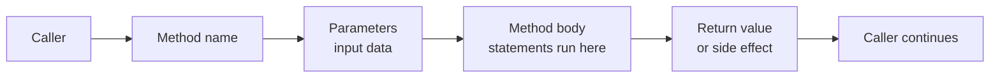

# Methods

Methods are one of the main ways behavior is organized in C#. A variable stores data. A method performs an operation.

That operation might:

- calculate a result
- validate input
- update state
- print output
- coordinate several smaller steps

If types answer the question “what kind of data is this?”, methods answer the question “what can this code do?”

This chapter starts with methods because many later features are really refinements of method design. Parameters, return values, local functions, lambdas, delegates, and events all become easier once the core idea of a method is clear.

## A method at a glance



Read this left to right:

1. the caller invokes the method
2. arguments are passed in through parameters
3. the method body executes
4. the method may return a value, cause a side effect, or both

## Basic method syntax

```csharp
static int Square(int value)
{
    return value * value;
}

Console.WriteLine(Square(4));
```

This method has several parts:

- `static` is a modifier
- `int` is the return type
- `Square` is the method name
- `(int value)` is the parameter list
- the braces contain the method body

The call `Square(4)` passes an argument into the method and receives an `int` result back.

## Why methods matter

Without methods, programs become long sequences of repeated statements. Methods improve code by:

- reducing duplication
- giving names to reusable behavior
- making code easier to test and explain
- separating one responsibility from another

For example, instead of writing discount logic in five places, you can write one method and call it when needed.

## Calling a method

Calling a method means asking it to run.

```csharp
static void PrintWelcome()
{
    Console.WriteLine("Welcome to the app.");
}

PrintWelcome();
```

Here the method returns `void`, which means it does not give a result value back to the caller. It still does work by printing output.

This is an important distinction:

- some methods return a value
- some methods perform an action only
- some methods do both

## Parameters and arguments

Parameters are the names listed in the method declaration. Arguments are the actual values provided at the call site.

```csharp
static decimal CalculateTax(decimal price, decimal rate)
{
    return price * rate;
}

decimal tax = CalculateTax(100m, 0.15m);
```

In this example:

- `price` and `rate` are parameters
- `100m` and `0.15m` are arguments

This difference matters because methods are designed around parameters, while callers work with arguments.

## Return types

A method's return type tells callers what kind of result to expect.

```csharp
static string FormatName(string firstName, string lastName)
{
    return $"{lastName}, {firstName}";
}
```

Because the return type is `string`, callers know the method produces text.

If the return type is `void`, the method produces no direct result value.

## Method bodies are blocks

Like `if` statements and loops, methods use blocks. That means variables declared inside a method are local to that method.

```csharp
static int Add(int left, int right)
{
    int total = left + right;
    return total;
}

// Console.WriteLine(total); // Does not compile
```

The variable `total` exists only inside `Add`.

This is one of the reasons methods help manage complexity. They give code its own local workspace.

## A worked example

Suppose you are writing a small checkout helper.

```csharp
static decimal CalculateFinalPrice(decimal basePrice, decimal discountRate)
{
    decimal discountAmount = basePrice * discountRate;
    decimal finalPrice = basePrice - discountAmount;
    return finalPrice;
}

decimal finalPrice = CalculateFinalPrice(200m, 0.10m);
Console.WriteLine($"Final price: {finalPrice:C}");
```

Read it from the caller's point of view:

1. the caller provides `200m` and `0.10m`
2. the method calculates the discount amount
3. the method calculates the reduced price
4. the method returns the final result
5. the caller stores and prints the returned value

This is a good example of what methods are for: they package one meaningful operation behind a clear name.

## A good method name does real work

Method names should describe behavior, not implementation detail.

Better names usually sound like actions:

- `CalculateFinalPrice`
- `PrintSummary`
- `TryParseAge`
- `SendEmail`

Weak names often hide meaning:

- `DoThing`
- `Run`
- `ProcessData`

The method name is part of the API. Callers should not need to inspect the body to guess what it does.

## A useful mental model

Think of a method as a small service with a contract:

- the name tells you what it does
- the parameters tell you what it needs
- the return type tells you what it gives back
- the body describes how it gets the job done

That contract-centered view becomes especially important later when you design public APIs or reusable helper methods.

## Common mistakes

- Giving methods vague names that do not reveal intent.
- Making one method do too many unrelated things.
- Hiding important output in side effects when a return value would be clearer.
- Repeating the same logic in multiple places instead of extracting a method.

## Summary

Methods are reusable named units of behavior.

The main ideas are:

- methods package actions and calculations
- parameters receive input
- return types describe the result
- method bodies create local scope
- good method names improve readability at the call site

Every later topic in this chapter builds on this foundation.

## Practice

Write a method named `Multiply` that takes two `int` parameters and returns their product.

As a second exercise, write a `void` method that prints a short welcome message, then compare how its call site differs from a method that returns a value.
