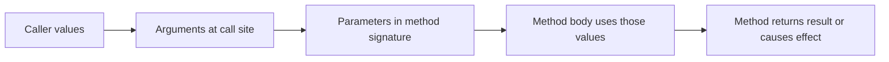

# Method Parameters

Parameters define the input a method expects. They are one of the most important parts of method design because they shape how callers interact with the method.

When you read a method signature, parameters answer questions such as:

- What information does this method need?
- Can the method change the caller's variable?
- Is the input required or optional?
- Does the API feel simple or awkward to call?

Good parameter design makes a method predictable at the call site.

## Parameters versus arguments

A parameter is the name in the method declaration. An argument is the actual value passed by the caller.

```csharp
static int Add(int left, int right)
{
    return left + right;
}

int sum = Add(3, 4);
```

In this example:

- `left` and `right` are parameters
- `3` and `4` are arguments

That vocabulary matters because method design happens in terms of parameters, while method usage happens in terms of arguments.

## Parameter flow at a glance



In the most common case, the caller passes values in, and the method works with its own local parameter variables.

## Value parameters

By default, C# passes arguments by value.

```csharp
static void PrintDouble(int number)
{
    number *= 2;
    Console.WriteLine(number);
}

int value = 10;
PrintDouble(value);
Console.WriteLine(value);
```

This prints `20` inside the method, but `value` remains `10` afterward.

That is because the method received its own copy of the value parameter.

For value types, this often means the caller's original variable is not changed.

## `ref` parameters

`ref` passes a variable by reference, which means the method can work with the caller's actual variable rather than a separate copy.

```csharp
static void Increment(ref int value)
{
    value++;
}

int count = 5;
Increment(ref count);
Console.WriteLine(count);
```

This prints `6` because the method changed the caller's variable directly.

Notice that `ref` must appear in both places:

- in the method declaration
- at the call site

That explicit syntax is important because it makes the stronger behavior visible.

## `out` parameters

`out` parameters are used when a method needs to assign a value back through a parameter.

```csharp
static bool TryGetDiscount(string customerType, out decimal rate)
{
    if (customerType == "Premium")
    {
        rate = 0.15m;
        return true;
    }

    rate = 0m;
    return false;
}
```

An `out` parameter must be assigned inside the method before the method returns.

This style is common in APIs such as `TryParse`:

```csharp
if (int.TryParse("42", out int number))
{
    Console.WriteLine(number);
}
```

## `in` parameters

`in` passes an argument by reference for reading only.

```csharp
static decimal CalculateTax(in decimal price, in decimal rate)
{
    return price * rate;
}
```

This can be useful in more advanced scenarios, especially with larger value types, but beginners should mainly remember the intent: the method can read the value without being allowed to reassign it.

## `params` parameters

`params` lets callers supply a variable number of arguments.

```csharp
static int Sum(params int[] values)
{
    int total = 0;

    foreach (int value in values)
    {
        total += value;
    }

    return total;
}

Console.WriteLine(Sum(1, 2, 3, 4));
```

This is useful when a method naturally accepts “zero or more” values.

## A worked example

Suppose you want a method that updates an account balance and also reports the new value.

```csharp
static bool TryWithdraw(ref decimal balance, decimal amount, out decimal remainingBalance)
{
    if (amount <= 0 || amount > balance)
    {
        remainingBalance = balance;
        return false;
    }

    balance -= amount;
    remainingBalance = balance;
    return true;
}

decimal balance = 250m;

if (TryWithdraw(ref balance, 40m, out decimal updatedBalance))
{
    Console.WriteLine($"Withdrawal successful. Remaining: {updatedBalance:C}");
}
```

This example shows why parameter design matters:

- `ref balance` means the caller's balance can change
- `amount` is a normal input parameter
- `out decimal updatedBalance` reports a result through a second output channel
- the `bool` return value tells the caller whether the operation succeeded

Even when this is technically valid, you should still ask whether the API is the clearest possible design.

## Parameter design guidance

Prefer the simplest parameter style that expresses the intent.

- use normal value parameters by default
- use `ref` only when caller state truly needs to be modified
- use `out` when the method naturally follows a “try/get” pattern
- use `params` when a variable number of inputs improves usability

Do not add advanced parameter modifiers just because the syntax exists.

## Common mistakes

- Confusing parameters with arguments.
- Using `ref` when returning a value would make the API clearer.
- Forgetting that `ref` and `out` must be visible at the call site too.
- Making a method signature so complicated that callers struggle to understand it.

## Summary

Parameters define how data enters or leaves a method.

The main ideas are:

- normal parameters are passed by value by default
- `ref` allows direct modification of a caller variable
- `out` is used for output assignment patterns
- `in` supports read-only by-reference input
- `params` supports variable-length argument lists

Good parameter design makes a method easier to call correctly.

## Practice

Write a method that takes two `decimal` parameters and returns their average.

As a second exercise, write a small `TryParse`-style method that returns `bool` and uses an `out` parameter to provide a parsed result.
