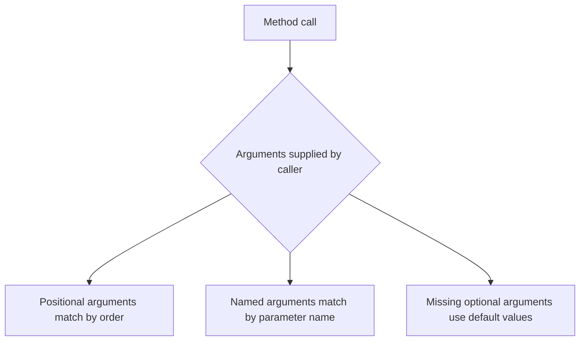

# Optional and Named Arguments

Optional and named arguments improve call-site readability when a method has parameters that are descriptive, commonly omitted, or easy to confuse by position alone.

These features do not change what a method can do. They change how clearly callers can express their intent.

That makes them a design topic, not just a syntax topic.

## Why these features exist

Consider a method with several parameters:

```csharp
ScheduleMeeting("Design Review", "Room 4", 30, true);
```

This might be correct, but the call site forces the reader to remember what each argument position means.

Named and optional arguments solve that readability problem in different ways.

## Optional arguments

An optional parameter has a default value in the method declaration.

```csharp
static void Greet(string name, string title = "Friend")
{
    Console.WriteLine($"Hello {title} {name}");
}

Greet("Sara");
Greet("Sara", "Dr.");
```

If the caller omits `title`, the default value is used.

This is useful when one or more parameters are common enough to deserve a standard value.

## Named arguments

Named arguments let the caller specify parameter names explicitly.

```csharp
Greet(name: "Sara", title: "Dr.");
Greet(name: "Sara");
```

This improves readability because the meaning of each argument is visible at the call site.

## How they fit together



The big idea is that callers have more than one way to express the same method call clearly.

## Rules worth remembering

- Optional parameters must come after required parameters in most practical designs.
- Named arguments can improve clarity when there are several similar parameters.
- You can mix positional and named arguments, but once you use an out-of-order named argument, readability becomes more important than cleverness.

## A worked example

Suppose you are writing a helper for report generation.

```csharp
static void PrintReport(string title, bool includeDate = true, int copies = 1)
{
    Console.WriteLine($"Title: {title}");
    Console.WriteLine($"Include date: {includeDate}");
    Console.WriteLine($"Copies: {copies}");
}

PrintReport("Quarterly Results");
PrintReport("Quarterly Results", copies: 3);
PrintReport("Quarterly Results", includeDate: false, copies: 2);
```

This shows three levels of use:

1. rely on all defaults except the required title
2. override just one optional setting
3. override multiple settings explicitly

The named arguments make the last two calls much easier to read.

## When named arguments help most

Named arguments are especially useful when:

- there are multiple parameters of the same type
- boolean flags would be unclear by position alone
- some arguments are rare overrides
- the call should read almost like a sentence

For example, compare these two calls:

```csharp
CreateUser("Mina", true, false);
CreateUser("Mina", isAdmin: true, sendWelcomeEmail: false);
```

The second call is much clearer.

## When optional arguments are not ideal

Optional parameters are convenient, but they are not always the best design.

Be cautious when:

- the method already has many parameters
- the defaults are not stable or obvious
- different combinations of arguments create confusing overload-like behavior

Sometimes separate overloads or a configuration object provide a cleaner design.

## Common mistakes

- Adding too many optional parameters until the method signature becomes overloaded with meaning.
- Using optional parameters when the default behavior is not obvious.
- Assuming named arguments fix a poor overall API design.
- Creating calls that mix positional and named arguments in a way that becomes harder to scan.

## Summary

Optional and named arguments improve method usability at the call site.

The main ideas are:

- optional parameters provide default values
- named arguments make intent visible
- both features are mainly about readability and caller experience
- they work best when they simplify a method, not when they hide poor design

Use them to make APIs easier to call correctly, not merely shorter to type.

## Practice

Write a method named `SendEmail` with one required parameter and two optional parameters, such as `subject` and `isHtml`.

As a second exercise, call that method using named arguments and compare the readability with a purely positional call.
