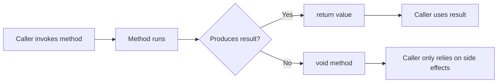

# Return Values

A return value is the result a method gives back to its caller. It is one of the clearest ways a method communicates meaning.

When a method returns a value, the caller can:

- store it in a variable
- print it
- pass it into another method
- use it in an expression

That makes return values central to method design. A good return type tells the caller what the method produces and how it should be used.

## Return flow at a glance



This distinction matters because methods that return values usually feel different to use than methods that only cause side effects.

## Methods that return a value

```csharp
static decimal ApplyDiscount(decimal price)
{
    return price * 0.9m;
}

decimal discountedPrice = ApplyDiscount(100m);
Console.WriteLine(discountedPrice);
```

Here the return value is the method's main product.

This is often clearer than having the method silently update some hidden field elsewhere.

## `void` methods

A `void` method does not return a result value.

```csharp
static void PrintReceipt()
{
    Console.WriteLine("Receipt printed.");
}
```

This method still does work, but its main purpose is the side effect, not a returned result.

## Why return design matters

The return type influences how readable the call site becomes.

Compare these two styles:

```csharp
decimal finalPrice = CalculateFinalPrice(120m, 0.15m);
```

```csharp
CalculateAndStoreFinalPrice(120m, 0.15m);
```

The first style makes the result explicit. The second may hide where the value went.

In many cases, returning a value makes code easier to reason about.

## Returning early

Methods can return as soon as they know the answer.

```csharp
static string DescribeScore(int score)
{
    if (score < 0)
    {
        return "Invalid";
    }

    if (score >= 50)
    {
        return "Pass";
    }

    return "Fail";
}
```

This is called an early return. It often reduces nesting and keeps logic direct.

## Returning reference types and value types

A method can return either kind of type.

```csharp
static int GetCount() => 10;
static string GetTitle() => "C# Fundamentals";
```

The main thing the caller cares about is the return type contract. The caller needs to know what kind of value will come back.

## Returning multiple pieces of information

Sometimes one result is enough. Sometimes a method naturally needs to return more than one thing.

One option is a tuple:

```csharp
static (decimal subtotal, decimal tax) CalculateTotals(decimal price)
{
    decimal tax = price * 0.15m;
    return (price, tax);
}
```

Another option is a dedicated type when the result has real domain meaning.

The important design question is whether the return shape matches the meaning of the operation.

## A worked example

Suppose you want to calculate a student's result summary.

```csharp
static string GetLetterGrade(int score)
{
    if (score >= 90)
    {
        return "A";
    }

    if (score >= 80)
    {
        return "B";
    }

    if (score >= 70)
    {
        return "C";
    }

    return "Needs improvement";
}

string result = GetLetterGrade(84);
Console.WriteLine(result);
```

This is a good return-value method because:

- the method name describes the result
- the return type is clear
- the caller can decide what to do with the returned value

The method computes a result rather than directly deciding every side effect for the caller.

## Design guidance

Prefer a return value when the method's main job is to compute or discover something.

Prefer a `void` method when the method's main job is to perform an action.

Ask this question:

“What is the most meaningful thing the caller needs after this method finishes?”

If the answer is a value, return it.

## Common mistakes

- Returning `void` when callers really need a result.
- Returning vague types that do not communicate enough meaning.
- Hiding important results in mutable external state.
- Using overly complicated return structures for simple operations.

## Summary

Return values are a core part of method contracts.

The main ideas are:

- return types describe what a method produces
- `void` means no direct result value
- early returns can simplify logic
- return shapes should match the meaning of the operation

Good return design makes caller code more readable and predictable.

## Practice

Write a method that takes a `decimal price` and `decimal taxRate`, then returns the total price after tax.

As a second exercise, rewrite a `void` method idea into one that returns a value instead, and compare which version is clearer at the call site.
