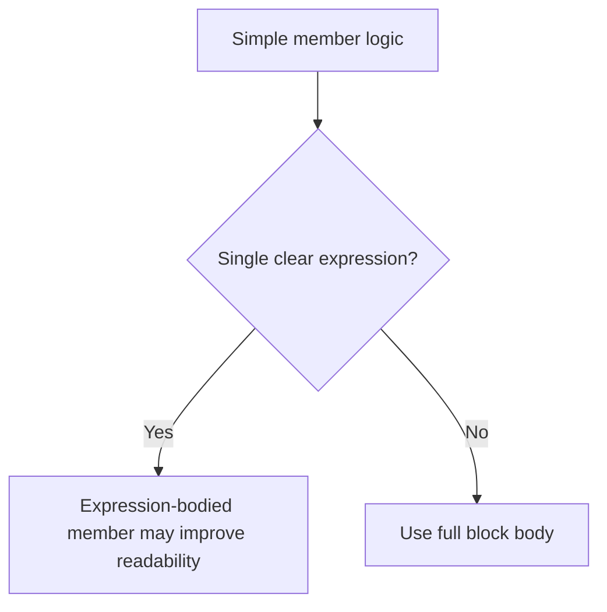

# Expression-Bodied Members

Expression-bodied members are a compact syntax for members whose logic can be expressed as a single expression. They are mainly a readability feature.

They do not give you new capabilities. They give you a shorter way to write simple members when the shorter form genuinely makes the code clearer.

## The core syntax

Instead of a full block body with braces and `return`, an expression-bodied member uses `=>`.

```csharp
static int Square(int value) => value * value;
```

This means “the result of this member is the value of the expression on the right.”

## Where expression-bodied syntax can appear

It can be used for several member kinds, including:

- methods
- read-only properties
- constructors
- finalizers
- indexers
- event accessors in advanced cases

The main beginner-friendly uses are methods, properties, and constructors.

## Block body versus expression body



This is the right way to think about the feature. The question is not “can I make this shorter?” The question is “does the shorter form make the intent clearer?”

## Method example

Block-bodied form:

```csharp
static int Square(int value)
{
    return value * value;
}
```

Expression-bodied form:

```csharp
static int Square(int value) => value * value;
```

Both are correct. The second is shorter because the method is only one simple expression.

## Property example

```csharp
class Circle
{
    public double Radius { get; }
    public Circle(double radius) => Radius = radius;
    public double Area => Math.PI * Radius * Radius;
}
```

The `Area` property is a good expression-bodied property because it computes one simple value from existing state.

## Constructor example

```csharp
class Product
{
    public string Name { get; }

    public Product(string name) => Name = name;
}
```

This works well because the constructor performs one small assignment.

## When not to use it

Avoid expression-bodied syntax when:

- the logic has multiple steps
- validation or branching is involved
- the compact form hides important work
- debugging or future editing would be clearer with a block

For example, this usually belongs in a block body:

```csharp
static decimal CalculateFinalPrice(decimal price, decimal discountRate)
{
    decimal discountAmount = price * discountRate;
    return price - discountAmount;
}
```

The block body communicates the steps more clearly.

## A worked example

Suppose you want a small type representing a temperature reading.

```csharp
class Temperature
{
    public double Celsius { get; }

    public Temperature(double celsius) => Celsius = celsius;

    public double Fahrenheit => (Celsius * 9 / 5) + 32;

    public override string ToString() => $"{Celsius} C / {Fahrenheit:F1} F";
}
```

This is a good use of expression-bodied members because each member has one small, direct meaning.

## A useful mental model

Expression-bodied syntax is best treated like punctuation for simple intent.

If the member is truly one clear expression, `=>` can make the code feel crisp and direct.

If the member is doing real work across several steps, a block is usually the better teaching and maintenance choice.

## Common mistakes

- Converting a block body to `=>` only to save lines.
- Using expression-bodied syntax for logic that is no longer simple.
- Treating the feature as “more modern” even when it hurts readability.
- Mixing styles in a way that makes similar members harder to scan.

## Summary

Expression-bodied members provide a concise syntax for members with a single clear expression.

The main ideas are:

- they are a readability tool, not a capability change
- they work best for very small members
- methods, constructors, and read-only properties are the most common beginner uses
- block bodies are still the better choice for multi-step logic

Choose the form that makes the code easiest to understand at a glance.

## Practice

Rewrite a simple method such as `Cube(int value)` in expression-bodied form.

As a second exercise, take a multi-step method and decide whether the block body or expression-bodied form is clearer, then explain why.
