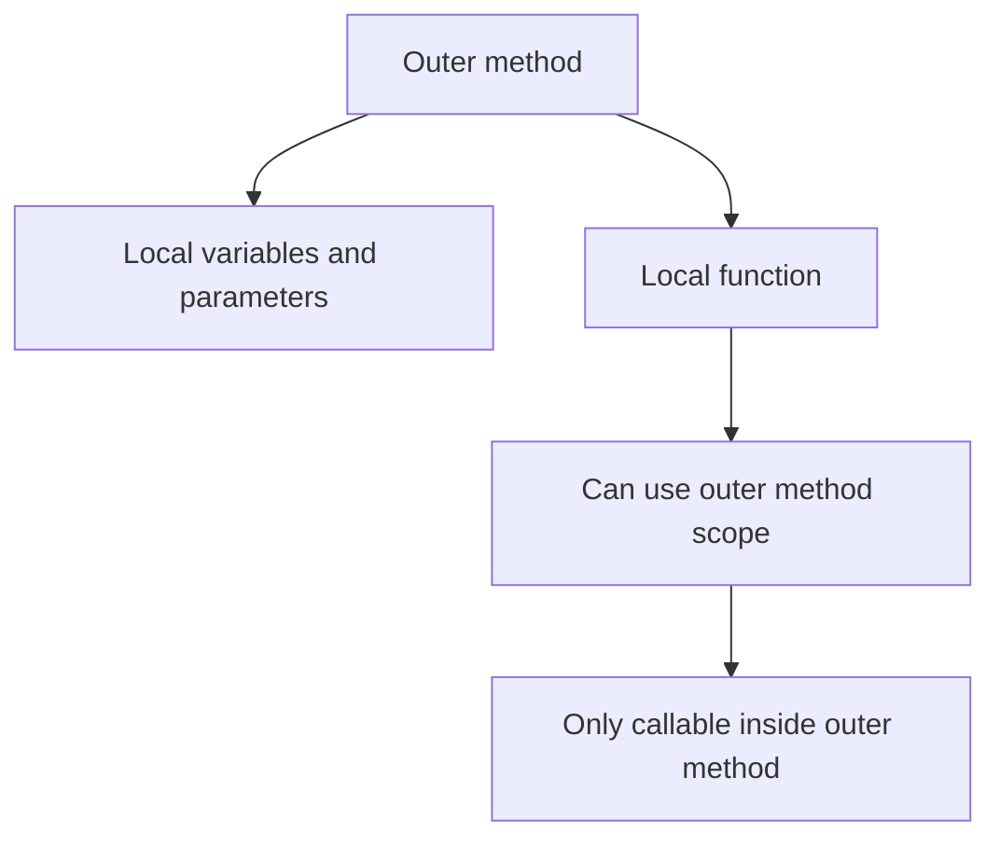

# Local Functions

Local functions are methods declared inside another method. They let you keep helper behavior close to the code that uses it.

This is useful when a helper should not become part of the wider type API and does not make sense anywhere else.

In other words, local functions help you answer this design question:

“Is this helper important enough to be a real member of the class, or is it only relevant inside this one method?”

## Basic syntax

```csharp
static int Factorial(int value)
{
    int Impl(int n)
    {
        return n <= 1 ? 1 : n * Impl(n - 1);
    }

    return Impl(value);
}
```

Here `Impl` is a local function. It exists only inside `Factorial`.

## Why local functions exist

They are useful when:

- a helper is only relevant to one method
- a recursive helper should stay near the outer logic
- input validation and core logic should be separated without exposing extra members
- a long method becomes clearer if part of it is named locally

## Scope relationship



This is the key structural idea:

- the local function lives inside the outer method
- it can access outer-scope variables
- code outside the outer method cannot call it

## A simple example

```csharp
static int AddPositiveNumbers(int left, int right)
{
    ValidatePositive(left, nameof(left));
    ValidatePositive(right, nameof(right));

    return left + right;

    static void ValidatePositive(int value, string parameterName)
    {
        if (value <= 0)
        {
            throw new ArgumentOutOfRangeException(parameterName, "Value must be positive.");
        }
    }
}
```

This keeps the validation helper close to the method that needs it, without adding a new type-level member.

## Local functions versus separate methods

Choose a local function when the helper:

- is tightly tied to one method
- would not make sense as part of the broader API
- improves readability by staying nearby

Choose a separate method when the helper:

- is reused in multiple places
- represents a meaningful operation on its own
- deserves a stable name on the containing type

## Local functions versus lambdas

Local functions and lambdas can sometimes solve similar problems, but they are not identical.

In general:

- local functions are often clearer for named multi-line helper logic
- lambdas are often better when passing behavior as a value to another API

This chapter covers lambdas separately because they are more than small helper syntax. They are also function values.

## A worked example

Suppose you want to parse a comma-separated list of numbers and keep the parsing helper local.

```csharp
static int SumNumbers(string csv)
{
    string[] parts = csv.Split(',');
    int total = 0;

    foreach (string part in parts)
    {
        total += ParsePart(part);
    }

    return total;

    static int ParsePart(string text)
    {
        return int.Parse(text.Trim());
    }
}
```

This design is nice because:

- the outer method explains the main workflow
- the helper name `ParsePart` removes clutter from the loop
- the helper stays private to the method that needs it

## Static local functions

You can mark a local function as `static` when it does not need to capture variables from the outer scope.

```csharp
static int DoubleValue(int value)
{
    static int Double(int number) => number * 2;
    return Double(value);
}
```

This can make intent clearer by showing that the local function does not depend on outer variables.

## Common mistakes

- Using local functions for helpers that should really be reusable type-level methods.
- Nesting too many local functions so the method becomes hard to scan.
- Choosing a lambda when a named local function would better explain the logic.
- Keeping a method large and messy just because local functions make it technically possible.

## Summary

Local functions let you define helper methods inside another method.

The main ideas are:

- they keep helper logic close to the place it is used
- they are visible only inside the outer method
- they work well for validation helpers, parsing helpers, and recursion support
- they are best when the helper does not belong in the wider API

Used well, local functions improve structure without expanding the public surface of a type.

## Practice

Write a method that validates an age and uses a local function to perform the validation.

As a second exercise, take one small helper method idea and decide whether it should be a local function or a regular method, then explain the tradeoff.
