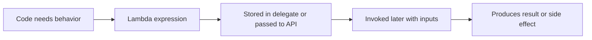

# Lambda Expressions

Lambda expressions are compact ways to write anonymous functions. They let you treat behavior like a value that can be stored, passed into methods, and invoked later.

This makes lambdas central to modern C# because many APIs do not just accept data. They also accept behavior.

Examples include:

- sorting rules
- filtering conditions
- projection logic
- callbacks
- event handlers

## Basic lambda syntax

```csharp
Func<int, int> doubleIt = x => x * 2;
Console.WriteLine(doubleIt(21));
```

This lambda takes one input, `x`, and returns `x * 2`.

You can read `x => x * 2` as:

“given `x`, produce `x * 2`.”

## Why lambdas matter

Without lambdas, you often need separate named methods for small pieces of behavior.

Lambdas let you write that behavior inline when that makes the code clearer.

For example:

```csharp
List<int> numbers = new() { 1, 2, 3, 4, 5 };
List<int> evenNumbers = numbers.FindAll(n => n % 2 == 0);
```

The lambda expresses the rule right where it is needed.

## Lambda flow at a glance



This is the big idea: lambdas are not only syntax. They are a way to package executable behavior as data.

## Common forms

One parameter:

```csharp
x => x * 2
```

Multiple parameters:

```csharp
(left, right) => left + right
```

No parameters:

```csharp
() => Console.WriteLine("Hello")
```

Block-bodied lambda:

```csharp
(x, y) =>
{
    int total = x + y;
    return total;
}
```

Use the shortest form that still reads clearly.

## Lambdas and delegate types

Lambdas are usually assigned to delegate types such as `Func<>` and `Action<>`.

```csharp
Func<int, int, int> add = (a, b) => a + b;
Action<string> print = text => Console.WriteLine(text);
```

Here:

- `Func<int, int, int>` means two `int` inputs and one `int` result
- `Action<string>` means one `string` input and no result

The delegate type provides the contract. The lambda provides the implementation.

## Lambdas and captured variables

Lambdas can use variables from the surrounding scope.

```csharp
int factor = 3;
Func<int, int> multiply = number => number * factor;

Console.WriteLine(multiply(5));
```

This is called capturing a variable.

It is powerful, but you should remember that the lambda may keep using that outer variable later, not just at the moment the lambda is written.

## A worked example

Suppose you want to sort products by price.

```csharp
var products = new List<(string Name, decimal Price)>
{
    ("Notebook", 12.50m),
    ("Pen", 2.20m),
    ("Backpack", 39.99m)
};

products.Sort((left, right) => left.Price.CompareTo(right.Price));

foreach (var product in products)
{
    Console.WriteLine($"{product.Name}: {product.Price:C}");
}
```

The lambda supplies the comparison logic directly to `Sort`.

That is exactly the kind of scenario lambdas are for: passing a small custom behavior into another method.

## Lambdas versus methods

Use a lambda when:

- the logic is short
- the behavior is used only here
- putting it inline improves readability

Use a named method when:

- the logic is reused
- the behavior deserves a meaningful name
- the code is large enough that inline syntax hurts readability

## Common mistakes

- Cramming too much logic into one lambda.
- Using a lambda when a named method would explain the intent better.
- Forgetting that lambdas can capture outer variables.
- Treating lambdas as mysterious syntax instead of functions with inputs and outputs.

## Summary

Lambda expressions are anonymous functions written with compact syntax.

The main ideas are:

- they let behavior be passed around like data
- they are commonly used with delegates such as `Func<>` and `Action<>`
- they work best for short, focused behavior
- they can capture variables from outer scope

Lambdas become especially important once you start using LINQ, delegates, and event handlers heavily.

## Practice

Write a lambda that takes a `decimal` price and returns the price after a 10% discount.

As a second exercise, create a list of integers and use a lambda with `FindAll` or a similar API to select only the odd numbers.
