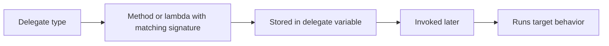

# Delegates

Delegates are types that represent references to methods. They make it possible to store behavior in a variable, pass behavior into another method, and invoke that behavior later.

If methods answer “what behavior exists?”, delegates answer “how can behavior itself become a value?”

This is one of the foundations behind callbacks, event handlers, LINQ, and many modern APIs.

## The core idea

A delegate defines the shape of callable code:

- what parameter types it accepts
- what return type it produces

Any method or lambda that matches that shape can be assigned to the delegate.

```csharp
delegate int Operation(int left, int right);

Operation add = (a, b) => a + b;
Console.WriteLine(add(3, 4));
```

`Operation` is a delegate type. The lambda matches its shape, so it can be assigned to a variable of that type.

## Delegate flow at a glance



This is the key idea: a delegate is a type-safe method reference.

## Named delegate types

You can declare your own delegate type:

```csharp
delegate int Operation(int left, int right);
```

This is useful when the delegate has a meaningful role in your program.

For example, `Operation` communicates that the delegate represents some two-number operation.

## Built-in delegate types

In many cases, C# already provides delegate types through `Action` and `Func`.

```csharp
Func<int, int, int> add = (a, b) => a + b;
Action<string> print = text => Console.WriteLine(text);
```

These are often preferred for simple cases because they avoid creating a new named delegate type when one is not needed.

## Assigning methods to delegates

A delegate does not require a lambda. It can also reference a named method.

```csharp
static int Multiply(int left, int right)
{
    return left * right;
}

Func<int, int, int> operation = Multiply;
Console.WriteLine(operation(3, 5));
```

This works because `Multiply` matches the delegate signature.

## Why delegates matter

Delegates let one part of a program say:

“I do not need to know exactly which method will run. I only need behavior with this shape.”

That makes APIs more flexible.

For example, a sorting method does not need one fixed comparison rule. It can accept a delegate representing whatever comparison rule the caller wants.

## A worked example

Suppose you want a method that applies any pricing rule to a base price.

```csharp
static decimal ApplyPricingRule(decimal basePrice, Func<decimal, decimal> pricingRule)
{
    return pricingRule(basePrice);
}

decimal standardPrice = ApplyPricingRule(100m, price => price);
decimal discountedPrice = ApplyPricingRule(100m, price => price * 0.9m);
decimal taxedPrice = ApplyPricingRule(100m, price => price * 1.15m);

Console.WriteLine(standardPrice);
Console.WriteLine(discountedPrice);
Console.WriteLine(taxedPrice);
```

The method `ApplyPricingRule` is reusable because it does not hard-code one behavior. It accepts a delegate describing the behavior.

## Multicast delegates

Delegates can sometimes reference more than one method.

```csharp
Action notify = () => Console.WriteLine("First");
notify += () => Console.WriteLine("Second");

notify();
```

This becomes especially important in the next lesson on events.

## A useful mental model

Think of a delegate as a strongly typed remote control for a method.

The delegate does not care about the method's name. It cares about whether the method matches the required signature.

## Common mistakes

- Thinking a delegate is the same thing as a method. It is a type that can point to methods.
- Creating custom delegate types when `Func<>` or `Action<>` would be simpler.
- Forgetting that the method or lambda must match the expected signature.
- Overcomplicating code when a direct method call would be clearer than an indirect delegate call.

## Summary

Delegates make behavior first-class in C#.

The main ideas are:

- a delegate is a type that represents callable code
- methods and lambdas can be assigned to delegates when the signatures match
- `Action` and `Func` cover many common cases
- delegates enable callbacks, flexible APIs, and event systems

Once delegates make sense, events and many lambda-heavy APIs become much easier to understand.

## Practice

Create a `Func<int, int, int>` that multiplies two numbers, then invoke it.

As a second exercise, write a method that accepts a `Func<string, string>` and uses it to transform some text before printing it.
