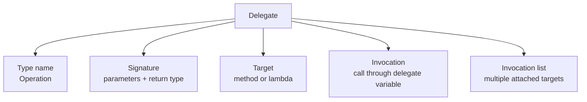
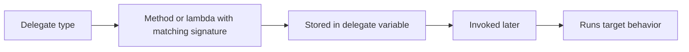

# Delegates

Delegates are types that represent references to methods. They make it possible to store behavior in a variable, pass behavior into another method, and invoke that behavior later.

If methods answer “what behavior exists?”, delegates answer “how can behavior itself become a value?”

This is one of the foundations behind callbacks, event handlers, LINQ, and many modern APIs.

## Delegate parts at a glance

Delegates become easier to understand when you break them into their main parts.

The most important delegate-related concepts are:

- the delegate type name
- the signature
- the target method or lambda
- invocation through a delegate variable
- the invocation list in multicast scenarios



That is the key mental model: a delegate is a typed callable contract plus a reference to executable behavior.

## The core idea

A delegate defines the shape of callable code:

- what parameter types it accepts
- what return type it produces

Any method or lambda that matches that shape can be assigned to the delegate.

```csharp
delegate int Operation(int left, int right);

Operation add = (a, b) => a + b;
Console.WriteLine(add(3, 4));
```

`Operation` is a delegate type. The lambda matches its shape, so it can be assigned to a variable of that type.

## The delegate signature

The most important part of a delegate is its signature.

```csharp
delegate int Operation(int left, int right);
```

This delegate says:

- it accepts two `int` parameters
- it returns one `int`

Any method or lambda assigned to this delegate must match that shape.

That is why delegates are type-safe.

## Delegate flow at a glance



This is the key idea: a delegate is a type-safe method reference.

## Target methods and lambdas

The delegate variable can point to:

- a named method
- a lambda expression
- an anonymous method in older syntax

Named method example:

```csharp
static int Multiply(int left, int right)
{
    return left * right;
}

Operation op = Multiply;
```

Lambda example:

```csharp
Operation op = (a, b) => a + b;
```

The target can change, but the signature compatibility rule stays the same.

## Named delegate types

You can declare your own delegate type:

```csharp
delegate int Operation(int left, int right);
```

This is useful when the delegate has a meaningful role in your program.

For example, `Operation` communicates that the delegate represents some two-number operation.

When the delegate has a real domain meaning, a named delegate can communicate that role more clearly than a raw `Func<>`.

## Built-in delegate types

In many cases, C# already provides delegate types through `Action` and `Func`.

```csharp
Func<int, int, int> add = (a, b) => a + b;
Action<string> print = text => Console.WriteLine(text);
```

These are often preferred for simple cases because they avoid creating a new named delegate type when one is not needed.

## Assigning methods to delegates

A delegate does not require a lambda. It can also reference a named method.

```csharp
static int Multiply(int left, int right)
{
    return left * right;
}

Func<int, int, int> operation = Multiply;
Console.WriteLine(operation(3, 5));
```

This works because `Multiply` matches the delegate signature.

## Invoking a delegate

Once a delegate variable has a target, you invoke it with normal call syntax.

```csharp
Operation add = (a, b) => a + b;
int result = add(3, 4);
```

That is why delegates feel natural to use after assignment. They behave like indirect method calls.

## Why delegates matter

Delegates let one part of a program say:

“I do not need to know exactly which method will run. I only need behavior with this shape.”

That makes APIs more flexible.

For example, a sorting method does not need one fixed comparison rule. It can accept a delegate representing whatever comparison rule the caller wants.

## A worked example

Suppose you want a method that applies any pricing rule to a base price.

```csharp
static decimal ApplyPricingRule(decimal basePrice, Func<decimal, decimal> pricingRule)
{
    return pricingRule(basePrice);
}

decimal standardPrice = ApplyPricingRule(100m, price => price);
decimal discountedPrice = ApplyPricingRule(100m, price => price * 0.9m);
decimal taxedPrice = ApplyPricingRule(100m, price => price * 1.15m);

Console.WriteLine(standardPrice);
Console.WriteLine(discountedPrice);
Console.WriteLine(taxedPrice);
```

The method `ApplyPricingRule` is reusable because it does not hard-code one behavior. It accepts a delegate describing the behavior.

## A fuller delegate example

Suppose a report processor should run a status callback several times.

```csharp
delegate void ReportStep(string message);

static void RunReport(ReportStep step)
{
    step("Loading data");
    step("Calculating totals");
    step("Finishing report");
}

ReportStep handler = message => Console.WriteLine($"[REPORT] {message}");
RunReport(handler);
```

This example shows several core delegate ideas together:

- a named delegate type
- a signature with one parameter and no return value
- a lambda target
- invocation through another method

## Multicast delegates

Delegates can sometimes reference more than one method.

```csharp
Action notify = () => Console.WriteLine("First");
notify += () => Console.WriteLine("Second");

notify();
```

This becomes especially important in the next lesson on events.

## Invocation lists and multicast delegates

When multiple methods or lambdas are attached, the delegate has an invocation list.

That means one call to the delegate can trigger several handlers in sequence.

For beginners, the practical lesson is this:

- single-target delegates are easy to think of as indirect method calls
- multicast delegates are especially useful for notification-style scenarios

That is one reason events build so naturally on delegates.

## A useful mental model

Think of a delegate as a strongly typed remote control for a method.

The delegate does not care about the method's name. It cares about whether the method matches the required signature.

## Delegates versus methods

A method is behavior defined somewhere in code.

A delegate is a typed reference that can point to compatible behavior.

That distinction is the key to understanding callbacks, event handlers, and APIs that accept behavior as input.

## Common mistakes

- Thinking a delegate is the same thing as a method. It is a type that can point to methods.
- Creating custom delegate types when `Func<>` or `Action<>` would be simpler.
- Forgetting that the method or lambda must match the expected signature.
- Overcomplicating code when a direct method call would be clearer than an indirect delegate call.

## Summary

Delegates make behavior first-class in C#.

The main ideas are:

- a delegate is a type that represents callable code
- methods and lambdas can be assigned to delegates when the signatures match
- `Action` and `Func` cover many common cases
- delegates enable callbacks, flexible APIs, and event systems
- delegates make the most sense when you think in terms of signature, target, invocation, and invocation list

Once delegates make sense, events and many lambda-heavy APIs become much easier to understand.

## Practice

Create a `Func<int, int, int>` that multiplies two numbers, then invoke it.

As a second exercise, declare a custom delegate type, assign both a named method and a lambda to variables of that type, and explain why both assignments are valid.
