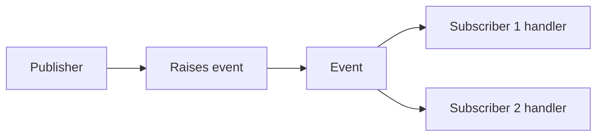

# Events

Events are a structured way for one part of a program to notify other parts that something happened.

They are built on delegates, but they add an important design restriction: outside code can subscribe and unsubscribe, but it cannot freely raise the event itself.

That makes events a safer notification mechanism than exposing raw delegate fields directly.

## The core idea

An event connects three roles:

- a publisher that raises the event
- one or more subscribers that listen
- an event handler delegate that defines the shape of the notification



This is why events are often described as a notification model.

## Basic event example

```csharp
class Alarm
{
    public event Action? Triggered;

    public void Raise()
    {
        Triggered?.Invoke();
    }
}
```

Here:

- `Triggered` is the event
- `Action` is the delegate type
- `Raise()` invokes the event inside the class

Outside code can subscribe with `+=` and unsubscribe with `-=`.

## Subscribing to events

```csharp
Alarm alarm = new();
alarm.Triggered += () => Console.WriteLine("Alarm received.");

alarm.Raise();
```

This means “when the event happens, run this handler.”

## Why events exist instead of plain delegates

If a delegate were exposed directly as a field, outside code could replace it, invoke it, or clear it in ways that break the publisher's control.

An event restricts that API surface. Subscribers can attach and detach handlers, but the publisher keeps control over when the notification is raised.

That is a big design difference.

## Common event pattern

Many .NET APIs use `EventHandler` or `EventHandler<TEventArgs>`.

```csharp
class DownloadCompletedEventArgs : EventArgs
{
    public string FileName { get; }

    public DownloadCompletedEventArgs(string fileName)
    {
        FileName = fileName;
    }
}

class Downloader
{
    public event EventHandler<DownloadCompletedEventArgs>? DownloadCompleted;

    public void Complete(string fileName)
    {
        DownloadCompleted?.Invoke(this, new DownloadCompletedEventArgs(fileName));
    }
}
```

This pattern carries more context than a plain `Action` event because subscribers receive sender information and structured event data.

## A worked example

Suppose a course enrollment system should notify listeners when a student is added.

```csharp
class Course
{
    public event Action<string>? StudentEnrolled;

    public void Enroll(string studentName)
    {
        Console.WriteLine($"Enrolling {studentName}...");
        StudentEnrolled?.Invoke(studentName);
    }
}

Course course = new();

course.StudentEnrolled += studentName =>
    Console.WriteLine($"Notification: {studentName} enrolled successfully.");

course.Enroll("Mina");
```

This is a good event scenario because:

- the publisher does not need to know who is listening
- subscribers react when the event occurs
- the notification mechanism stays loosely coupled

## A useful mental model

Think of an event as a public announcement channel controlled by the publisher.

Subscribers can listen in, but only the publisher decides when the announcement is made.

## Common mistakes

- Treating events like ordinary delegate fields.
- Forgetting to unsubscribe in longer-lived systems when that matters for object lifetime.
- Using events when a simple direct method call would be clearer.
- Putting too much business logic into event handlers without clear ownership.

## Summary

Events provide structured notifications built on top of delegates.

The main ideas are:

- a publisher raises the event
- subscribers register handlers
- events keep control of invocation inside the publishing type
- `EventHandler` patterns are common in .NET APIs

Events are valuable when parts of a system need to react to something happening without being tightly coupled to the code that caused it.

## Practice

Create a class with an event named `Completed` and a method that raises it.

As a second exercise, subscribe to that event with a lambda and print a message when it fires.
