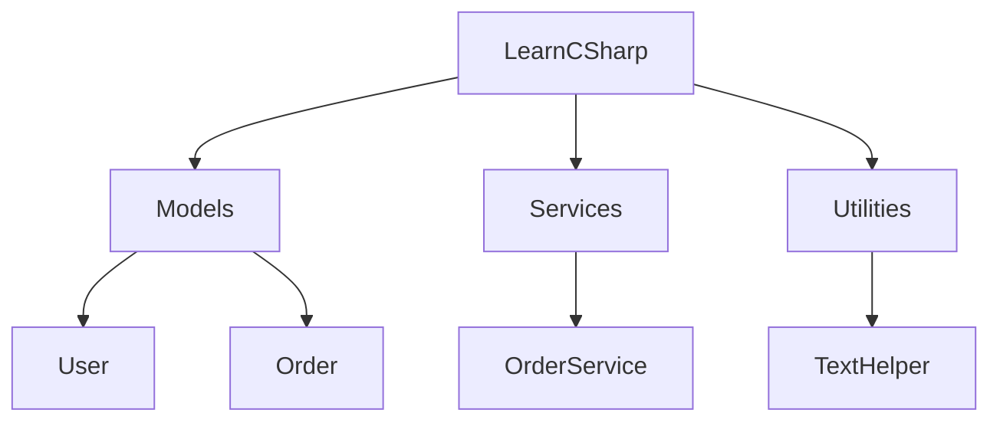

# Namespaces

Namespaces organize types into named groups. They help answer a practical question that becomes more important as code grows:

“Where does this type belong?”

Without namespaces, every class, interface, record, enum, and struct would compete in one giant global naming space. That quickly causes confusion, naming collisions, and poor discoverability.

Namespaces are one of the main tools C# uses to keep codebases understandable.

## Why namespaces exist

Imagine a project with these types:

- `User`
- `Order`
- `Logger`
- `User`
- `Order`

That may look strange, but different parts of a system often need similarly named types. For example:

- a database model `User`
- an API contract `User`
- a UI view model `User`

Namespaces let each one live in a meaningful context.

## Namespace hierarchy at a glance



This is the right mental model: namespaces are organizational containers for related types.

## File-scoped namespace syntax

Modern C# often uses file-scoped namespaces.

```csharp
namespace LearnCSharp.Models;

public class User
{
    public string Name { get; set; } = string.Empty;
}
```

This means the types in the file belong to `LearnCSharp.Models`.

It is equivalent in purpose to the older block-scoped form:

```csharp
namespace LearnCSharp.Models
{
    public class User
    {
        public string Name { get; set; } = string.Empty;
    }
}
```

The file-scoped form is shorter and avoids one extra indentation level.

## Namespaces and type names

Two types can share the same short name if they are in different namespaces.

```csharp
namespace LearnCSharp.ApiModels;
public class User { }
```

```csharp
namespace LearnCSharp.DomainModels;
public class User { }
```

At that point, the full names are different:

- `LearnCSharp.ApiModels.User`
- `LearnCSharp.DomainModels.User`

That is one of the main reasons namespaces matter.

## How namespaces relate to folders

In many projects, folder structure and namespace structure roughly align, but they are not the same thing.

- folders organize files on disk
- namespaces organize types in code

It is common and often helpful when they match, but the compiler cares about namespace declarations, not folder names by themselves.

## A worked example

Suppose a project has product models and product services.

```csharp
namespace LearnCSharp.Catalog.Models;

public class Product
{
    public string Name { get; set; } = string.Empty;
    public decimal Price { get; set; }
}
```

```csharp
namespace LearnCSharp.Catalog.Services;

public class ProductService
{
    public void PrintProduct(Product product)
    {
        Console.WriteLine($"{product.Name}: {product.Price:C}");
    }
}
```

This structure communicates intent clearly:

- models belong under `Models`
- service logic belongs under `Services`

The namespace names help readers navigate conceptually even before they inspect every file.

## Namespace design guidance

Good namespaces usually reflect meaningful code boundaries such as:

- feature area
- layer
- module
- company or project root

For example:

- `MyCompany.Accounting`
- `MyApp.Notifications`
- `LearnCSharp.Catalog.Models`

Avoid namespace names that are too vague or inconsistent.

## Common mistakes

- Treating namespaces as unnecessary until the project becomes large.
- Using inconsistent naming that makes related types harder to find.
- Assuming folders alone define code organization.
- Creating deeply nested namespace hierarchies with little real value.

## Summary

Namespaces organize types into meaningful code boundaries.

The main ideas are:

- they prevent naming collisions
- they improve discoverability
- they provide conceptual structure for a codebase
- they are related to folders, but not identical to them

Good namespace design makes a project easier to navigate, explain, and maintain.

## Practice

Create two example namespaces for a small school app, such as `School.Models` and `School.Services`, and place one type in each.

As a second exercise, think of two different `User` types that might exist in one application and describe how namespaces would keep them distinct.
