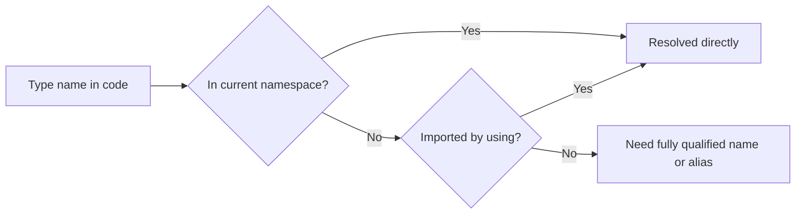

# Using Directives

`using` directives control how type names are resolved inside a file. They reduce the need to write fully qualified names repeatedly and make code easier to read.

This is a small syntax feature, but it strongly affects readability because it changes how much namespace information appears at each use site.

## Why `using` directives matter

Without `using`, you may need to write full type names:

```csharp
System.Text.StringBuilder builder = new System.Text.StringBuilder();
```

With a `using` directive, the same code becomes:

```csharp
using System.Text;

StringBuilder builder = new StringBuilder();
```

That is easier to scan because the namespace context is declared once, near the top of the file.

## Name resolution at a glance



This is the basic role of `using`: it gives the compiler more places to look when resolving short type names.

## Standard namespace imports

The most common form imports a namespace.

```csharp
using System;
using System.Text;
```

This makes types from those namespaces available by short name in the current file.

## Alias directives

You can create an alias when a long namespace or conflicting name would be awkward.

```csharp
using ProjectModels = LearnCSharp.Models;
```

Then you can write:

```csharp
ProjectModels.User user = new();
```

Aliases are especially helpful when two namespaces contain types with the same name.

## Static imports

You can also import static members from a type.

```csharp
using static System.Math;

double result = Sqrt(25);
```

This allows direct use of static members without repeating the type name.

Use this carefully. It can improve readability, but overuse can make code less obvious because readers can no longer see where the member came from.

## Global using directives

In modern C#, some `using` directives can be declared globally so many files do not need to repeat them.

```csharp
global using System;
global using System.Collections.Generic;
```

This is especially useful for common framework namespaces in larger projects.

## A worked example

Suppose a file needs `StringBuilder` and a project model alias.

```csharp
using System.Text;
using AppModels = LearnCSharp.Models;

StringBuilder builder = new();
builder.AppendLine("User report");

AppModels.User user = new() { Name = "Mina" };
builder.AppendLine(user.Name);

Console.WriteLine(builder.ToString());
```

This is easier to read than repeatedly writing full namespace paths throughout the file.

## When `using` improves clarity

`using` directives help when:

- a namespace is used multiple times in the file
- the fully qualified names are noisy
- an alias makes a naming conflict clearer

They hurt clarity when:

- too many unrelated namespaces are imported casually
- aliases are cryptic
- static imports hide where members come from

## Common mistakes

- Importing many namespaces that are not actually used.
- Using aliases with unclear names.
- Overusing `using static` until code loses context.
- Thinking `using` copies code or creates dependencies by itself. It only affects name resolution.

## Summary

`using` directives help the compiler and the reader resolve type names more cleanly.

The main ideas are:

- standard `using` imports namespaces
- alias directives shorten or disambiguate names
- `using static` imports static members
- global `using` can reduce repetition across a project

Good `using` choices reduce noise without hiding too much context.

## Practice

Write a file that imports `System.Text` and uses `StringBuilder` without a fully qualified name.

As a second exercise, create an alias for a namespace and use it to declare a type instance in code.
