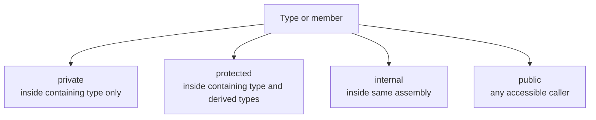

# Access Modifiers

Access modifiers control visibility. They let you decide which code can see or use a type or member.

This is one of the main tools behind encapsulation in C#. Encapsulation means exposing what other code needs while hiding details that should stay protected or flexible.

Without access modifiers, every detail would risk becoming part of the public surface area of your code.

## Why visibility matters

When a member is visible to more code, more code can depend on it.

That has consequences:

- changing it becomes harder
- misuse becomes more likely
- the API becomes larger and noisier

Good access control keeps boundaries intentional.

## Visibility levels at a glance



This diagram is simplified for beginners, but it captures the main idea: each modifier widens or narrows the audience for the code.

## `private`

`private` means only the containing type can access the member.

```csharp
public class Account
{
    private decimal _balance;

    public void Deposit(decimal amount)
    {
        _balance += amount;
    }
}
```

The field `_balance` is hidden from outside code. That is good because callers should not directly modify an account's internal state without rules.

## `public`

`public` means the member or type is accessible to any caller that can reach it.

```csharp
public class Account
{
    public void Deposit(decimal amount)
    {
        Console.WriteLine($"Depositing {amount:C}");
    }
}
```

Use `public` only for behavior that is truly part of the intended API.

## `internal`

`internal` means the type or member is accessible only within the same assembly.

```csharp
internal class ValidationHelper
{
    public static bool IsPositive(decimal value) => value > 0;
}
```

This is useful for implementation details that should be shared inside one project but not exposed to consumers of the assembly.

## `protected`

`protected` means the member is available inside the containing type and derived types.

```csharp
public class Animal
{
    protected void Breathe()
    {
        Console.WriteLine("Breathing...");
    }
}
```

This matters mainly in inheritance scenarios.

## A worked example

Suppose you are designing a simple bank account type.

```csharp
public class BankAccount
{
    private decimal _balance;

    public decimal GetBalance()
    {
        return _balance;
    }

    public void Deposit(decimal amount)
    {
        if (amount <= 0)
        {
            throw new ArgumentOutOfRangeException(nameof(amount));
        }

        _balance += amount;
    }
}
```

This is a good visibility design because:

- `_balance` is hidden
- callers can read the balance through a controlled method
- callers can update the balance only through a validated operation

That is exactly what encapsulation is supposed to achieve.

## Access modifiers on types and members

You can apply access modifiers to:

- top-level types
- nested types
- fields
- methods
- properties
- constructors

The same core question always applies:

“Who should be allowed to use this?”

## Design guidance

Prefer the most restrictive visibility that still supports the intended design.

That often means:

- start with `private`
- widen to `internal`, `protected`, or `public` only when there is a real reason

This keeps APIs smaller and easier to evolve.

## Common mistakes

- Making too many members `public` too early.
- Exposing fields directly instead of protecting state behind methods or properties.
- Using `protected` without a real inheritance-based reason.
- Forgetting that public APIs create long-term maintenance commitments.

## Summary

Access modifiers define who can see and use types and members.

The main ideas are:

- `private` hides implementation details inside a type
- `public` exposes intentional API surface
- `internal` limits use to the current assembly
- `protected` supports inheritance scenarios

Good access control keeps boundaries clear and reduces accidental coupling.

## Practice

Write a class with one private field and one public method that updates that field.

As a second exercise, identify one helper type that would make sense as `internal` rather than `public`, and explain why.
