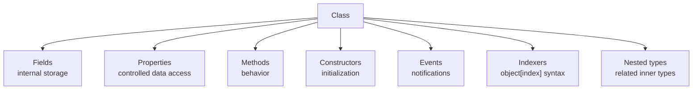
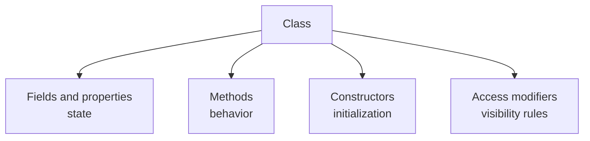

# Classes

Classes are the most common way to model objects in C#. A class can hold state, expose behavior, and participate in object-oriented features such as inheritance.

Classes are reference types. That means a variable of a class type usually holds a reference to an object rather than containing the whole object data directly.

This matters because class instances have identity, can be shared through references, and can be mutated through those shared references.

## Class members at a glance

One of the most important things to understand about classes is that they can contain many different kinds of members. A class is not just one feature. It is a container for related members that together describe one concept.

Common class members include:

- fields
- properties
- methods
- constructors
- events
- indexers
- nested types



Learning classes well means learning what each of these member kinds is for.

## What a class is for

Use a class when you want to model an object that has:

- related data
- related behavior
- a meaningful identity over time

Examples include:

- `Product`
- `Order`
- `Customer`
- `Logger`
- `ShoppingCart`

## Class shape at a glance



This is the right beginner mental model: a class packages state and behavior together.

## Fields

Fields are variables declared directly inside a class.

```csharp
public class Account
{
    private decimal _balance;
}
```

Fields usually store internal state.

They are often `private` because raw internal storage should usually stay hidden from outside code.

Typical field uses include:

- backing storage for properties
- cached values
- dependency references
- internal flags or counters

## Properties

Properties provide controlled access to data.

```csharp
public class Product
{
    public string Name { get; set; } = string.Empty;
    public decimal Price { get; set; }
}
```

Properties can:

- expose readable values
- allow or restrict writing
- compute values dynamically
- validate assignments

Examples:

Auto-property:

```csharp
public string Name { get; set; } = string.Empty;
```

Read-only property:

```csharp
public decimal UnitPrice { get; }
```

Computed property:

```csharp
public decimal Total => UnitPrice * Quantity;
```

Properties are usually preferred over public fields because they preserve encapsulation and future flexibility.

## Methods

Methods define what the class can do.

```csharp
public void PrintSummary()
{
    Console.WriteLine($"{Name}: {Price:C}");
}
```

Methods are used for behavior such as:

- calculations
- validation
- state changes
- coordinating related operations

If properties answer “what data does this object expose?”, methods answer “what actions can this object perform?”

## Basic example

```csharp
public class Product
{
    public string Name { get; set; } = string.Empty;
    public decimal Price { get; set; }

    public void PrintSummary()
    {
        Console.WriteLine($"{Name}: {Price:C}");
    }
}
```

This class contains:

- state through properties
- behavior through a method

That combination is what makes classes so useful.

## Creating objects from a class

```csharp
Product notebook = new Product
{
    Name = "Notebook",
    Price = 12.50m
};

notebook.PrintSummary();
```

The class is the blueprint. The object created with `new` is the instance.

## Class instances are references

Because classes are reference types, two variables can refer to the same object.

```csharp
Product first = new Product { Name = "Pen", Price = 2.50m };
Product second = first;

second.Price = 3.00m;

Console.WriteLine(first.Price);
```

This prints `3.00` because both variables refer to the same object.

That behavior is one of the biggest differences between classes and structs.

## Constructors

Constructors initialize new objects.

```csharp
public class Product
{
    public string Name { get; }
    public decimal Price { get; }

    public Product(string name, decimal price)
    {
        Name = name;
        Price = price;
    }
}
```

Constructors help ensure objects start in a valid state.

## Events

Classes can publish events so other code can react when something happens.

```csharp
public class FileDownloader
{
    public event Action? DownloadCompleted;

    public void CompleteDownload()
    {
        DownloadCompleted?.Invoke();
    }
}
```

An event is a notification member. It lets the class announce something without needing to know who is listening.

## Indexers

An indexer lets an object be accessed with array-like syntax.

```csharp
public class ScoreBoard
{
    private readonly List<int> _scores = new();

    public int this[int index]
    {
        get => _scores[index];
        set => _scores[index] = value;
    }
}
```

This makes sense for classes that conceptually behave like containers, lists, or keyed lookups.

## Nested types

Classes can contain other types too.

```csharp
public class Report
{
    public class Section
    {
        public string Title { get; set; } = string.Empty;
    }
}
```

Nested types are useful when one type is strongly tied to another and should stay grouped with it.

## A worked example

Suppose you want a shopping cart item type.

```csharp
public class CartItem
{
    public string ProductName { get; }
    public decimal UnitPrice { get; }
    public int Quantity { get; private set; }

    public CartItem(string productName, decimal unitPrice, int quantity)
    {
        ProductName = productName;
        UnitPrice = unitPrice;
        Quantity = quantity;
    }

    public decimal GetLineTotal()
    {
        return UnitPrice * Quantity;
    }

    public void IncreaseQuantity(int amount)
    {
        Quantity += amount;
    }
}
```

This is a good class example because the type has:

- state that belongs together
- behavior that naturally operates on that state
- identity as one specific cart item instance

## Putting member kinds together

Here is a fuller example that combines several member types in one class.

```csharp
public class ShoppingCart
{
    private readonly List<decimal> _prices = new();

    public string CustomerName { get; }

    public event Action? CheckedOut;

    public ShoppingCart(string customerName)
    {
        CustomerName = customerName;
    }

    public int ItemCount => _prices.Count;

    public decimal this[int index] => _prices[index];

    public void AddItem(decimal price)
    {
        _prices.Add(price);
    }

    public decimal GetTotal()
    {
        return _prices.Sum();
    }

    public void Checkout()
    {
        CheckedOut?.Invoke();
    }
}
```

This example is useful because it shows that classes become expressive by combining the right member kinds, not by relying on only one of them.

## Classes and responsibility

A good class usually represents one clear concept.

If a class seems to do unrelated jobs, it often needs refactoring.

For example, a `Product` class should not also parse files, send emails, and manage UI layout. Those are separate responsibilities.

## Choosing the right member kind

Part of good class design is choosing the right member for the right job.

- Use fields for internal storage.
- Use properties for controlled data access.
- Use methods for actions and operations.
- Use constructors for initialization.
- Use events for notifications.
- Use indexers when indexed access is natural.

That distinction makes classes easier to read and maintain.

## Common mistakes

- Treating classes as giant containers for unrelated logic.
- Exposing too much mutable state publicly.
- Forgetting that class variables share object references.
- Creating classes when a simpler type or existing library type would do.

## Summary

Classes are reference types used to model objects with state and behavior.

The main ideas are:

- a class groups related data and operations
- instances are created with `new`
- class variables usually hold references to objects
- constructors help establish valid initial state
- classes can define many member kinds such as fields, properties, methods, events, and indexers

Classes are the default modeling tool in many C# applications because they are flexible and expressive.

## Practice

Create a `Book` class with `Title` and `Author` properties and a method that prints a description.

As a second exercise, extend that class with a private field, a constructor, and one computed property. Then explain why each member kind exists.
