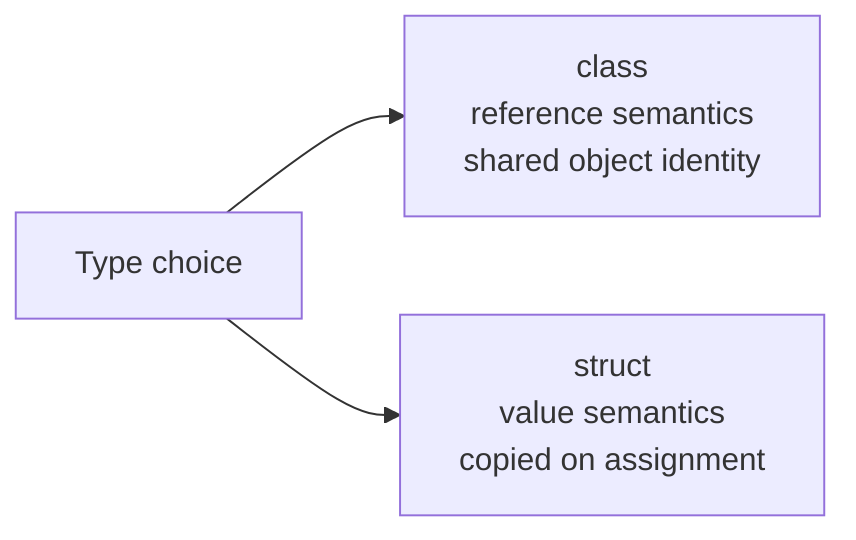

# Structs

Structs are value types used for small data models with clear value semantics. They are copied by value, which means assignment and parameter passing usually create independent copies.

That makes structs fundamentally different from classes. A struct is not just a “small class.” It has a different behavior model.

## When a struct makes sense

Structs are often a good fit when the type:

- represents a single value or a small group of values
- has value-like meaning
- is logically compared by its contained data
- does not need identity-based behavior

Common examples include:

- coordinates
- sizes
- ranges
- measurements
- small immutable data holders

## Struct versus class at a glance



This difference is the starting point for every struct decision.

## Basic struct example

```csharp
public readonly struct Point
{
    public int X { get; }
    public int Y { get; }

    public Point(int x, int y)
    {
        X = x;
        Y = y;
    }
}
```

This struct represents one point value with two coordinates.

It is `readonly`, which helps communicate that it should behave as an immutable value.

## Copy behavior

Assignment copies struct values.

```csharp
Point first = new Point(2, 3);
Point second = first;
```

Now `first` and `second` are separate values.

That is very different from class reference behavior, where both variables may point to the same object.

## Why this matters

When you change one struct variable, you are typically changing that copy, not some shared object elsewhere.

That makes structs feel more like numbers, dates, and coordinates than like entities with identity.

## Immutable structs

Immutable structs are usually easier to reason about.

```csharp
public readonly struct Size
{
    public int Width { get; }
    public int Height { get; }

    public Size(int width, int height)
    {
        Width = width;
        Height = height;
    }

    public int Area => Width * Height;
}
```

This is a good value-type design because the struct holds a stable value rather than mutable shared state.

## A worked example

Suppose you want a type to represent a discount percentage.

```csharp
public readonly struct DiscountRate
{
    public decimal Value { get; }

    public DiscountRate(decimal value)
    {
        Value = value;
    }

    public decimal ApplyTo(decimal amount)
    {
        return amount - (amount * Value);
    }
}
```

This is a reasonable struct because:

- it represents one meaningful value concept
- it does not need object identity
- it behaves naturally as a copyable value

## Struct design guidance

Prefer structs when the type is naturally value-like.

Prefer classes when the type has:

- identity
- significant mutable state
- more complex lifetime expectations

Structs are most effective when they are small and stable.

## Common mistakes

- Choosing a struct only because the data seems small.
- Forgetting that structs are copied on assignment and parameter passing.
- Making mutable structs that become hard to reason about.
- Treating a struct like an identity-based entity.

## Summary

Structs are value types designed for value-like data.

The main ideas are:

- they are copied by value
- they are best for small value-oriented models
- immutable structs are often the clearest design
- they are not just lighter versions of classes

Choose a struct because its semantics fit the problem, not merely because the syntax is available.

## Practice

Create a `RectangleSize` struct with `Width` and `Height` properties and an `Area` member.

As a second exercise, assign one struct variable to another and explain why changing one copy does not necessarily affect the other.
