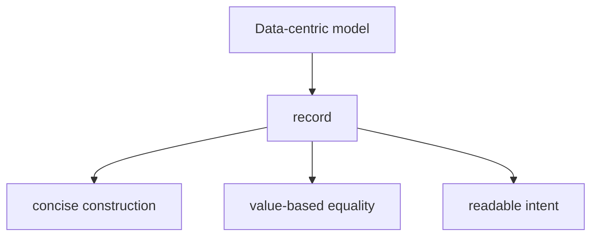

# Records

Records are types designed to make data-centric modeling easier and clearer. They reduce boilerplate and provide value-oriented behavior such as value equality more naturally than ordinary classes.

Records are especially useful when the meaning of the object is mainly in its data rather than in its identity.

## Why records exist

Many types are mostly about carrying data:

- an order summary
- a customer profile snapshot
- a configuration value set
- a message passed between parts of a system

Before records, developers often wrote a lot of repetitive code for these types, especially when they wanted good equality behavior and concise construction.

Records make that style easier to express.

## Record mental model



This is the core idea: records emphasize data meaning over object identity.

## Basic positional record

```csharp
public record Order(int Id, string CustomerName);
```

This short declaration defines a record with two pieces of data.

It is concise, but it also communicates intent: this type is mostly about its values.

## Record classes and record structs

Records can be reference types or value types.

- `record` or `record class` creates a reference type
- `record struct` creates a value type

For beginners, the most common starting point is `record` as a reference type.

## Value equality

One of the most important record features is value-based equality.

```csharp
public record Order(int Id, string CustomerName);

Order first = new(1, "Mina");
Order second = new(1, "Mina");

Console.WriteLine(first == second);
```

This compares by the record's data, not just by whether both variables point to the exact same object instance.

That makes records feel different from ordinary classes.

## `with` expressions

Records also work well with non-destructive copying using `with`.

```csharp
Order original = new(1, "Mina");
Order updated = original with { CustomerName = "Sara" };
```

This is useful when you want a modified copy rather than mutating the original object.

## A worked example

Suppose you want to model a support ticket summary.

```csharp
public record SupportTicket(int Id, string Title, string Status);

SupportTicket openTicket = new(101, "Login issue", "Open");
SupportTicket resolvedTicket = openTicket with { Status = "Resolved" };

Console.WriteLine(openTicket);
Console.WriteLine(resolvedTicket);
```

This is a strong record scenario because:

- the type is mainly data
- value equality is useful
- making modified copies is natural

## Records versus classes

Choose a record when:

- the type is data-oriented
- value equality is desirable
- concise syntax improves clarity

Choose a class when:

- identity matters more than value equality
- mutable lifecycle-heavy behavior is central
- the type models a richer object with behavior and state transitions

## Common mistakes

- Using records just because the syntax is short, without considering whether value equality fits.
- Assuming records replace all classes. They do not.
- Ignoring the semantic difference between identity-based and value-based types.
- Using records for highly mutable domain entities where class semantics may be clearer.

## Summary

Records are data-focused types that make value-oriented modeling easier.

The main ideas are:

- they reduce boilerplate for data models
- they support value-based equality
- they work well with concise construction and `with` expressions
- they are best when the type's meaning comes mainly from its values

Use records when data identity is less important than data content.

## Practice

Create a `StudentRecord` record with an `Id` and `Name`.

As a second exercise, create a new value from an existing record using `with`, and explain how it differs from mutating the original object directly.
