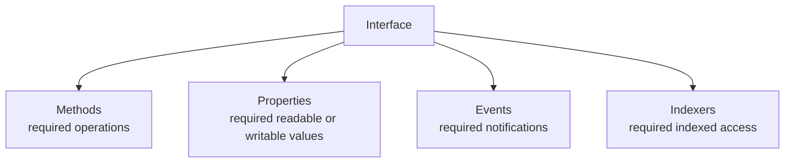
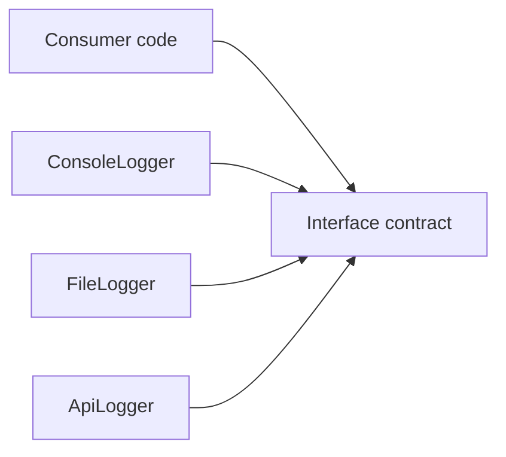

# Interfaces

Interfaces define contracts. They describe what operations a type must provide without specifying how those operations are implemented.

This separation is powerful because it lets code depend on capability instead of on one concrete implementation.

## Interface members at a glance

Interfaces can declare several kinds of members, but they declare them as contracts rather than as storage or implementation.

Common interface member kinds include:

- methods
- properties
- events
- indexers



This is the key difference from classes: interfaces describe what must exist, not how the members are implemented internally.

## Why interfaces matter

Suppose code only needs “something that can log messages.” It may not need to know whether the logger writes to:

- the console
- a file
- a database
- a remote service

An interface captures that idea.

## Contract model at a glance



This is the essential design benefit: the consumer depends on the contract, while multiple implementations can satisfy it.

## Basic interface example

```csharp
public interface ILogger
{
    void Log(string message);
}
```

This says that any implementing type must provide a `Log` method with that signature.

## Methods in interfaces

Methods are the most common interface members.

```csharp
public interface ILogger
{
    void Log(string message);
}
```

This means any implementing type must provide the `Log` operation.

Methods are ideal when the interface describes actions.

## Properties in interfaces

Interfaces can also require properties.

```csharp
public interface IUserSession
{
    string UserName { get; }
    bool IsAuthenticated { get; }
}
```

This does not provide storage. It only says that implementing types must expose those properties.

Properties are useful when consumer code needs state-like information through the contract.

## Events in interfaces

Interfaces can require notifications through events.

```csharp
public interface IDownloadTracker
{
    event Action? DownloadCompleted;
}
```

That is useful when the contract says consumers must be able to subscribe to something happening.

## Indexers in interfaces

Interfaces can declare indexers too.

```csharp
public interface IStringLookup
{
    string this[int index] { get; }
}
```

This is useful when the abstraction naturally supports indexed access.

## What interfaces usually do not contain

For beginner design, the important point is that interfaces are not mainly about object storage.

They do not act like ordinary classes with internal fields and private backing state. They describe required members that an implementation must provide.

## Implementing an interface

```csharp
public class ConsoleLogger : ILogger
{
    public void Log(string message)
    {
        Console.WriteLine(message);
    }
}
```

Now a `ConsoleLogger` can be used anywhere an `ILogger` is expected.

## Why this helps design

Interfaces help with:

- loose coupling
- substitution of implementations
- clearer boundaries between parts of a system
- easier testing and composition

The biggest mental shift is this:

code can ask for a capability instead of a concrete type.

## A worked example

Suppose an order service needs a logger.

```csharp
public interface ILogger
{
    void Log(string message);
}

public class ConsoleLogger : ILogger
{
    public void Log(string message)
    {
        Console.WriteLine($"[LOG] {message}");
    }
}

public class OrderService
{
    private readonly ILogger _logger;

    public OrderService(ILogger logger)
    {
        _logger = logger;
    }

    public void SubmitOrder(int orderId)
    {
        _logger.Log($"Submitting order {orderId}");
    }
}
```

This design is valuable because `OrderService` does not depend on `ConsoleLogger` specifically. It depends on the logging contract.

## A fuller interface example

Here is an interface that uses several different member kinds together.

```csharp
public interface IPlaylist
{
    string Name { get; }
    int Count { get; }
    event Action? Changed;
    string this[int index] { get; }
    void Add(string song);
}
```

This says that any playlist implementation must:

- expose a name
- report a count
- notify when it changes
- allow indexed access
- support adding songs

That shows how interfaces can define a rich contract without committing to one implementation.

## Interfaces versus classes

An interface is not a replacement for a class. They serve different roles:

- an interface describes capability
- a class provides implementation

You often use both together.

## Good interface design

Good interfaces are usually:

- focused
- cohesive
- easy to understand from the member list alone

Poor interfaces often become giant collections of unrelated operations.

## Choosing interface members well

Good interface design depends on choosing member kinds that match the capability.

- Use methods for actions.
- Use properties for observable data.
- Use events for notifications.
- Use indexers when indexed access is part of the abstraction.

If the members do not belong to one cohesive capability, the interface is usually too broad.

## Common mistakes

- Creating interfaces for every class automatically, even when no abstraction benefit exists.
- Making interfaces too broad and unfocused.
- Forgetting that interfaces describe contracts, not storage or object state.
- Using an interface when a simple concrete type would be clearer in small, local code.

## Summary

Interfaces define what a type can do without saying how it does it.

The main ideas are:

- they model contracts
- classes and other types can implement them
- they reduce coupling by separating use from implementation
- they are most valuable when multiple implementations or clear boundaries matter
- they can declare methods, properties, events, and indexers as part of the contract

Interfaces are one of the main design tools for writing flexible C# code.

## Practice

Define an `INotifier` interface with one method named `Send`.

As a second exercise, design an interface with at least one method, one property, and one event, then explain what capability the contract represents.
