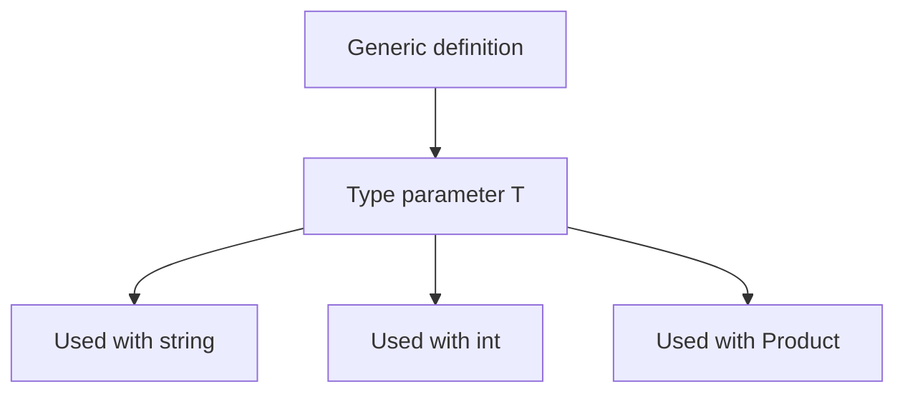

# Generics

Generics let you write reusable code without giving up strong typing. They allow a type or method to work with many data types while still preserving compile-time type safety.

This is one of the reasons C# can be both reusable and precise.

## Why generics matter

Without generics, reusable code often becomes one of two bad extremes:

- overly specific and duplicated for each type
- overly loose and based on `object`, which loses type safety

Generics solve that by letting you write code once while keeping the real type information.

## Generic idea at a glance



The generic definition describes a pattern. The concrete type is supplied later.

## Generic collections

One of the first places beginners meet generics is with collections.

```csharp
List<string> names = new() { "Ava", "Noah" };
Console.WriteLine(names[0]);
```

Here, `List<T>` becomes `List<string>`.

That means:

- the list stores strings
- the compiler can enforce string-only operations
- callers do not need unsafe casting when reading values back

## Generic methods

Methods can also be generic.

```csharp
static void PrintValue<T>(T value)
{
    Console.WriteLine(value);
}

PrintValue(42);
PrintValue("hello");
```

The method works with multiple types while remaining strongly typed.

## Generic classes

Types themselves can be generic.

```csharp
public class Box<T>
{
    public T Value { get; }

    public Box(T value)
    {
        Value = value;
    }
}
```

Then you can create concrete versions:

```csharp
Box<int> numberBox = new(10);
Box<string> textBox = new("hello");
```

## Why generics are better than `object`

Compare these approaches conceptually:

- `List<object>` can hold anything, but callers must often cast when reading values
- `List<string>` says exactly what the collection contains

Generics keep the compiler involved. That is one of their biggest benefits.

## Type parameter naming

The common name `T` means “type.”

You will also see names such as:

- `TKey`
- `TValue`
- `TItem`

Use names that help readers understand the role of the type parameter.

## Generic constraints

Sometimes generic code needs to limit what kinds of types are allowed.

```csharp
static T CreateInstance<T>() where T : new()
{
    return new T();
}
```

This says `T` must have a public parameterless constructor.

Constraints are an advanced topic, but the main idea is simple: they place rules on the type argument.

## A worked example

Suppose you want a reusable repository-style container for one type of item.

```csharp
public class Repository<T>
{
    private readonly List<T> _items = new();

    public void Add(T item)
    {
        _items.Add(item);
    }

    public IReadOnlyList<T> GetAll()
    {
        return _items;
    }
}
```

This class can work with many concrete types while staying strongly typed.

```csharp
Repository<string> messages = new();
messages.Add("Hello");

Repository<int> ids = new();
ids.Add(42);
```

That is the core generics benefit in practice.

## Common mistakes

- Thinking generics are only for collections.
- Using `object` where a generic type parameter would preserve stronger typing.
- Choosing vague type parameter names in more complex code.
- Introducing generics when the code is not actually meant to be reusable across types.

## Summary

Generics let C# code be reusable and strongly typed at the same time.

The main ideas are:

- types and methods can use type parameters such as `T`
- concrete types are supplied later
- generics preserve compile-time safety better than `object`
- collections are the most common beginner example, but generics are much broader than that

Generics are one of the most important features for writing scalable, reusable C# code.

## Practice

Write a generic method `PrintTwice<T>` that prints the same value two times.

As a second exercise, create a generic `Container<T>` type with one property named `Item`, then instantiate it once with `string` and once with `int`.
