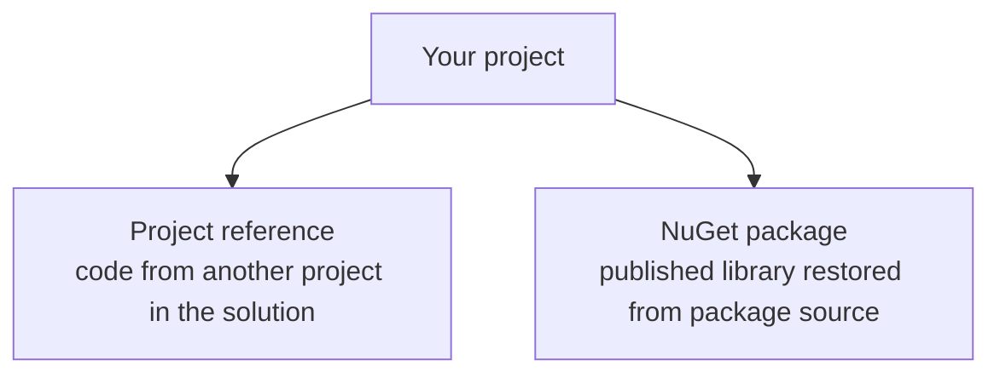

# NuGet Packages and References

Modern .NET development depends on managing dependencies well. In C#, the two most common ways a project depends on other code are:

- project references
- NuGet package references

Understanding the difference helps you reason about code sharing, versioning, builds, and restore behavior.

## Two dependency sources



These are both references, but they represent different relationships.

## Project references

A project reference connects one local project to another local project.

For example, a console app may reference a class library in the same solution.

Command-line example:

```bash
dotnet add reference ../Shared/Shared.csproj
```

Project-file example:

```xml
<ItemGroup>
    <ProjectReference Include="..\Shared\Shared.csproj" />
</ItemGroup>
```

This means the current project depends directly on another project you own in the workspace.

## NuGet packages

NuGet is the package manager for .NET.

A NuGet package is a versioned unit of reusable code published to a package source such as nuget.org or a private feed.

Command-line example:

```bash
dotnet add package Serilog
```

Project-file example:

```xml
<ItemGroup>
    <PackageReference Include="Serilog" Version="4.0.0" />
</ItemGroup>
```

This means the project depends on an external package rather than another local project.

## Restore behavior

When you build or restore a .NET project, the tooling makes sure required packages are available.

That process is called restore.

For NuGet packages, restore downloads the package assets needed for the build.

For project references, restore and build coordinate the local dependency graph across projects.

## A worked example

Suppose you have:

- a local project named `Catalog.Core`
- a logging library from NuGet such as `Serilog`

Your application project might:

- reference `Catalog.Core` through a project reference
- reference `Serilog` through a package reference

That means one dependency comes from your own solution, and the other comes from a versioned external package source.

## Why this distinction matters

Project references are ideal when:

- you are actively developing both projects together
- the code belongs to the same solution or repository
- changes should flow directly through local source code

NuGet packages are ideal when:

- the code is distributed as a reusable library
- versioning matters explicitly
- the dependency comes from outside your current solution

## Common dependency concerns

When working with packages and references, think about:

- version compatibility
- transitive dependencies
- restore behavior
- whether the dependency should be local or packaged

These are not just tooling details. They affect reliability and maintainability.

## Common mistakes

- Using a package when a project reference would be simpler during local development.
- Treating all dependencies as equivalent when local and packaged code behave differently in the workflow.
- Ignoring package versions until conflicts appear.
- Adding dependencies casually without understanding why the project needs them.

## Summary

Dependencies in .NET usually enter a project through project references or NuGet packages.

The main ideas are:

- project references connect projects you build together locally
- package references pull in versioned reusable libraries
- restore makes required dependencies available for build
- understanding dependency type helps you navigate code sharing and maintenance

Dependency management is part of understanding a real C# project, not just a tooling detail on the side.

## Practice

Write down one scenario where a project reference is the better choice and one scenario where a NuGet package is the better choice.

As a second exercise, inspect a `.csproj` file and identify whether it contains a `ProjectReference`, a `PackageReference`, or both.
