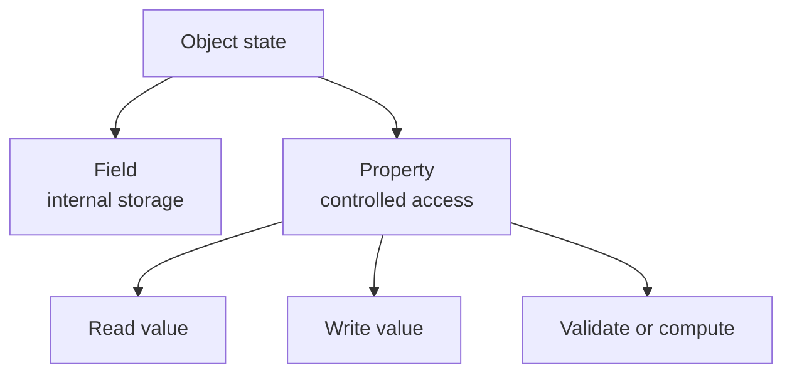

# Fields and Properties

Fields and properties both relate to object data, but they play different roles. A field is storage. A property is an access point that controls how callers read or write a value.

This difference matters because object-oriented design is not only about holding values. It is also about protecting state, enforcing rules, and deciding what the outside world should be allowed to touch.

## The difference at a glance



In many well-designed classes, fields are private and properties form the public surface.

## Fields store data

A field is a variable that belongs to an object or type. Fields often hold the real data that the object uses internally.

```csharp
class Counter
{
    private int _count;

    public void Increment()
    {
        _count++;
    }
}
```

Here `_count` is implementation detail. Outside code cannot change it directly.

Fields are useful when the class needs storage that callers should not manipulate freely.

## Properties control access

A property looks like a field from the caller's point of view, but it is really a member with access logic.

```csharp
class Counter
{
    private int _count;

    public int Count
    {
        get { return _count; }
    }

    public void Increment()
    {
        _count++;
    }
}
```

The caller reads `Count` as if it were simple data, but the class still controls how that value is exposed.

## Why properties are preferred in public APIs

Properties give a type room to evolve without forcing callers to change how they use it. A property can later add:

- validation
- logging
- lazy initialization
- computed results
- restricted writing through `private set` or `init`

That flexibility is one reason public properties are usually better than public fields.

```csharp
class Product
{
    private decimal _price;

    public decimal Price
    {
        get { return _price; }
        set
        {
            if (value < 0)
                throw new ArgumentOutOfRangeException(nameof(value));

            _price = value;
        }
    }
}
```

If `Price` had been a public field, adding validation later would have changed the type design much more awkwardly.

## Common property forms

### Auto-properties

Auto-properties are the shortest form when no custom logic is needed yet.

```csharp
public string Name { get; set; } = string.Empty;
```

The compiler creates the hidden backing storage automatically.

### Read-only properties

These are useful when a value should be set only during construction.

```csharp
public string OrderNumber { get; }
```

### Properties with restricted setters

These allow reading from anywhere but writing only from inside the class.

```csharp
public int Balance { get; private set; }
```

### Computed properties

These calculate a value from other state rather than storing their own value.

```csharp
class Rectangle
{
    public double Width { get; set; }
    public double Height { get; set; }
    public double Area => Width * Height;
}
```

`Area` does not store separate data. It computes the result whenever it is read.

## Backing fields and validation

Sometimes a property needs a field behind it.

```csharp
class BankAccount
{
    private decimal _balance;

    public decimal Balance
    {
        get { return _balance; }
        private set
        {
            if (value < 0)
                throw new InvalidOperationException("Balance cannot be negative.");

            _balance = value;
        }
    }

    public void Deposit(decimal amount)
    {
        if (amount <= 0)
            throw new ArgumentOutOfRangeException(nameof(amount));

        Balance += amount;
    }
}
```

The property helps keep the object valid while still exposing the value safely.

## Choosing between a field and a property

Use a field when:

- the data is internal implementation detail
- outside code should not access it directly
- the class only needs storage, not public API exposure

Use a property when:

- the value is part of the type's public or protected surface
- you may need validation or computed behavior
- you want a stable, readable API for callers

## Common beginner mistakes

- Exposing public fields just because they are shorter.
- Using a property when the value is only private internal storage.
- Forgetting that a property can execute logic and is not always just raw data.
- Duplicating stored data when a computed property would be clearer.

## Summary

- a field is storage
- a property is controlled access to data
- public APIs usually prefer properties over public fields
- properties can validate, compute, or restrict access
- private fields often support encapsulated object state

## Practice

Take a class with one public field and refactor it into a private field plus a property.

As a second exercise, add validation to a property and explain why that behavior would be harder to enforce safely with a public field.
