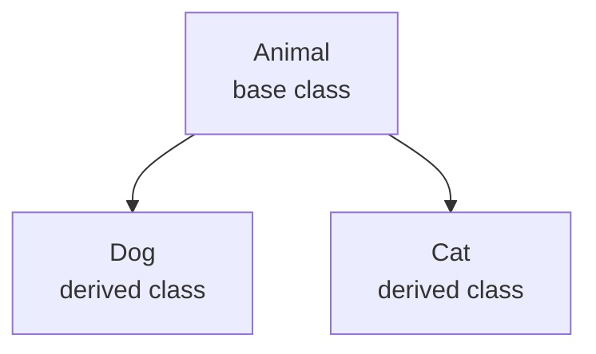

# Inheritance

Inheritance allows one class to build on another class. In C#, a derived class inherits members from a base class and can add new members or override inherited behavior.

Inheritance can be useful, but it is not just a reuse tool. It is a modeling tool. The derived type should truly be a more specific kind of the base type.

## The basic relationship



That diagram means `Dog` and `Cat` inherit from `Animal`. Every `Dog` is also an `Animal`, and every `Cat` is also an `Animal` from the type system's point of view.

## Basic example

```csharp
class Animal
{
    public virtual void Speak()
    {
        Console.WriteLine("Animal sound");
    }
}

class Dog : Animal
{
    public override void Speak()
    {
        Console.WriteLine("Woof");
    }
}
```

`Dog` inherits `Speak` from `Animal`, but it overrides that behavior with a more specific implementation.

## What inheritance gives you

Inheritance can provide:

- shared members defined once in the base class
- more specialized behavior in derived classes
- a common type that caller code can work with

That common type becomes especially valuable when combined with polymorphism.

## Inherited members and added members

A derived class can both reuse and extend behavior.

```csharp
class Employee
{
    public Employee(string name)
    {
        Name = name;
    }

    public string Name { get; }

    public virtual void PrintRole()
    {
        Console.WriteLine("Employee");
    }
}

class Manager : Employee
{
    public Manager(string name, int teamSize)
        : base(name)
    {
        TeamSize = teamSize;
    }

    public int TeamSize { get; }

    public override void PrintRole()
    {
        Console.WriteLine("Manager");
    }
}
```

`Manager` inherits `Name`, adds `TeamSize`, and overrides `PrintRole()`.

## The `base` keyword

The `base` keyword lets a derived class refer to members defined in the base class.

In constructors, `: base(...)` is used to call the base-class constructor. That matters when the base class requires initialization before the derived class finishes building itself.

## When inheritance fits well

Inheritance usually fits when the relationship is stable and meaningful in plain language.

Good examples often sound like:

- a savings account is a kind of bank account
- a square is a kind of shape
- a manager is a kind of employee

The more naturally the relationship reads as "is a," the stronger the case for inheritance becomes.

## Composition versus inheritance

If the relationship is really "has a," "uses a," or "works with a," composition is usually more honest.

For example, a `Car` has an `Engine`. It is not a kind of `Engine`.

That means this is usually better:

```csharp
class Engine
{
    public void Start() => Console.WriteLine("Engine started");
}

class Car
{
    private readonly Engine _engine = new();

    public void Start()
    {
        _engine.Start();
    }
}
```

This is composition, not inheritance.

## Risks of inheritance

Inheritance creates stronger coupling than many beginners expect.

When a base class changes, every derived type can be affected. That means a poor base-class design can spread problems widely.

Some common risks are:

- derived classes depending too heavily on base-class details
- base classes becoming too large and too generic
- using inheritance only to share code instead of to express meaning

## A practical rule of thumb

Before using inheritance, ask:

- does the derived type truly satisfy the meaning of the base type
- can callers safely treat the derived object as the base type
- would composition express the relationship more clearly

If those answers are weak, inheritance is probably the wrong tool.

## Common beginner mistakes

- Using inheritance as the default form of reuse.
- Creating a base class only to avoid repeating a small amount of code.
- Modeling a "has a" relationship as "is a."
- Forgetting that base-class changes ripple into derived classes.

## Summary

- inheritance lets a derived class reuse and specialize a base class
- it works best for real "is a" relationships
- derived classes can inherit, add, and override members
- `base` helps initialize and reference the base part of the object
- composition is often better when the relationship is not truly inheritance

## Practice

Think of one example where inheritance fits naturally and one where composition would be better.

As a second exercise, write a base class and a derived class, then explain which members are inherited, which members are new, and why the relationship qualifies as "is a" rather than "has a".
