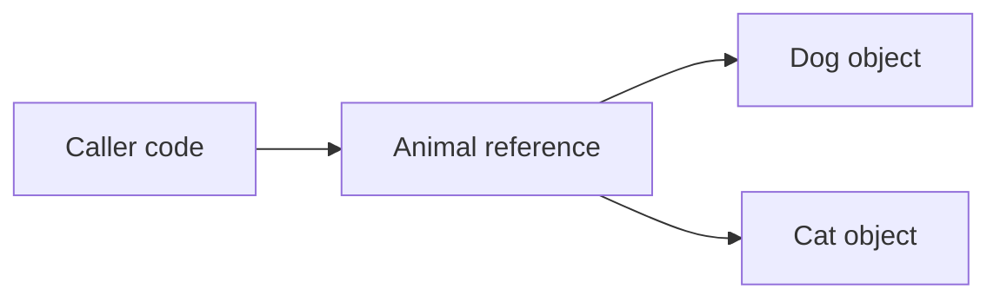

# Polymorphism

Polymorphism means code can work with a common abstraction while different concrete types provide different behavior. In C#, this commonly appears through overridden virtual members, abstract classes, and interfaces.

The practical benefit is that caller code can ask for behavior without hard-coding every specific type decision itself.

## The core idea



The caller works with the abstraction, while the runtime chooses the correct implementation based on the actual object.

## Runtime dispatch with inheritance

```csharp
Animal animal = new Dog();
animal.Speak();

class Animal
{
    public virtual void Speak()
    {
        Console.WriteLine("Animal");
    }
}

class Dog : Animal
{
    public override void Speak()
    {
        Console.WriteLine("Dog");
    }
}
```

Even though the variable is typed as `Animal`, the runtime calls `Dog.Speak()` because the actual object is a `Dog`.

That selection of the correct implementation at runtime is one of the central ideas in polymorphism.

## Why polymorphism matters

Without polymorphism, caller code often grows long chains of `if`, `switch`, or type checks.

With polymorphism, behavior variation moves into the participating types themselves.

That usually leads to code that is:

- easier to extend
- easier to read
- easier to test
- less dependent on concrete type details

## A non-polymorphic approach

```csharp
string Export(string format, string data)
{
    if (format == "json")
        return $"JSON: {data}";

    if (format == "xml")
        return $"XML: {data}";

    throw new InvalidOperationException("Unknown format.");
}
```

This works, but every new format forces changes to the same method.

## A polymorphic approach

```csharp
interface IExporter
{
    string Export(string data);
}

class JsonExporter : IExporter
{
    public string Export(string data)
    {
        return $"JSON: {data}";
    }
}

class XmlExporter : IExporter
{
    public string Export(string data)
    {
        return $"XML: {data}";
    }
}
```

Now caller code can depend on `IExporter` instead of branching on every format manually.

## Polymorphism through interfaces

Interfaces are often the most practical polymorphism tool in application code.

```csharp
interface INotifier
{
    void Send(string message);
}

class EmailNotifier : INotifier
{
    public void Send(string message)
    {
        Console.WriteLine($"Email: {message}");
    }
}

class SmsNotifier : INotifier
{
    public void Send(string message)
    {
        Console.WriteLine($"SMS: {message}");
    }
}
```

Code that depends on `INotifier` does not need to know whether the message goes through email or SMS.

## One caller, different behaviors

```csharp
void NotifyUser(INotifier notifier, string message)
{
    notifier.Send(message);
}
```

The caller stays small because the behavior difference lives in the implementation object.

## Polymorphism is not only inheritance

Beginners often associate polymorphism only with base and derived classes. That is incomplete.

Polymorphism is really about one interface or abstraction being used by many implementations. Inheritance is one route. Interfaces are another major route.

## When polymorphism helps most

Polymorphism is especially useful when:

- behavior genuinely varies by type
- new implementations are likely over time
- caller code should not know implementation details
- replacing implementations in tests or different environments is valuable

## When it adds noise

Polymorphism is not automatically good. If there is only one stable implementation and no real variation, extra abstractions can make the code harder to follow.

The design question is not "can I add an interface here?" The real question is "does variation in behavior matter here?"

## Common beginner mistakes

- Confusing polymorphism with inheritance alone.
- Adding abstractions where no real variation exists.
- Writing long type-check branches instead of moving behavior into the types.
- Forgetting that the runtime object, not only the variable type, affects behavior.

## Summary

- polymorphism lets one abstraction support many concrete behaviors
- runtime dispatch selects behavior based on the actual object
- inheritance and interfaces can both support polymorphism
- good polymorphism reduces branching in caller code
- abstractions are most valuable when behavior truly varies

## Practice

Take a branch-heavy example such as exporting data in two formats and sketch how polymorphism could replace the branching logic.

As a second exercise, define an interface with two implementations and write one method that depends only on the interface. Explain why the caller does not need to know the concrete type.
