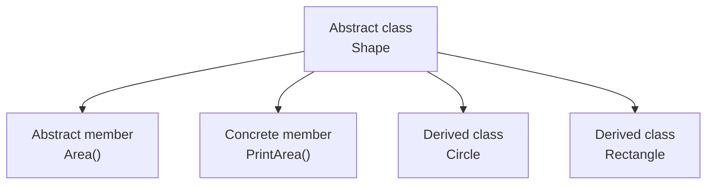

# Abstract Classes

An abstract class is a base class that cannot be instantiated directly. It exists to capture shared structure and shared behavior while still leaving some parts incomplete for derived classes to provide.

Abstract classes are useful when related types clearly belong to one family and that family has both common logic and required specialization.

## The main idea

An abstract class can contain both:

- abstract members, which derived classes must implement
- concrete members, which derived classes inherit and reuse



That mix of shared logic and required specialization is what makes abstract classes different from ordinary base classes and from interfaces.

## Basic example

```csharp
abstract class Shape
{
    public abstract double Area();

    public void PrintArea()
    {
        Console.WriteLine(Area());
    }
}
```

`Shape` cannot be created directly, but derived types can inherit `PrintArea()` and must implement `Area()`.

## Why not just use a normal base class

If the base type is incomplete and should never exist on its own, making it abstract communicates that clearly.

For example, a general `Shape` concept may be useful, but a program may only create concrete shapes such as circles and rectangles.

Making `Shape` abstract prevents accidental creation of an object that has no meaningful complete behavior.

## Example with derived classes

```csharp
abstract class Shape
{
    public abstract double Area();

    public void PrintArea()
    {
        Console.WriteLine($"Area: {Area()}");
    }
}

class Circle : Shape
{
    public Circle(double radius)
    {
        Radius = radius;
    }

    public double Radius { get; }

    public override double Area()
    {
        return Math.PI * Radius * Radius;
    }
}

class Rectangle : Shape
{
    public Rectangle(double width, double height)
    {
        Width = width;
        Height = height;
    }

    public double Width { get; }
    public double Height { get; }

    public override double Area()
    {
        return Width * Height;
    }
}
```

Both derived classes share the idea of being shapes, but each calculates area differently.

## Shared implementation plus required specialization

This is the strongest reason to use an abstract class:

- some behavior belongs once in the base class
- some behavior must vary across derived types

That is different from an interface, which mainly defines a contract rather than shared stateful implementation.

## Abstract class versus interface

A useful beginner comparison is:

- use an interface when you mainly need a contract
- use an abstract class when you need a contract plus reusable base behavior

For example, if many types should all support `Save()`, an interface may be enough. If many related types also share protected helpers, validation, or lifecycle logic, an abstract class may be more appropriate.

## Abstract members and overrides

An abstract member has no implementation in the base class. Derived classes must provide one.

```csharp
public abstract double Area();
```

The derived class then uses `override`.

```csharp
public override double Area()
{
    return Width * Height;
}
```

This pattern combines inheritance with polymorphism.

## A more practical example

```csharp
abstract class DocumentExporter
{
    public void Export(string content)
    {
        Validate(content);
        WriteHeader();
        WriteBody(content);
    }

    protected virtual void Validate(string content)
    {
        if (string.IsNullOrWhiteSpace(content))
            throw new ArgumentException("Content is required.", nameof(content));
    }

    protected abstract void WriteHeader();
    protected abstract void WriteBody(string content);
}
```

This design shows a common pattern: the base class controls the overall workflow, while derived classes provide the variable parts.

## Tradeoffs to watch

Abstract classes create stronger coupling than interfaces because derived types inherit implementation details, assumptions, and sometimes state.

That can be helpful, but it also means the base class should be:

- stable
- cohesive
- focused on one family of related responsibilities

If the base class becomes too broad, every derived class pays the cost.

## Common beginner mistakes

- Choosing an abstract class when only a contract is needed.
- Putting too much unrelated behavior into the base class.
- Creating abstract bases only to share a few lines of code.
- Forgetting that abstract classes create stronger coupling than interfaces.

## Summary

- an abstract class cannot be instantiated directly
- it can contain both abstract and concrete members
- it is useful when related types share behavior but still need specialization
- derived classes must implement abstract members
- abstract classes are strongest when the shared base behavior is real and stable

## Practice

Model a small family of related types and decide whether they need an interface, an abstract class, or neither.

As a second exercise, write an abstract base class with one concrete method and one abstract method, then explain what logic belongs in the base class and what logic belongs in derived classes.
