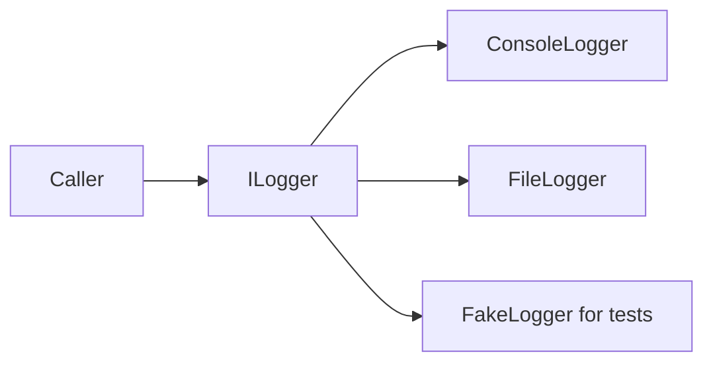

# Interfaces in Practice

Interfaces define contracts. They say what operations or values a type must provide without specifying how the type must implement them.

In real code, interfaces are important because they let one part of a system depend on a capability rather than on one concrete class.

## The practical idea



The caller depends on the contract. Different implementations can be substituted behind that contract.

## A simple example

```csharp
ILogger logger = new ConsoleLogger();
logger.Log("Started");

interface ILogger
{
    void Log(string message);
}

class ConsoleLogger : ILogger
{
    public void Log(string message)
    {
        Console.WriteLine(message);
    }
}
```

The caller only needs `ILogger`. It does not need to know whether the implementation writes to the console, a file, a database, or a remote service.

## Why this matters in real systems

Interfaces are useful when you want:

- multiple implementations of one capability
- looser coupling between parts of the system
- easier replacement in tests or development environments
- clearer boundaries between layers or services

Common examples include `ILogger`, `IClock`, `IPaymentGateway`, `INotifier`, and `IRepository<T>`.

## A service depending on an interface

```csharp
interface INotifier
{
    void Send(string message);
}

class EmailNotifier : INotifier
{
    public void Send(string message)
    {
        Console.WriteLine($"Email: {message}");
    }
}

class OrderService
{
    private readonly INotifier _notifier;

    public OrderService(INotifier notifier)
    {
        _notifier = notifier;
    }

    public void CompleteOrder(int orderId)
    {
        _notifier.Send($"Order {orderId} completed.");
    }
}
```

`OrderService` depends on the capability to send notifications, not on one specific notification mechanism.

## Why that design is useful

If notification requirements change later, `OrderService` may not need to change at all. A different implementation can simply be supplied.

For example, the same service could work with:

- `EmailNotifier`
- `SmsNotifier`
- `PushNotifier`
- a test fake such as `FakeNotifier`

That is the practical power of interfaces.

## Interfaces and testing

Interfaces often make testing easier because tests can supply simple controlled implementations.

```csharp
class FakeNotifier : INotifier
{
    public List<string> Messages { get; } = new();

    public void Send(string message)
    {
        Messages.Add(message);
    }
}
```

This allows a test to verify whether a service attempted to send a message without using a real email or SMS system.

## Good places for interfaces

Interfaces are especially useful at boundaries where one part of the program should not know too much about another part.

Typical examples include:

- infrastructure dependencies
- external systems
- application services with multiple implementations
- pluggable behaviors that vary by environment or feature choice

## When not to add one

Do not create an interface automatically for every class. If there is only one stable implementation and no real benefit from substitution, an interface may add ceremony without helping design clarity.

The most important question is not "can I make an interface here?" It is "does another part of the system benefit from depending on a capability instead of this exact class?"

## Interface design guidance

Good interfaces are usually:

- small
- focused
- named after a clear capability
- cohesive rather than broad collections of unrelated operations

An interface becomes hard to implement and hard to reason about when it tries to represent too many unrelated responsibilities.

## Common beginner mistakes

- Creating an interface for every single class automatically.
- Making interfaces too large and unfocused.
- Using an interface even when no substitution point exists.
- Treating an interface as a marker of abstraction instead of a real design boundary.

## Summary

- interfaces define contracts rather than implementations
- they help parts of a program depend on capabilities instead of concrete types
- they are valuable when substitution, decoupling, or testing matters
- they work best when small and focused
- not every class needs an interface

## Practice

Pick one service-like class and ask whether callers would benefit from depending on an interface instead of the concrete type.

As a second exercise, create an interface with two implementations and one consumer class that depends on the interface. Explain what became easier to change or test because of that design.
