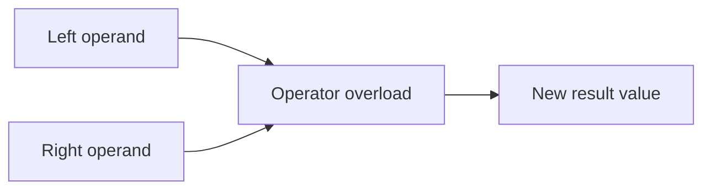

# Operator Overloading

Operator overloading lets a custom type participate in built-in operator syntax such as `+`, `-`, `==`, or `<`. This can make code feel natural, but only when the overloaded operator means what readers already expect it to mean.

The design question is not whether operator overloading is possible. The real question is whether it improves clarity.

## The basic idea

If a type has a clear mathematical or value-oriented meaning, operator syntax can make code more expressive.

```csharp
public readonly record struct Money(decimal Amount)
{
    public static Money operator +(Money left, Money right)
    {
        return new Money(left.Amount + right.Amount);
    }
}
```

Now this becomes possible:

```csharp
Money total = new(10m) + new Money(5m);
```

That reads naturally because `+` already suggests numeric combination.

## How operator overloading fits conceptually



The overloaded operator is really a specially declared member that tells C# how to combine or compare values of the custom type.

## When it helps

Operator overloading can improve readability when:

- the type has a clear mathematical, geometric, or value-based meaning
- the operator matches normal intuition
- the result of the operator is predictable
- the overloaded syntax is simpler than a method call without hiding meaning

Common examples include:

- money-like value types
- vectors and points
- measurement types such as distance or duration
- value objects with obvious equality semantics

## A more complete example

```csharp
public readonly record struct Vector2(double X, double Y)
{
    public static Vector2 operator +(Vector2 left, Vector2 right)
    {
        return new Vector2(left.X + right.X, left.Y + right.Y);
    }

    public static Vector2 operator -(Vector2 left, Vector2 right)
    {
        return new Vector2(left.X - right.X, left.Y - right.Y);
    }
}
```

Here `+` and `-` feel natural because readers already understand those operations on coordinate-like values.

## Equality operators need extra care

If you overload equality-related operators such as `==` and `!=`, the type should have a very clear idea of value equality.

Readers should not have to guess whether equality means:

- same identity
- same stored values
- same external effect

For value objects, equality often compares state. For reference-oriented domain objects, that decision may be less obvious.

## When it hurts readability

Operator overloading becomes a problem when the meaning is clever instead of clear.

For example, if `+` on a `User` type means "merge profile settings unless blocked by permissions," that is probably too surprising for operator syntax.

In such cases, a named method such as `MergeWith` is usually clearer.

## Operator overloading versus methods

A useful rule is:

- use operators for obvious, expected meanings
- use methods when the action needs explanation

If the reader benefits from a verb, a method is often the better API.

## Design questions to ask

Before overloading an operator, ask:

- would most readers predict what this operator does
- does the operator preserve familiar meaning
- is the result type unsurprising
- would a named method be clearer

If those answers are weak, skip the overload.

## Common beginner mistakes

- Overloading operators only to make a type feel advanced.
- Using operator syntax for domain behavior that is not obvious.
- Forgetting that equality operators need a coherent equality model.
- Making operator behavior inconsistent with reader expectations.

## Summary

- operator overloading lets custom types use built-in operator syntax
- it works best for types with natural mathematical or value-oriented meaning
- clarity matters more than cleverness
- equality operators require especially careful design
- methods are often better when behavior needs explicit naming

## Practice

Think of one custom type where `+` would feel natural and one where it would feel misleading.

As a second exercise, define a small value type and choose whether one operator overload would improve readability or whether a named method would be clearer. Explain your reasoning from the reader's point of view.
