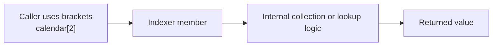

# Indexers

Indexers let an object use bracket syntax like an array, list, or dictionary. They are useful when the object naturally represents lookup by position or by key.

Instead of forcing callers to use a method such as `GetDay(1)`, an indexer can make access feel direct and familiar.

## The basic idea

```csharp
class WeekDays
{
    private readonly string[] _days = ["Mon", "Tue", "Wed"];

    public string this[int index]
    {
        get { return _days[index]; }
    }
}
```

The `this[...]` syntax means the object itself can be indexed.

## A visual model



The caller sees convenient bracket syntax, while the object controls what that access actually means.

## When indexers fit well

Indexers are a good fit when:

- the type represents a collection-like view of data
- positional or keyed access is central to the abstraction
- bracket syntax feels clearer than a named method

Examples include:

- wrappers around arrays or lists
- grid-like structures
- dictionaries or lookups
- domain objects where indexed access is part of the natural model

## Read-only indexers

Some types should allow indexed reading but not indexed writing.

```csharp
class TemperatureLog
{
    private readonly List<double> _readings = [20.5, 21.0, 19.8];

    public double this[int index]
    {
        get { return _readings[index]; }
    }
}
```

This lets callers read values with bracket syntax while still keeping write control inside the type.

## Read-write indexers

An indexer can also support both reading and writing.

```csharp
class ScoreBoard
{
    private readonly Dictionary<string, int> _scores = new();

    public int this[string name]
    {
        get { return _scores[name]; }
        set { _scores[name] = value; }
    }
}
```

Now callers can write:

```csharp
board["Mina"] = 10;
```

That is often clearer than separate `SetScore` and `GetScore` methods when the type naturally behaves like a lookup.

## Indexers still support encapsulation

Even though indexers look concise from the outside, they are still members with logic. That means they can:

- validate indexes or keys
- translate a key into some internal representation
- expose a view rather than raw storage
- restrict writing or allow only reading

So an indexer is not "just array syntax." It is controlled access designed by the type author.

## Indexer versus method

A useful design question is whether the object itself should feel indexable.

If the answer is yes, an indexer may make sense.

If callers really need a descriptive verb such as `FindByCode`, `GetCustomerByEmail`, or `CalculateRate`, then a method is usually clearer.

The fact that a type contains a collection internally does not automatically mean it should expose an indexer.

## A fuller example

```csharp
class SeatingChart
{
    private readonly string[,] _seats =
    {
        { "A1", "A2" },
        { "B1", "B2" }
    };

    public string this[int row, int column]
    {
        get { return _seats[row, column]; }
        set { _seats[row, column] = value; }
    }
}
```

This shows that indexers can also use multiple parameters, which fits matrix-like or grid-like models naturally.

## Common beginner mistakes

- Adding an indexer just because the type stores a collection internally.
- Using an indexer when a named method would explain intent more clearly.
- Forgetting that indexers can and should still protect the object's rules.
- Choosing bracket syntax for behavior that is not really lookup-oriented.

## Summary

- indexers let objects use bracket syntax
- they are best for collection-like or lookup-like abstractions
- they can be read-only or read-write
- they still encapsulate logic and rules
- methods are better when the action needs a descriptive name

## Practice

Take one collection-like type and decide whether an indexer would make its API clearer or more confusing.

As a second exercise, design a type with a two-parameter indexer and explain why bracket syntax matches the mental model of that type.
