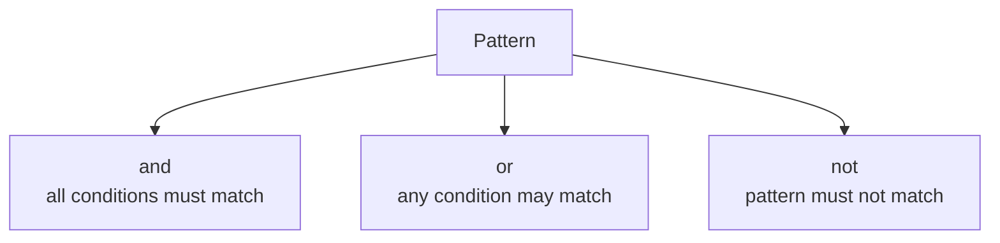

# Pattern Combinators

Pattern combinators extend pattern matching by letting you combine smaller patterns into larger logical conditions. Instead of writing several nested `if` statements or separate boolean expressions, you can often describe the intent directly in one `is` pattern.

This feature is useful because it can make condition-heavy code easier to read when the pattern really describes the shape of the value you are checking.

## The main combinators

C# pattern combinators most commonly use:

- `and` to require multiple pattern conditions
- `or` to accept one of several pattern conditions
- `not` to exclude a pattern



These keywords let you express logical combinations inside pattern syntax itself.

## A simple `and` example

```csharp
int temperature = 22;

if (temperature is > 18 and < 30)
{
    Console.WriteLine("Comfortable");
}
```

This reads almost like natural language: the value must be greater than 18 and less than 30.

Without pattern combinators, you might write:

```csharp
if (temperature > 18 && temperature < 30)
{
    Console.WriteLine("Comfortable");
}
```

Both are valid. Pattern combinators are most useful when they improve the clarity of pattern matching, not merely when they replace familiar boolean operators.

## Using `or`

`or` is helpful when several different patterns should be treated the same way.

```csharp
char command = 'y';

if (command is 'y' or 'Y')
{
    Console.WriteLine("Confirmed");
}
```

This keeps the valid alternatives close together in one readable expression.

## Using `not`

`not` is useful when you want to exclude one pattern.

```csharp
string? input = "hello";

if (input is not null)
{
    Console.WriteLine(input.Length);
}
```

This has become a common modern way to express a null check in pattern form.

## Combining combinators

Pattern combinators become more interesting when they describe richer conditions.

```csharp
int score = 85;

if (score is >= 50 and not 60)
{
    Console.WriteLine("Passing score, but not exactly 60");
}
```

This shows that pattern matching can express both inclusion and exclusion in one compact structure.

## Pattern combinators with type checks

They are not limited to numbers. They also work naturally with type patterns.

```csharp
object value = "CSharp";

if (value is string and not "")
{
    Console.WriteLine("Non-empty string");
}
```

Here the pattern says two things:

- the value must be a `string`
- the string must not be empty

## When they improve code

Pattern combinators help most when the condition is really about matching the value's form, range, or classification.

They are especially good for:

- range checks
- type-based branching
- matching one of several allowed values
- excluding a specific case from a broader pattern

## When they may hurt readability

If the expression becomes long or mentally heavy, ordinary boolean logic may be clearer.

For example, a very complicated condition with many nested patterns can be harder to read than a few well-named helper methods or boolean variables.

The rule is the same as with other advanced syntax: use it when it clarifies intent, not when it only looks modern.

## Common beginner mistakes

- Using pattern combinators where simple boolean logic would be clearer.
- Writing very large combined patterns that hide the real rule.
- Assuming pattern syntax is always better than `&&`, `||`, and `!`.
- Forgetting that readability matters more than novelty.

## Summary

- pattern combinators let you combine patterns with `and`, `or`, and `not`
- they make many pattern-matching conditions more expressive
- they work especially well for ranges, alternatives, and exclusions
- they are most valuable when they improve readability
- simpler boolean logic is still often the right choice

## Practice

Write one example using `and`, one using `or`, and one using `not`.

As a second exercise, rewrite a small branch condition twice: once with ordinary boolean operators and once with pattern combinators. Then explain which version is clearer and why.
