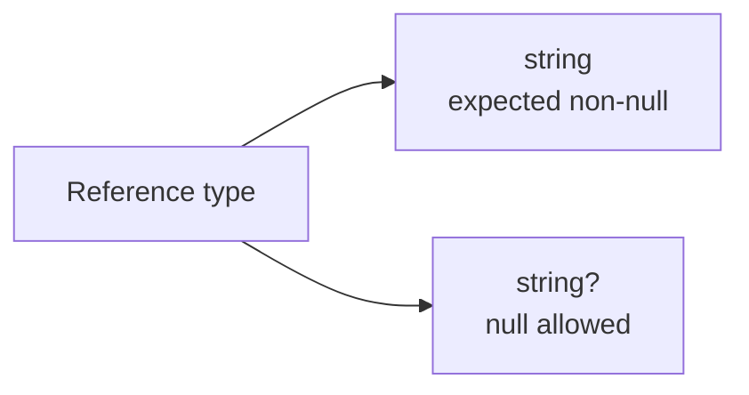

# Nullable Reference Types

Nullable reference types help C# warn you about many null-related mistakes before the program runs. They make you express whether a reference is expected to hold a value or may legally be missing.

This matters because `null` bugs are some of the most common and frustrating problems in application code. Nullable reference types do not eliminate all null problems, but they push many of them into compile-time warnings instead of runtime surprises.

## The core idea

With nullable reference types enabled:

- `string` means the variable is expected to hold a non-null string
- `string?` means the variable may be `null`



That small `?` changes how the compiler reasons about your code.

## A simple example

```csharp
string? nickname = null;
Console.WriteLine(nickname?.Length ?? 0);
```

The code says clearly that `nickname` may be absent. The null-conditional and null-coalescing operators then handle that possibility safely.

## Why this feature exists

Before nullable reference types, reference types such as `string` could always hold `null`, but the type system did not express that intent clearly. Programmers had to rely on comments, naming, or assumptions.

Nullable reference types change that by treating nullability as part of the design.

## Non-null reference example

```csharp
string name = "Lina";
Console.WriteLine(name.Length);
```

Here the compiler assumes `name` should not be `null`. If later code tries to assign `null` to it, the compiler can warn you.

## Nullable reference example

```csharp
string? middleName = null;

if (middleName is not null)
{
    Console.WriteLine(middleName.Length);
}
```

The explicit `?` tells readers and the compiler that absence is allowed.

## Flow analysis

One of the most useful parts of this feature is compiler flow analysis. The compiler tracks checks you make and adjusts its understanding of whether a value may be null.

```csharp
string? input = GetInput();

if (input is not null)
{
    Console.WriteLine(input.Length);
}
```

Inside the `if` block, the compiler knows `input` is not null because the code has already checked it.

## Common null-handling tools

Nullable reference types are most useful when combined with familiar null-safe operators and patterns:

- `?.` for conditional access
- `??` for fallback values
- `??=` for assigning a fallback when null
- `is null` and `is not null` for explicit checks

```csharp
string? title = null;
string displayTitle = title ?? "Untitled";
```

## A practical example

```csharp
class UserProfile
{
    public string UserName { get; }
    public string? Bio { get; }

    public UserProfile(string userName, string? bio)
    {
        UserName = userName;
        Bio = bio;
    }
}
```

This design communicates that every profile must have a `UserName`, but a `Bio` is optional.

That is exactly the kind of design clarity nullable reference types are meant to provide.

## Why warnings still matter

Nullable reference types usually produce warnings rather than hard compile errors. That means the compiler is helping you reason about possible mistakes, but it still expects you to decide how to handle them.

You should not treat the warnings as noise. They often point at real design uncertainty.

## When they improve design

Nullable reference types encourage better API design because they force useful questions:

- is this value truly required
- is absence valid here
- should the caller handle a missing value explicitly

Those are design questions, not only syntax questions.

## Common beginner mistakes

- Using `string?` everywhere just to suppress warnings.
- Ignoring nullability warnings instead of understanding them.
- Forgetting to check nullable values before dereferencing them.
- Marking required data as nullable when the constructor or API should enforce it instead.

## Summary

- nullable reference types make null intent part of the type design
- `string` means expected non-null and `string?` means null is allowed
- compiler flow analysis tracks null checks through the code
- nullability warnings often reveal real design problems
- the feature works best when combined with clear API design and safe null handling

## Practice

Create a small type with one required string property and one optional string property, then annotate them correctly.

As a second exercise, write a method that accepts a nullable string, checks it safely, and returns a fallback value when it is missing.
