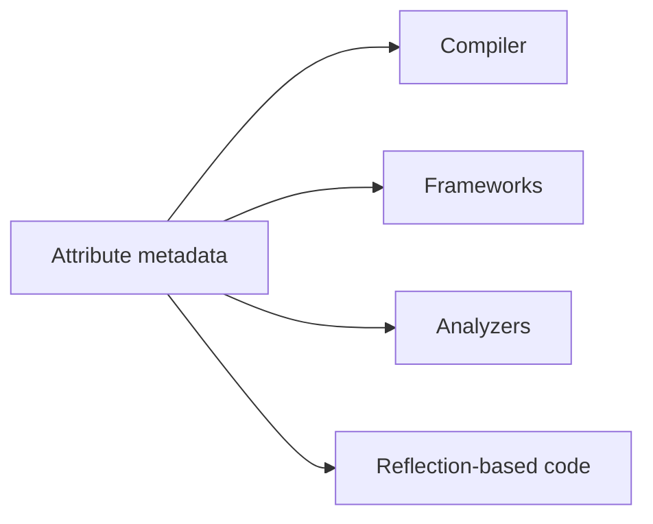

# Attributes

Attributes attach metadata to code declarations. That metadata can be read by the compiler, frameworks, analyzers, libraries, or reflection-based code to change behavior or communicate intent.

Attributes are powerful because they let you describe something about the code without changing the ordinary method body or class body itself.

## What an attribute is

An attribute is extra information attached to a declaration such as:

- a class
- a method
- a property
- a field
- a parameter
- an assembly



That means an attribute often does not do anything by itself. Its effect depends on who reads it.

## A simple example

```csharp
[Obsolete("Use NewMethod instead")]
static void OldMethod()
{
}
```

`[Obsolete]` tells the compiler and tools that the method should no longer be used. When code calls it, the compiler can produce a warning.

## Why attributes are useful

Attributes are common when code needs metadata for concerns such as:

- diagnostics
- serialization
- testing frameworks
- dependency injection or configuration tools
- API guidance
- runtime inspection through reflection

For example, test frameworks often use attributes such as `[TestMethod]`, and serializers may use attributes to control property names or behavior.

## Attribute syntax

Attributes appear in square brackets before the declaration they apply to.

```csharp
[Serializable]
class Order
{
}
```

Some attributes accept constructor arguments or named properties.

```csharp
[Obsolete("Use NewMethod instead", error: false)]
static void OldMethod()
{
}
```

This is similar to creating an object with configuration data, except the attribute becomes metadata attached to the code element.

## A practical example

```csharp
class ApiController
{
    [Obsolete("Use GetCustomerV2 instead")]
    public string GetCustomer()
    {
        return "Old version";
    }

    public string GetCustomerV2()
    {
        return "New version";
    }
}
```

The attribute does not change the method body. It changes how tools and developers are expected to treat the method.

## Attributes and reflection

One reason attributes matter so much in C# ecosystems is that frameworks can inspect them at runtime.

For example, a library can scan a type, look for specific attributes, and then decide how to serialize data, register handlers, or expose endpoints.

That is why attributes are often described as declarative metadata.

## Custom attributes

You can also define your own attributes by creating a class that derives from `Attribute`.

```csharp
public class AuditAttribute : Attribute
{
    public AuditAttribute(string actionName)
    {
        ActionName = actionName;
    }

    public string ActionName { get; }
}
```

Then you can apply it like this:

```csharp
[Audit("DeleteCustomer")]
void DeleteCustomer(int id)
{
}
```

The attribute itself does not automatically add auditing. Some tool or runtime behavior must read it and act on it.

## When attributes help most

Attributes are best when metadata should stay close to the declaration it describes.

They work well when you want code to say, in effect:

- this API is obsolete
- this member is serializable in a special way
- this method is a test
- this parameter has special validation or binding behavior

## Common beginner mistakes

- Assuming an attribute automatically performs behavior by magic.
- Forgetting that an attribute only matters if some tool or framework reads it.
- Overusing custom attributes when an ordinary method or configuration object would be clearer.
- Treating attributes as a replacement for clear code design.

## Summary

- attributes attach metadata to declarations
- compilers, frameworks, analyzers, and reflection code can read that metadata
- attributes are written in square brackets before declarations
- many framework features rely heavily on attributes
- attributes are most useful when metadata belongs close to the code it describes

## Practice

Find one built-in attribute and explain who reads it and what effect it has.

As a second exercise, define a small custom attribute with one constructor parameter, apply it to a method, and explain why the attribute alone does not perform behavior unless some code reads it.
