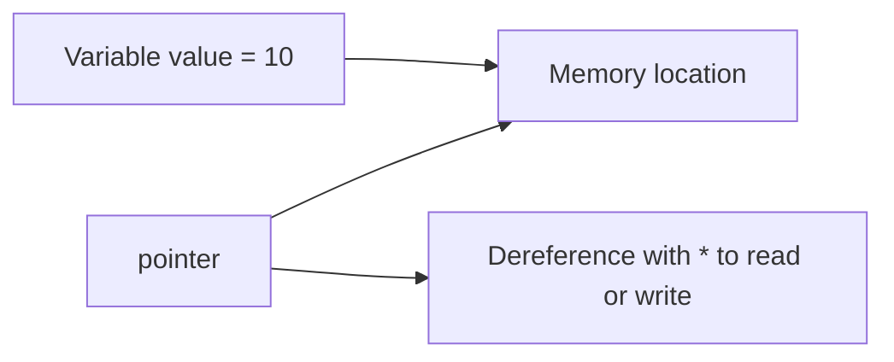

# Unsafe Code and Pointers

Unsafe code allows direct memory-oriented operations that normal C# does not allow. This includes pointer syntax, direct addresses, and certain low-level memory manipulations.

It is called unsafe because the compiler and runtime give up some of the normal guarantees that make ordinary C# safer and easier to reason about.

## Why unsafe code exists

Most C# code should stay in safe managed code. Unsafe code exists for specialized scenarios such as:

- interop with native APIs
- very low-level performance work
- special memory manipulation tasks
- working with buffers in ways that ordinary safe syntax cannot express directly

It is not a general-purpose style for everyday business logic.

## A basic pointer example

```csharp
unsafe
{
    int value = 10;
    int* pointer = &value;
    Console.WriteLine(*pointer);
}
```

This code does three important things:

- `&value` gets the address of `value`
- `int*` declares a pointer to an `int`
- `*pointer` dereferences the pointer to read the pointed-at value

## A mental model



The pointer does not store the integer value itself. It stores a memory address that can be used to access the value.

## What makes it unsafe

In safe C# code, the runtime helps protect you from many memory mistakes. In unsafe code, you can create problems such as:

- reading invalid memory
- writing to the wrong location
- corrupting data
- causing crashes or undefined behavior

That is why unsafe code requires extra care and explicit project support.

## `unsafe` context

Pointer operations must appear in an `unsafe` context.

```csharp
unsafe class BufferReader
{
}
```

or

```csharp
unsafe
{
}
```

This makes the low-level intent explicit.

## A practical caution

Unsafe code is often discussed together with performance, but unsafe does not automatically mean faster in a meaningful real-world way. Modern C# and .NET already provide many efficient safe APIs.

For example, `Span<T>`, `Memory<T>`, and optimized library code often provide the benefits people want without dropping into raw pointers.

## When pointers are more reasonable

Pointers are more reasonable when:

- calling native code requires them
- you are working in a tightly controlled low-level boundary
- profiling has shown a real need
- safe alternatives are not sufficient for the scenario

## When to avoid them

Avoid unsafe code when:

- ordinary collections or spans are enough
- the code is application logic rather than low-level systems code
- the team cannot confidently review and maintain pointer-heavy code
- the performance benefit is only guessed, not measured

## Common beginner mistakes

- Assuming unsafe code is the mark of advanced or better C#.
- Using pointers before understanding safer alternatives.
- Treating unsafe code as a shortcut rather than a specialized tool.
- Forgetting that memory mistakes here can become serious runtime problems.

## Summary

- unsafe code allows pointer-based memory operations in C#
- it is intended for specialized low-level scenarios
- pointer syntax works with addresses and dereferencing
- it reduces many of the normal safety guarantees of managed code
- safe alternatives should usually be preferred unless there is a real technical reason not to

## Practice

Explain in plain language what `&value`, `int*`, and `*pointer` mean in the basic example.

As a second exercise, describe one realistic scenario where unsafe code may be justified and one where ordinary safe C# would clearly be the better choice.
