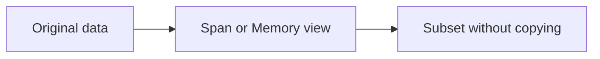

# Span and Memory Overview

`Span<T>` and `Memory<T>` are modern .NET types for working with contiguous data efficiently. They are especially useful when you want to work with slices of existing data without creating unnecessary copies.

These types matter most in performance-sensitive code, but even when you are not doing systems-level programming, it is helpful to understand the mental model behind them.

## The core idea

Normally, slicing data often creates a new array or string fragment. Span-based APIs let you refer to a window over existing data instead.



This is why span-based code can reduce allocations.

## A simple `Span<T>` example

```csharp
int[] values = [1, 2, 3, 4];
Span<int> middle = values.AsSpan(1, 2);
Console.WriteLine(middle[0]);
```

Here `middle` refers to a slice of the original array. It does not create a brand-new array containing `2` and `3`.

## Why this is useful

When code repeatedly slices, parses, transforms, or processes data, copying can add overhead. `Span<T>` helps code work with existing storage directly.

This is especially valuable for:

- parsing text or binary data
- working with buffers
- high-performance loops
- library code that wants to avoid temporary allocations

## `Span<T>` versus `Memory<T>`

A useful beginner summary is:

- `Span<T>` is for synchronous, stack-friendly, short-lived access
- `Memory<T>` is for scenarios where the data view needs to live longer or move through APIs more flexibly

`Span<T>` is a `ref struct`, which means it has special safety rules and cannot be used everywhere ordinary types can.

## A string example with spans

```csharp
string text = "CSharp";
ReadOnlySpan<char> firstPart = text.AsSpan(0, 3);
Console.WriteLine(firstPart.ToString());
```

This creates a read-only span view over part of the string.

## Why `ReadOnlySpan<T>` exists

Sometimes code should be able to read data but not modify it. `ReadOnlySpan<T>` expresses that intent clearly while keeping the same slice-based mental model.

For strings, this is especially useful because strings are already immutable.

## A practical mental model

Think of `Span<T>` as a lightweight view over existing memory, not as independent owned storage.

That means:

- the underlying data already exists somewhere else
- the span points at some portion of that data
- modifying a writable span affects the original underlying storage

## Where the complexity comes from

Span-based APIs come with usage rules because they are designed to be safe while still exposing memory-oriented performance benefits.

For beginners, the important takeaway is not every rule, but the overall design purpose:

- reduce copying
- reduce allocation pressure
- work with slices efficiently

## When to use them

They are most useful when:

- profiling shows allocations matter
- you are parsing or processing large amounts of data
- you are writing reusable performance-sensitive libraries
- array or string slicing is happening frequently

## When not to force them

If code is simple and performance is not a real issue, normal arrays, strings, and collections are often clearer.

`Span<T>` should not be used just to look advanced. It should solve a real clarity or performance problem.

## Common beginner mistakes

- Thinking a span owns its own storage like an array.
- Assuming span-based code is always the right choice.
- Introducing memory-oriented complexity before measuring any problem.
- Forgetting that changes through a writable span affect the underlying data.

## Summary

- `Span<T>` and `Memory<T>` let code work with slices of existing data efficiently
- they help avoid unnecessary copying and allocation
- `ReadOnlySpan<T>` provides a read-only slice view
- span-based APIs are most valuable in performance-sensitive scenarios
- the key idea is viewing existing data, not creating new storage

## Practice

Create an array and take a span over part of it, then explain whether a new array was created.

As a second exercise, compare a copy-based approach and a span-based approach conceptually, and explain when the simpler copy-based version would still be the better design.
