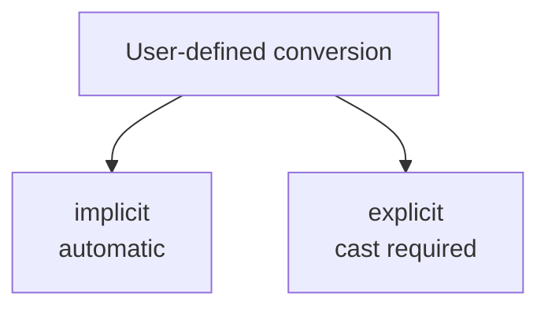

# User-defined Conversions

User-defined conversions let a type participate in conversion syntax so that code can convert between your custom type and another type in a controlled way.

This can make code feel natural, but it also carries risk. Conversions should communicate meaning clearly and never hide surprising transformations.

## The two main forms

C# supports two main kinds of user-defined conversions:

- `implicit` conversions, which happen automatically
- `explicit` conversions, which require a cast



The design choice between them matters a lot.

## A simple example

```csharp
public readonly record struct Meter(double Value)
{
    public static implicit operator double(Meter meter) => meter.Value;
}
```

This lets code use a `Meter` where a `double` is expected.

```csharp
Meter distance = new(5.5);
double rawValue = distance;
```

Because the conversion is `implicit`, no cast is required.

## When `implicit` is appropriate

An implicit conversion should be safe, unsurprising, and unlikely to lose meaning.

If readers can use it without stopping to wonder what happened, it may be reasonable.

Good candidates are usually conversions where:

- the meaning stays obvious
- no important information is lost
- the conversion feels natural in the domain

## When `explicit` is better

If a conversion may lose information, change interpretation, or surprise the reader, it should usually be explicit.

```csharp
public readonly record struct Celsius(double Value)
{
    public static explicit operator int(Celsius temperature) => (int)temperature.Value;
}
```

Now the caller must write:

```csharp
Celsius value = new(23.9);
int roundedDown = (int)value;
```

The cast makes the potentially meaningful change visible.

## Why this feature exists

User-defined conversions help custom value types participate in code more naturally.

They are often most reasonable for:

- measurement types
- lightweight numeric wrappers
- domain value objects with clear conversion meaning

## A fuller example

```csharp
public readonly record struct Kilometer(double Value)
{
    public static implicit operator double(Kilometer value) => value.Value;

    public static explicit operator Kilometer(double value) => new(value);
}
```

This design says:

- converting `Kilometer` to `double` is straightforward
- converting raw `double` to `Kilometer` should be written explicitly so the domain meaning is visible

## Conversion design is an API decision

Conversions are part of the public surface of a type. That means the question is not only "can I add a conversion?" The real question is "will this conversion make code clearer and safer for readers?"

If not, a named factory or method may be better.

For example, sometimes `Money.FromDecimal(value)` communicates intent more clearly than an automatic conversion.

## When conversions become risky

Conversions can hurt readability when:

- the conversion loses meaning or precision silently
- multiple conversions make the code ambiguous
- the type changes in ways readers do not expect
- the conversion hides an important domain step

## Common beginner mistakes

- Making conversions implicit when they are not obviously safe.
- Adding conversions only because they are possible.
- Hiding meaningful domain interpretation behind automatic syntax.
- Forgetting that a named method is often clearer than a clever conversion.

## Summary

- user-defined conversions let custom types participate in conversion syntax
- `implicit` conversions should be safe and unsurprising
- `explicit` conversions are better when meaning or information could be lost
- conversions are part of API design, not only syntax tricks
- a named method is often better when the conversion needs explanation

## Practice

Design one type with an `implicit` conversion that feels safe and one type where the conversion should clearly be `explicit`.

As a second exercise, compare a user-defined conversion with a named factory method and explain which one makes the domain intent clearer.
