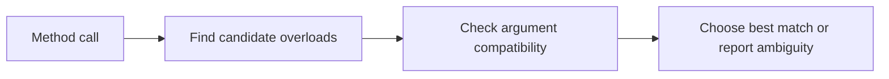

# Overload Resolution Overview

Overload resolution is the process the compiler uses to decide which overloaded member should be called when several members have the same name.

Understanding this helps explain why some calls compile exactly as expected, why others choose a surprising overload, and why some calls fail as ambiguous.

## A basic example

```csharp
void Print(int value) => Console.WriteLine("int");
void Print(string value) => Console.WriteLine("string");

Print(5);
```

The compiler sees `5` and chooses `Print(int)`.

## The basic idea

When the compiler sees a call, it looks for members with the right name and then tries to find the best match based on the provided arguments.



That means overload resolution is not random. It follows specific matching rules.

## Exact matches are easiest

If one overload matches the argument types exactly, that is usually the straightforward winner.

```csharp
void Show(int value) => Console.WriteLine("int");
void Show(double value) => Console.WriteLine("double");

Show(10);
```

The literal `10` is naturally an `int`, so `Show(int)` is chosen.

## Conversions also matter

Sometimes the compiler can convert the provided argument to fit more than one overload. Then it tries to determine which candidate is better.

```csharp
void Display(long value) => Console.WriteLine("long");
void Display(double value) => Console.WriteLine("double");

Display(5);
```

Both overloads may look possible because `int` can convert to `long` and to `double`. The compiler then applies its rules to pick the better match.

## Why overload resolution can be confusing

Overload resolution becomes harder to predict when you combine things like:

- numeric conversions
- optional parameters
- named arguments
- generic methods
- user-defined conversions
- `null` arguments

That is why it is useful to understand the concept even if you never memorize every rule.

## A common `null` example

```csharp
void Log(string text) => Console.WriteLine("string");
void Log(object value) => Console.WriteLine("object");

Log(null!);
```

Calls like this can make overload resolution feel subtle, because `null` can be compatible with multiple reference-type overloads.

## Ambiguity happens

Sometimes the compiler cannot decide.

```csharp
void Save(long value) { }
void Save(ulong value) { }

// Save(5); // may become ambiguous depending on the call context
```

When there is no clear best candidate, the compiler reports an ambiguity error.

## Good API design reduces confusion

Even though the compiler has detailed overload rules, API design should not depend on callers understanding obscure edge cases.

Good overload sets are usually:

- clearly different in purpose or parameter shape
- easy to call without surprising ambiguity
- small enough that the best match feels obvious

If overloads become confusing, different method names may be clearer.

## Practical advice

When an overload call behaves unexpectedly:

- check the exact argument types
- look for implicit conversions
- look for optional parameters
- consider whether a cast would make the intended overload explicit

Sometimes adding one cast is the cleanest way to show the compiler and the reader what you mean.

## Common beginner mistakes

- Assuming the compiler always chooses the overload you had in mind.
- Creating too many similar overloads in one API.
- Forgetting that conversions influence overload selection.
- Treating overload ambiguity as a compiler quirk instead of an API clarity problem.

## Summary

- overload resolution is how the compiler chooses among same-named members
- exact matches are simplest, but conversions can affect the result
- ambiguity appears when no single best overload exists
- `null`, conversions, and optional parameters can make overloads harder to predict
- clear API design reduces overload confusion dramatically

## Practice

Write two simple overloads and predict which one will be chosen for several different arguments.

As a second exercise, create an overload set that feels confusing, then redesign it so the caller intent becomes more obvious.
