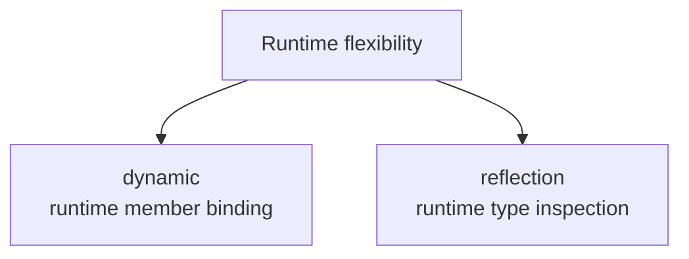

# Dynamic and Reflection Overview

`dynamic` and reflection both allow code to work with objects in ways that are less tied to compile-time type knowledge. They are useful when flexibility is necessary, but they also reduce many of the safety and clarity benefits that ordinary C# provides.

These are powerful tools, but they should usually be treated as boundary tools rather than default programming styles.

## Two different ideas

Although they are often mentioned together, `dynamic` and reflection are not the same thing.

- `dynamic` delays member binding until runtime
- reflection lets code inspect types, members, and metadata at runtime



Both move work away from normal compile-time certainty, but they do it in different ways.

## A simple `dynamic` example

```csharp
dynamic value = "hello";
Console.WriteLine(value.ToUpper());
```

This compiles even though `value` is not statically known as `string` at compile time.

At runtime, C# tries to resolve `ToUpper()` on whatever object is actually stored in `value`.

## What `dynamic` changes

With ordinary C#, the compiler checks members before the program runs. With `dynamic`, many of those checks are deferred until runtime.

That means:

- code may compile more easily in flexible scenarios
- mistakes may appear later at runtime instead of at compile time

## A simple reflection example

```csharp
Type type = typeof(string);
Console.WriteLine(type.Name);
```

Reflection lets code inspect information about types and members while the program runs.

For example, reflection can discover:

- type names
- properties
- methods
- attributes
- constructors

## Why these features exist

They are useful in scenarios such as:

- framework infrastructure
- plugin systems
- serialization libraries
- object mappers
- testing tools
- code that must work with types not fully known at compile time

These are real needs, but they are more specialized than ordinary application logic.

## A practical difference in feel

`dynamic` often feels like "treat this value more loosely and resolve calls later."

Reflection often feels like "inspect this type or member metadata and then act based on what exists."

They can even be used together in some advanced frameworks, but conceptually they solve different problems.

## Why caution is important

Both features reduce the simplicity of normal C# development.

Costs can include:

- fewer compile-time guarantees
- harder refactoring support
- harder-to-discover errors
- more runtime failure paths
- less obvious code intent for readers

That does not make them bad. It means they should be used where their flexibility is truly needed.

## When to prefer ordinary C# instead

If interfaces, generics, ordinary method calls, or strongly typed models can solve the problem clearly, they are usually better choices.

Strong typing improves readability, refactoring, tooling, and error detection.

## Good use cases

Reasonable use cases often include:

- reading attributes through reflection
- building infrastructure code that scans assemblies
- interop with dynamic environments
- carefully bounded framework integration points

## Common beginner mistakes

- Using `dynamic` to avoid learning proper type design.
- Replacing normal strongly typed code with reflection unnecessarily.
- Treating runtime flexibility as automatically more powerful or better.
- Forgetting that errors may move from compile time to runtime.

## Summary

- `dynamic` delays member binding until runtime
- reflection inspects type and member metadata at runtime
- both features provide flexibility but reduce some compile-time safety
- they are most useful in infrastructure and boundary scenarios
- strongly typed code is usually the better default when it can express the design clearly

## Practice

Write one sentence explaining the difference between `dynamic` and reflection without using the word flexible.

As a second exercise, describe one scenario where reflection is appropriate and one where a normal interface-based design would be clearer and safer.
