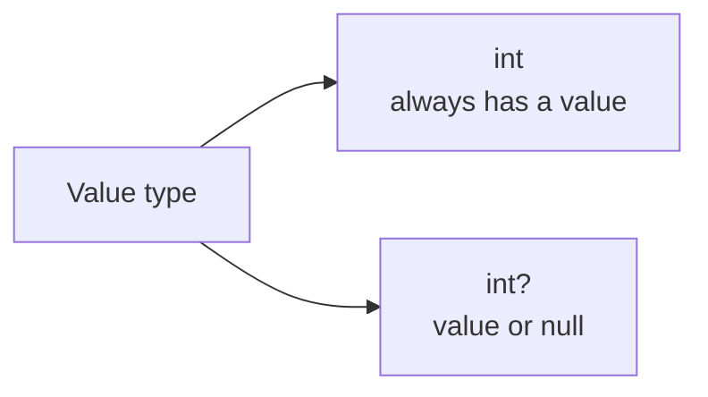

# Nullable Value Types

Nullable value types let a value type represent either a real value or the absence of a value. They solve a practical problem: many domains need to distinguish between `0` and "no value was supplied," or between `false` and "the answer is unknown."

Original Microsoft Learn reference: [Nullable value types](https://learn.microsoft.com/en-us/dotnet/csharp/language-reference/builtin-types/nullable-value-types).

This feature is written with `?` after a value type, such as `int?`, `bool?`, or `DateTime?`.

## The core idea

Normal value types always contain a value.

```csharp
int quantity = 0;
bool isActive = false;
DateTime createdAt = DateTime.UtcNow;
```

Those values may or may not mean what you want semantically. Sometimes `0` is a real quantity. Sometimes it means the user has not chosen a quantity yet. A nullable value type gives you a way to model that distinction directly.



## A simple example

```csharp
int? discountPercent = null;

if (discountPercent.HasValue)
{
    Console.WriteLine($"Discount: {discountPercent.Value}%");
}
else
{
    Console.WriteLine("No discount configured.");
}
```

The type communicates that the value is optional.

## Why this feature matters

Without nullable value types, developers often choose a fake sentinel value such as `-1`, `0`, or `DateTime.MinValue`. That usually makes code harder to read because the type no longer tells the whole truth.

Compare these two designs:

```csharp
int expirationDays = -1;
```

```csharp
int? expirationDays = null;
```

The second version is clearer because absence is explicit instead of hidden behind a convention.

## `Nullable<T>` and the `?` shorthand

`int?` is syntactic sugar for `Nullable<int>`.

These two declarations mean the same thing:

```csharp
int? score = null;
Nullable<int> otherScore = null;
```

In normal code, the `?` form is easier to read and is used almost everywhere.

## Reading nullable value types safely

The two most common ways to work with a nullable value type are:

- check `HasValue` and then read `Value`
- use `??` to provide a fallback value

```csharp
int? retries = null;

int effectiveRetries = retries ?? 3;
Console.WriteLine(effectiveRetries);
```

That pattern is usually more convenient than manually checking `HasValue`.

## A practical example

```csharp
DateTime? lastLoginAt = null;

string message = lastLoginAt is DateTime value
    ? $"Last login: {value:O}"
    : "User has never logged in.";

Console.WriteLine(message);
```

This example also shows how pattern matching works nicely with nullable value types.

## Lifted operators

Many operators that work on value types also work on nullable value types. These are called lifted operators. If either operand is `null`, the result is often `null` as well.

```csharp
int? a = 10;
int? b = null;

int? sum = a + b;
Console.WriteLine(sum is null);
```

This produces `true` because the result is unknown when one operand has no value.

That behavior is especially important with comparisons and calculations. Nullable value types model uncertainty, not just storage.

## Nullable booleans

`bool?` deserves extra attention because it can represent three states:

- `true`
- `false`
- `null`

That is useful when the answer may be unknown or not provided yet.

```csharp
bool? acceptedTerms = null;
```

Be careful, though. A three-state boolean is useful only when the third state has real meaning. Otherwise it adds complexity.

## Common scenarios

Nullable value types are often appropriate for:

- optional form fields
- database columns that allow nulls
- filters where the user may leave a criterion unspecified
- configuration values with fallback defaults
- timestamps or measurements that may not exist yet

## When not to use them

Do not use `int?` or `DateTime?` when the domain actually requires a value at all times. Optionality should express real business meaning, not uncertainty in your design.

If a value is required, prefer enforcing it in constructors, method parameters, or validation rules.

## Common beginner mistakes

- Using `.Value` without checking whether a value exists.
- Replacing clear domain rules with nulls everywhere.
- Using sentinel values and nullable value types at the same time.
- Forgetting that arithmetic and comparisons can produce nullable results.

## Practical guidance

- Use nullable value types when absence is part of the domain.
- Prefer `??` and pattern matching for simple consumption.
- Avoid `.Value` unless the control flow already proves the value exists.
- Choose required non-nullable value types when the domain guarantees a value.

## Summary

- nullable value types let value types represent either a value or no value
- `int?` is shorthand for `Nullable<int>`
- they are more expressive than sentinel values such as `-1` or `DateTime.MinValue`
- `??`, pattern matching, and `HasValue` are the main tools for consuming them safely
- they improve design only when optionality is a real part of the domain

## Practice

Create a small `Reservation` type with an optional `DateTime? ConfirmedAt` property and explain what `null` means.

As a second exercise, write code that reads an `int?` and falls back to a default value without using an `if` statement.
