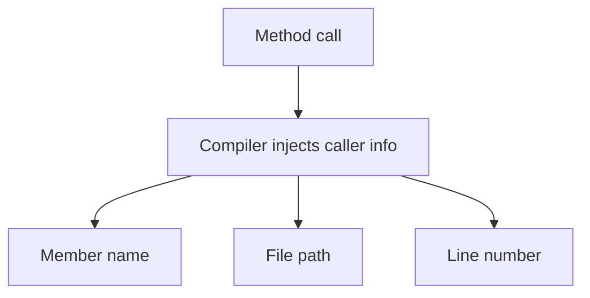

# Caller Information Attributes

Caller information attributes let the compiler automatically pass details about the calling code into a method. They are especially useful for logging, diagnostics, argument validation helpers, and lightweight tracing.

Original Microsoft Learn reference: [Caller information](https://learn.microsoft.com/en-us/dotnet/csharp/language-reference/attributes/caller-information).

This feature matters because it removes a lot of repetitive manual strings while keeping diagnostic code more accurate and easier to maintain.

## The core idea

When a method parameter is decorated with a caller information attribute, the compiler can fill in that parameter at the call site.

The three most common attributes are:

- `CallerMemberName`
- `CallerFilePath`
- `CallerLineNumber`



## A simple example

```csharp
using System.Runtime.CompilerServices;

static void Log(string message,
    [CallerMemberName] string memberName = "",
    [CallerLineNumber] int lineNumber = 0)
{
    Console.WriteLine($"[{memberName}:{lineNumber}] {message}");
}

Log("Starting work");
```

The caller does not supply `memberName` or `lineNumber`, but the method still receives them.

## Why this is useful

Without caller information attributes, logging helpers often require extra strings that callers must remember to keep in sync.

```csharp
Log("Save started", "SaveCustomer");
```

That is fragile. If the method is renamed, the string may become wrong. Caller information attributes avoid that duplication because the compiler derives the information directly from the call site.

## `CallerMemberName`

`CallerMemberName` provides the name of the calling member.

```csharp
using System.Runtime.CompilerServices;

static void Notify([CallerMemberName] string memberName = "")
{
    Console.WriteLine($"Called from: {memberName}");
}

static void ProcessOrder()
{
    Notify();
}
```

This prints `ProcessOrder`.

One common use is property-change notification in UI or state-management code.

## `CallerLineNumber`

`CallerLineNumber` captures the source line where the call appears.

```csharp
using System.Runtime.CompilerServices;

static void TraceStep(
    string message,
    [CallerLineNumber] int lineNumber = 0)
{
    Console.WriteLine($"Line {lineNumber}: {message}");
}
```

This is most useful in diagnostics, especially when you want lightweight tracing without a full debugger attached.

## `CallerFilePath`

`CallerFilePath` captures the full source file path of the call site.

```csharp
using System.Runtime.CompilerServices;

static void TraceFile([CallerFilePath] string filePath = "")
{
    Console.WriteLine(filePath);
}
```

This can help in debugging tools or test helpers, but be careful about logging full file paths in production because they may expose environment-specific details.

## Argument validation helpers

Caller information attributes also connect nicely with reusable validation helpers.

```csharp
using System.Runtime.CompilerServices;

static void EnsureNotNull<T>(
    T value,
    [CallerArgumentExpression(nameof(value))] string expression = "")
    where T : class
{
    ArgumentNullException.ThrowIfNull(value, expression);
}
```

If you call `EnsureNotNull(customer.Name);`, the helper can report the original expression text automatically.

`CallerArgumentExpression` is newer than the original caller info attributes, but it belongs to the same family of compile-time call-site assistance.

## A practical example

```csharp
using System.Runtime.CompilerServices;

public sealed class OperationTracker
{
    public void Mark(
        string status,
        [CallerMemberName] string memberName = "",
        [CallerLineNumber] int lineNumber = 0)
    {
        Console.WriteLine($"{memberName} at line {lineNumber}: {status}");
    }
}

OperationTracker tracker = new();
tracker.Mark("Loaded configuration");
```

This kind of helper is useful in small tools, sample code, and local diagnostics.

## What the compiler is really doing

It helps to think of the compiler as rewriting the call with extra arguments.

Conceptually, this:

```csharp
tracker.Mark("Loaded configuration");
```

becomes something like this:

```csharp
tracker.Mark("Loaded configuration", "Main", 27);
```

You usually do not write that expanded form yourself, but it explains why the feature has almost no runtime mystery.

## Common mistakes

- Forgetting that these attributes work through optional parameters.
- Logging full file paths in environments where that data should stay private.
- Using caller info as a replacement for structured logging design.
- Assuming the values are discovered at runtime through reflection. They are usually inserted by the compiler.

## Practical guidance

- Use caller information attributes to reduce repetitive diagnostic boilerplate.
- Prefer them for helper methods, tracing utilities, and validation infrastructure.
- Treat `CallerFilePath` carefully in production logs.
- Keep the surrounding logging design clear; caller info improves context, but it does not replace thoughtful diagnostics.

## Summary

- caller information attributes let the compiler supply call-site details automatically
- `CallerMemberName`, `CallerLineNumber`, and `CallerFilePath` are the main classic attributes
- `CallerArgumentExpression` extends the same idea to validation and diagnostics
- these features reduce fragile manual strings and improve helper APIs
- they are most valuable in tracing, validation, and diagnostic utilities

## Practice

Write a small logging helper that prints the caller member name automatically.

As a second exercise, create an `EnsureNotNull` helper that uses `CallerArgumentExpression` so the thrown exception reports the original argument expression.
