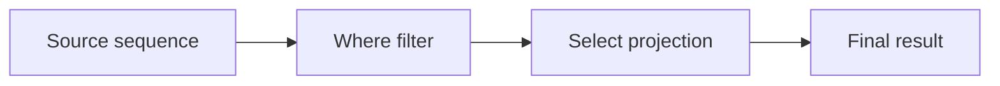

# LINQ Basics

LINQ gives C# a shared vocabulary for working with data. Instead of writing explicit loops for every filtering, sorting, or transformation step, LINQ lets you build data pipelines from small query operations.

Original Microsoft Learn reference: [Introduction to LINQ Queries in C#](https://learn.microsoft.com/en-us/dotnet/csharp/linq/get-started/introduction-to-linq-queries).

This is a practical topic because application code constantly works with collections: users, orders, files, configuration entries, log records, API results, and more.

## Why LINQ matters in real code

LINQ is useful because it helps you express what data result you want instead of manually managing every loop and temporary list.

Common practical uses include:

- filtering records before display
- sorting results for reporting
- transforming raw data into view models or summaries
- aggregating totals, counts, and statistics
- preparing data for serialization or output

## A basic pipeline

```csharp
var numbers = new[] { 1, 2, 3, 4, 5 };

var evens = numbers
    .Where(n => n % 2 == 0)
    .Select(n => n * 10);

Console.WriteLine(string.Join(", ", evens));
```

This pipeline does two things:

- keeps only even numbers
- transforms each remaining number

## A mental model



Each LINQ operator creates the next step in the pipeline.

## LINQ versus loops

A loop is still often the right tool, especially when logic is stateful or imperative. But when the work is clearly about querying and transforming data, LINQ usually reads closer to the real intent.

Loop version:

```csharp
List<int> result = new();

foreach (int number in numbers)
{
    if (number % 2 == 0)
    {
        result.Add(number * 10);
    }
}
```

LINQ version:

```csharp
var result = numbers
    .Where(number => number % 2 == 0)
    .Select(number => number * 10)
    .ToList();
```

Both are valid. LINQ is strongest when it makes the data flow easier to see.

## A more practical example

Suppose a small application loads customer orders and wants a quick display summary.

```csharp
var orders = new[]
{
    new { Id = 1, Customer = "Lina", Total = 120m },
    new { Id = 2, Customer = "Omid", Total = 45m },
    new { Id = 3, Customer = "Sara", Total = 200m }
};

var premiumOrders = orders
    .Where(order => order.Total >= 100m)
    .OrderByDescending(order => order.Total)
    .Select(order => $"{order.Customer}: {order.Total:C}");

foreach (string summary in premiumOrders)
{
    Console.WriteLine(summary);
}
```

This feels like application code because the query is doing real reporting work, not only manipulating toy numbers.

## Deferred execution matters

Many LINQ queries do not execute immediately. They often run only when you actually enumerate them.

That means LINQ can be efficient and composable, but it also means you should understand when the query is really evaluated.

If you need a fixed snapshot, materialize the result with methods such as `ToList()` or `ToArray()`.

## Practical guidance

LINQ is especially useful when:

- the code is clearly about data filtering or transformation
- multiple query steps should compose neatly
- readability improves compared with manual loops

It is less helpful when:

- the logic is heavily stateful
- side effects dominate the code
- a loop would be easier for the team to understand

## Common beginner mistakes

- Chaining many LINQ calls without understanding what each step does.
- Forgetting that many queries execute later, not immediately.
- Using LINQ for side effects instead of data querying.
- Assuming LINQ is always better than a loop.

## Summary

- LINQ provides a shared query vocabulary for collection and data work
- it is strongest for filtering, transforming, sorting, and aggregating data
- query pipelines often read closer to the real intent than manual loops
- many LINQ operations are deferred until enumeration
- loops are still appropriate when they make the logic clearer

## Practice

Take a small list of values and write a pipeline that filters, sorts, and transforms them.

As a second exercise, rewrite the same logic with a `foreach` loop and explain which version is easier to read and why.
